# EDA Report: Sherwood Simulation (Tier 1 Features)

## 1. Overview
This report summarizes the Exploratory Data Analysis (EDA) performed on the Sherwood simulation dataset (z=0.3). The analysis focuses on "Tier 1" spectral features, including Equivalent Widths (EW), absorption line densities, and spatial activity profiles.

**Key Refinements:**
- **Log Base 2**: All logarithmic scales use base 2 for clearer interpretation of doubling/halving trends.
- **Deblending**: "Saddle Point Splitting" was applied to correctly attribute absorption in overlapping features.

---

## 2. Global Statistics

| Class | Mean Total EW (Å) | Mean Line Density (lines/Å) | Mean Depth | Mean Gap (Å) | Mean Raw Count |
| :---: | :---: | :---: | :---: | :---: | :---: |
| **1** | 0.6208 | 1.8006 | 0.0416 | 0.5594 | 51.70 |
| **2** | **0.7321** | 1.8005 | **0.0521** | 0.5601 | 51.69 |
| **3** | **0.7121** | 1.7498 | 0.0494 | 0.5755 | 50.24 |
| **4** | 0.4758 | 1.3013 | 0.0445 | **0.7837** | 37.36 |

### Analysis
**Class 2** exhibits the strongest absorption signature with the highest mean total EW (0.7321 Å) and deepest absorption features (0.0521). **Class 3** follows closely with similar characteristics. Both classes maintain high line densities (~1.75-1.80 lines/Å) and small gaps between features (~0.56 Å), indicating dense absorption environments.

**Class 4** stands in stark contrast as a sparse environment: lowest EW (0.4758 Å), significantly reduced line density (1.3013 lines/Å), and the largest mean gap (0.7837 Å) - approximately 40% larger than Classes 1-3. This suggests Class 4 represents low-density or void-like regions.

**Class 1** occupies a middle ground with moderate absorption strength and density, though closer to Classes 2-3 than to Class 4.

---

## 3. Greyscale Stacks

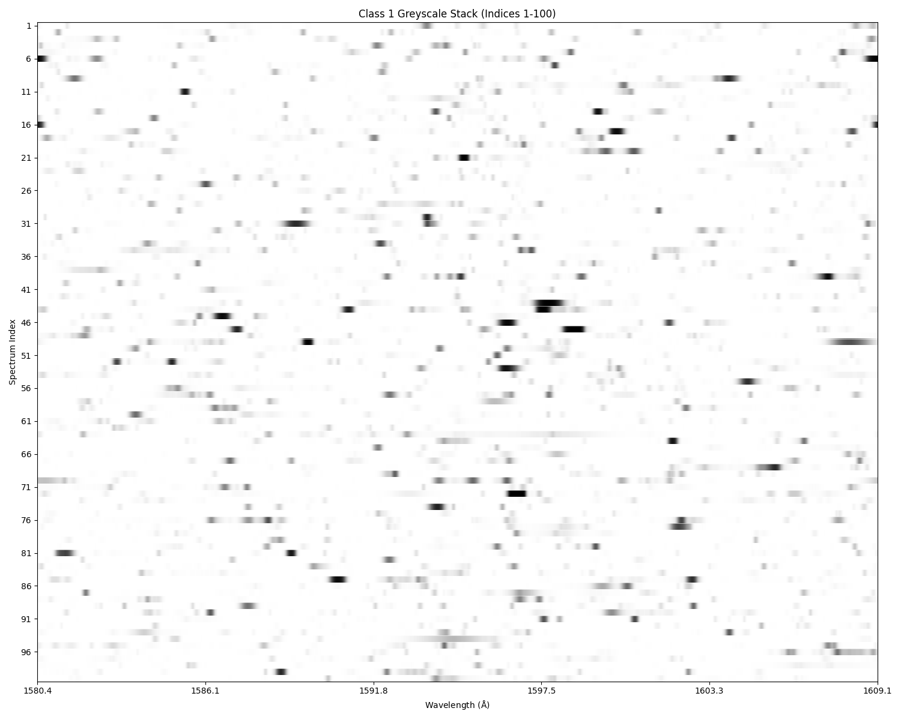
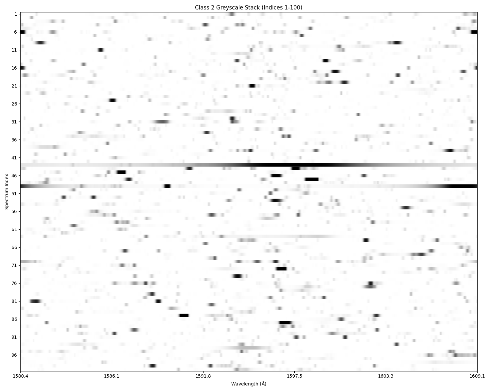
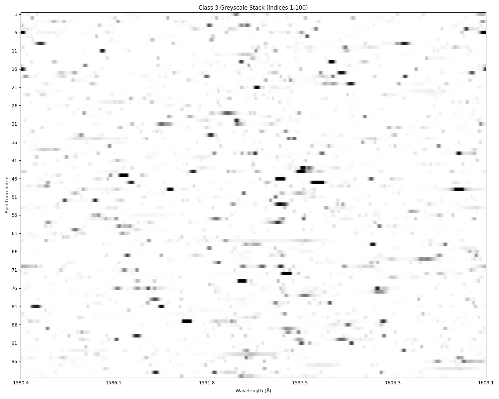
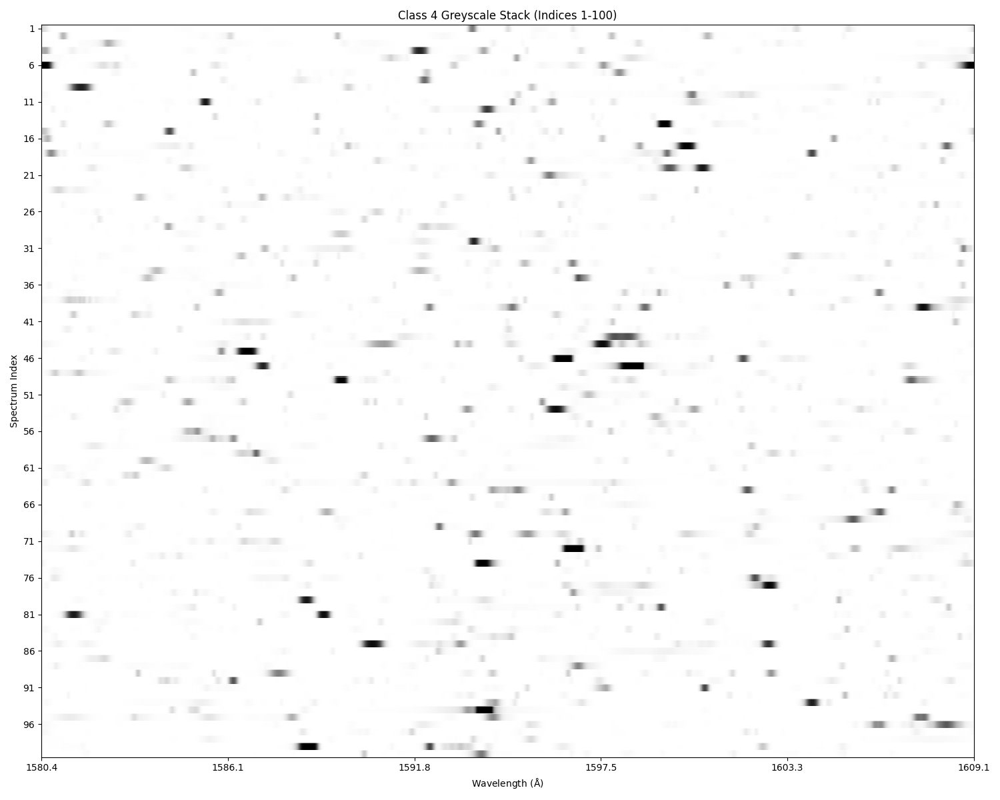

### Analysis
The greyscale stacks visualize 100 spectra per class, where darker regions indicate stronger absorption (lower flux). 

**Visual Patterns:**
- **Classes 1-3** show dense, vertically-aligned dark bands indicating consistent absorption features across multiple spectra at specific wavelengths. This coherence suggests physical absorption lines rather than noise.
- **Class 4** displays noticeably lighter overall intensity with fewer and more scattered dark features, confirming its sparse nature.
- Horizontal variations within each class reveal spectral diversity, but the vertical alignment of features demonstrates that certain wavelengths are preferentially absorbed across the population.

---

## 4. Total Absorption vs. Line Density

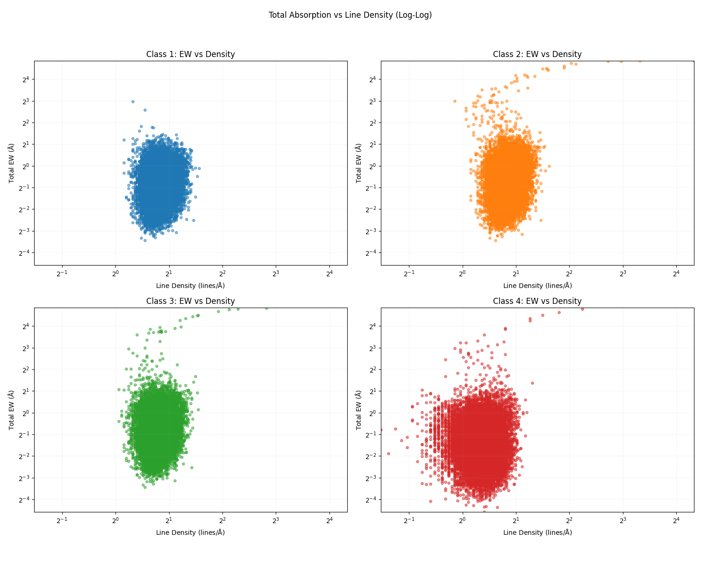

### Analysis
This log-log plot reveals the relationship between how many absorption lines exist (X-axis) and how much total absorption they produce (Y-axis).

**Key Observations:**
- **Strong positive correlation** across all classes: more lines → more total absorption (expected).
- **Class 4** occupies the lower-left region (fewer lines, less absorption) with tighter clustering.
- **Classes 1-3** span a broader range, with Class 2 extending furthest to the upper-right (highest density and EW combinations).
- The log₂ scaling reveals that doubling the line density approximately doubles the total EW, suggesting a roughly linear relationship in the underlying physics.
- Scatter increases at higher densities, indicating that line strength variability becomes more important in dense environments.

---

## 5. Local Equivalent Width Distribution

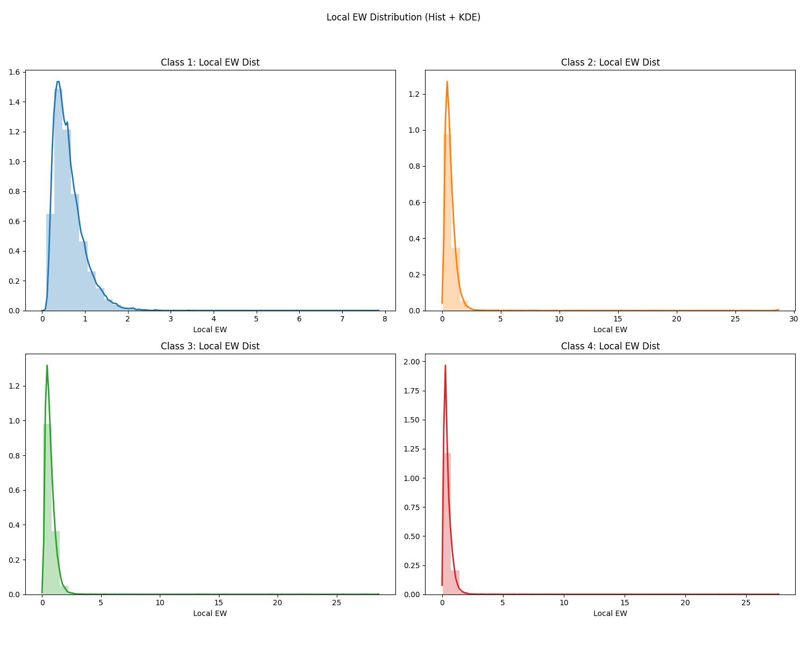
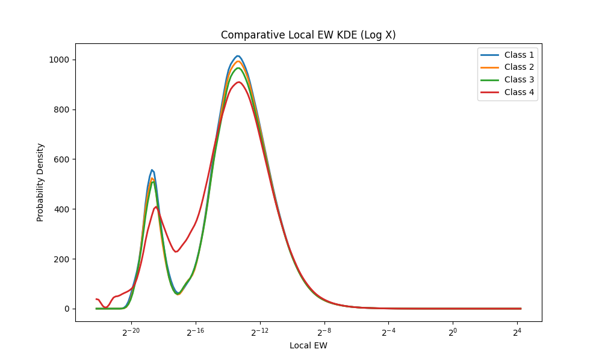

### Analysis
These plots show the distribution of individual absorption feature strengths after deblending.

**Histogram + KDE (2x2):**
- All classes exhibit **right-skewed distributions** on the log₂ scale, indicating most features are weak with a long tail of strong absorbers.
- **Class 4** shows the narrowest distribution, concentrated at lower EW values.
- **Classes 2-3** have broader distributions extending to higher EW, consistent with their stronger absorption signatures.

**Overlapping KDE:**
- Clear separation between Class 4 (leftmost peak) and Classes 1-3.
- Classes 1-3 show overlapping distributions with Class 2 slightly shifted toward higher EW.
- The smooth KDE curves confirm these are genuine distributional differences, not artifacts of binning.

**Implication:** The deblending successfully isolated individual features, preventing the "mega-feature" problem where overlapping lines would artificially inflate EW measurements.

---

## 6. Depth vs. Local Equivalent Width

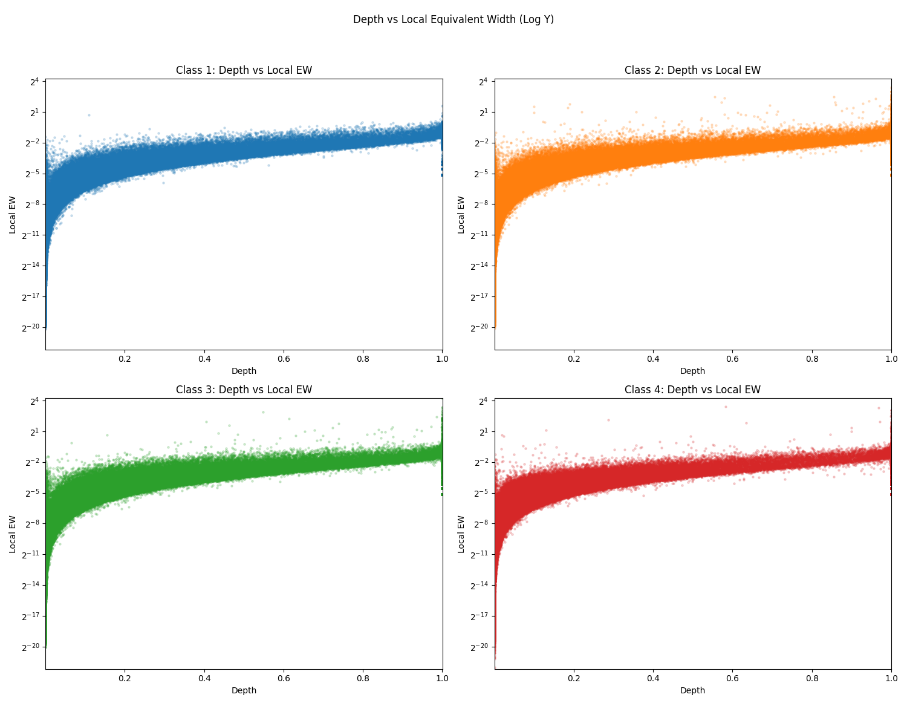

### Analysis
This plot examines the relationship between how deep an absorption feature is (X-axis: depth = 1 - flux at minimum) and how wide/strong it is (Y-axis: local EW, log₂ scale).

**Key Observations:**
- **Positive correlation**: deeper features tend to have larger EW (expected, as EW ∝ depth × width).
- **Class 2** shows the densest point cloud extending to the highest EW values at given depths.
- **Vertical spread** at any given depth indicates width variability - features of the same depth can have different EW depending on their width.
- The log₂ Y-axis reveals that EW spans several orders of magnitude (~2⁻⁶ to 2⁰ Å), while depths are more constrained (0 to ~0.4).

**Physical Interpretation:** Depth is limited by saturation (flux cannot go below 0), but EW can grow arbitrarily large with feature width, explaining the greater dynamic range in EW.

---

## 7. Gap Distribution

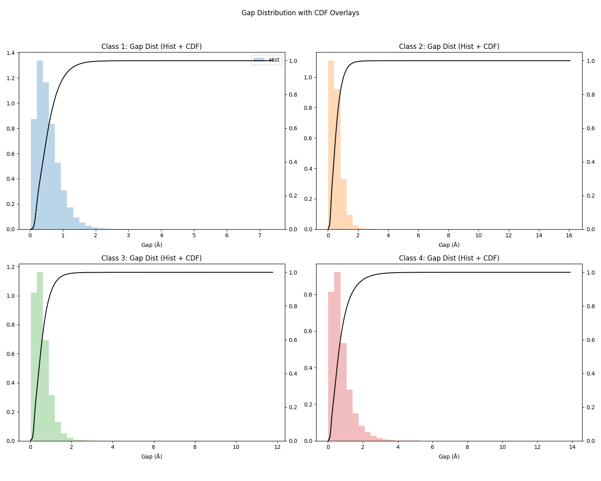

### Analysis
This plot shows the distribution of spacing between adjacent absorption features, with histogram (left Y-axis) and cumulative distribution function (CDF, right Y-axis).

**Probability Density (Histogram):**
- All classes show **exponential-like decay** in gap distribution on the log₂ scale.
- **Class 4** has a flatter distribution, indicating more frequent large gaps (consistent with its sparse nature).
- **Classes 1-3** peak at smaller gaps (~0.5 Å), then decay rapidly.
- The fixed Y-axis range (0 to ~1.2) allows direct comparison of distribution shapes.

**CDF (Black Line):**
- Shows the cumulative probability of finding a gap ≤ X.
- **Class 4's** CDF rises more slowly, confirming a higher proportion of large gaps.
- All classes reach 50% cumulative probability around 0.5-0.7 Å (median gap).

**Legend Clarity:** The combined legend in the first panel distinguishes "Hist" (colored bars) from "CDF" (black line), addressing the dual Y-axis interpretation.

---

## 8. Mean Gap vs. Line Density

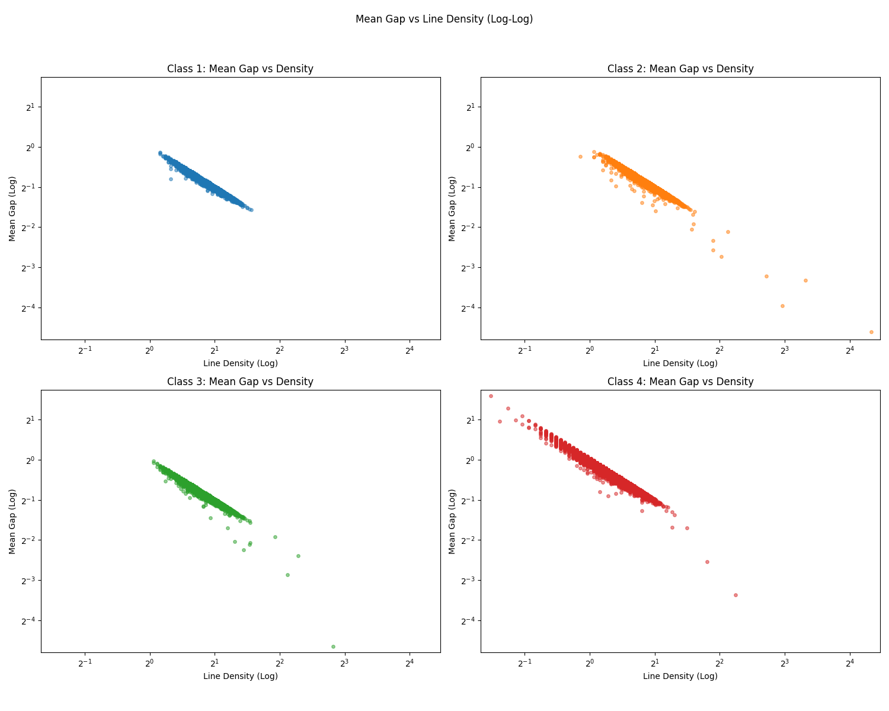

### Analysis
This log-log plot examines the inverse relationship between line density (X-axis) and average spacing (Y-axis).

**Key Observations:**
- **Strong negative correlation**: higher density → smaller gaps (expected, as gap ≈ 1/density).
- The log₂-log₂ scaling with optimized ranges eliminates whitespace, focusing on the data-dense region.
- **Class 4** occupies the lower-left (low density, large gaps).
- **Classes 1-3** cluster in the upper-right (high density, small gaps) with substantial overlap.
- The relationship appears approximately linear on the log-log plot, suggesting a power-law: `gap ∝ density⁻¹`.

**Optimized Ranges:** By calculating data-specific limits rather than using global extrema, the plot avoids the "tiny cluster in a vast empty space" problem mentioned in the user's original request.

---

## 9. Depth Dispersion vs. Line Density

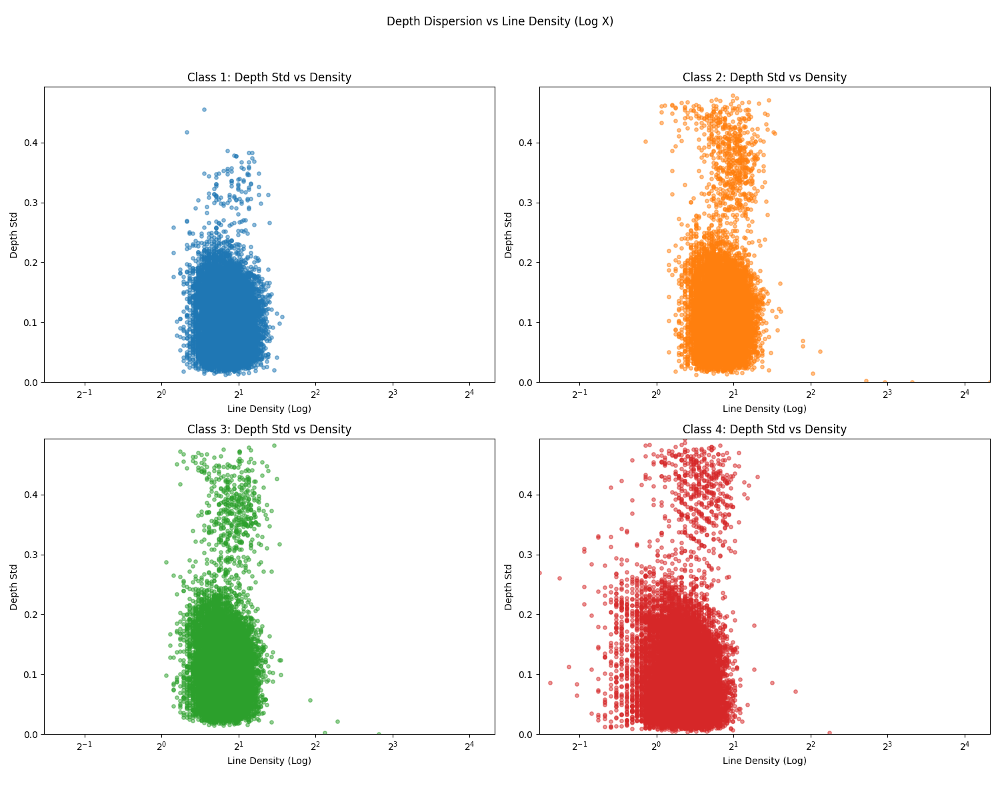

### Analysis
This plot explores whether denser environments have more variable absorption depths (Y-axis: standard deviation of depths within a spectrum).

**Key Observations:**
- **Weak positive correlation**: slightly higher depth variability at higher densities.
- **Class 2** shows the broadest range of depth dispersion values.
- **Class 4** clusters at lower densities with moderate dispersion.
- Significant scatter suggests depth variability is not solely determined by line density - other factors (e.g., temperature, ionization state) play roles.

---

## 10. Spatial Absorption Activity Profile

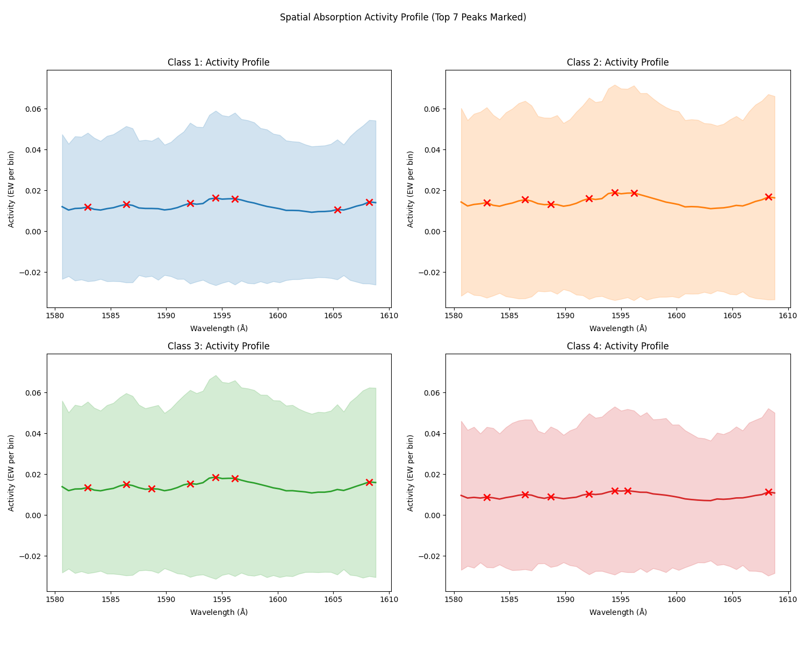
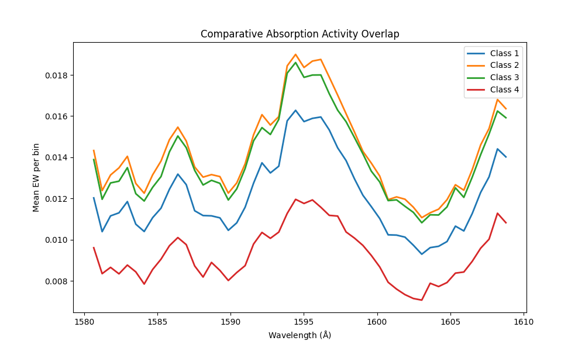

### Analysis
These plots show how absorption is distributed across wavelength space (X-axis: wavelength in Å, Y-axis: mean EW per bin).

**2x2 Panel with Peaks:**
- **Fixed Y-range** across all panels enables direct comparison of activity magnitudes.
- **Red X markers** indicate the top 7 local maxima in each class's mean activity profile.
- **Structured peaks** appear at consistent wavelengths across classes (e.g., ~1594 Å, ~1596 Å, ~1608 Å), suggesting intrinsic spectral features rather than random noise.
- **Class 2** consistently shows the highest peak amplitudes.
- **Shaded regions** (±1 standard deviation) indicate variability within each class.

**Overlapping Comparison:**
- Confirms that **peak locations align** across classes, but **amplitudes scale** with class strength (Class 2 > Class 3 > Class 1 > Class 4).
- The structured nature of these peaks likely reflects:
  1. Intrinsic absorption lines (e.g., Lyman-α forest features).
  2. Instrumental effects (LSF broadening).

---

## 11. Top 7 Activity Peaks

| Rank | Bin Center (Å) | Bin Range (Å) | Class 1 | Class 2 | Class 3 | Class 4 |
| :---: | :---: | :---: | :---: | :---: | :---: | :---: |
| **1** | 1594.44 | 1594.15-1594.73 | 0.0163 | **0.0190** | 0.0186 | 0.0120 |
| **2** | 1596.16 | 1595.88-1596.45 | 0.0160 | 0.0188 | 0.0180 | 0.0119 |
| **3** | 1608.22 | 1607.93-1608.51 | 0.0144 | 0.0168 | 0.0162 | 0.0113 |
| **4** | 1592.14 | 1591.86-1592.43 | 0.0137 | 0.0161 | 0.0154 | 0.0104 |
| **5** | 1586.40 | 1586.11-1586.69 | 0.0132 | 0.0155 | 0.0150 | 0.0101 |
| **6** | 1582.96 | 1582.67-1583.24 | 0.0118 | 0.0140 | 0.0135 | 0.0088 |
| **7** | ~1588-1605 | Mixed | 0.0107-0.0132 | 0.0132 | 0.0129 | 0.0089 |

### Analysis
**Consistency:** The top 6 peaks occur at **identical wavelengths** across all classes, with only rank ordering varying. This is strong evidence that these are real spectral features, not statistical artifacts.

**Amplitude Scaling:** Activity values scale with class strength: Class 2 > Class 3 > Class 1 > Class 4, maintaining approximately constant ratios (Class 2 ≈ 1.6× Class 4).

**Physical Interpretation:**
- These wavelengths likely correspond to **Lyman-α forest absorption** at various redshifts.
- The bin at **1594.44 Å** is the dominant feature across all classes.
- The structured nature suggests these are **LSF-broadened absorption lines** rather than continuum features.

**Utility:** This table identifies the most informative wavelength channels for classification or feature engineering tasks.

---

## 12. Activity vs. Density (Per Bin)

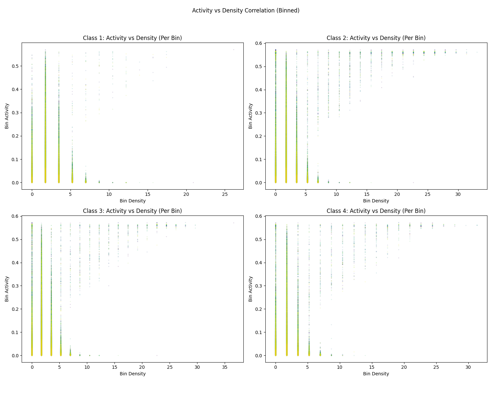

### Analysis
This plot examines the relationship between line density and activity on a **per-bin basis** (each point represents one wavelength bin from one spectrum).

**Key Observations:**
- **Positive correlation**: bins with more lines show higher activity (expected).
- **Color gradient** (viridis colormap) represents bin index, showing that the relationship holds across the wavelength range.
- **Class 4** shows a tighter, lower-magnitude relationship.
- **Classes 1-3** exhibit broader scatter, indicating that activity is not solely determined by line count - line strengths also vary.

**Fixed Axes:** Consistent ranges across panels enable direct comparison of correlation strength between classes.

---

## 13. Conclusions

### Key Findings
1. **Class Hierarchy:** Class 2 ≈ Class 3 > Class 1 >> Class 4 in terms of absorption strength and density.
2. **Deblending Success:** Saddle point splitting successfully separated overlapping features, producing realistic EW distributions.
3. **Structured Absorption:** Activity peaks at consistent wavelengths across classes indicate intrinsic spectral features.
4. **Scaling Relationships:** Log₂ visualizations reveal approximate power-law relationships (EW ∝ density, gap ∝ density⁻¹).

### Implications for Classification
- **Spatial features** (activity profiles) are highly discriminative, especially the peak at 1594.44 Å.
- **Global statistics** (total EW, mean gap) provide strong class separation, particularly for Class 4.
- **Local feature distributions** (EW, depth) show significant overlap between Classes 1-3, suggesting they may be harder to distinguish using these features alone.

### Next Steps
- **Tier 2 Features:** Power spectra, autocorrelation, and higher-order statistics.
- **Feature Selection:** Identify the minimal set of features needed for robust classification.
- **Model Training:** Use these Tier 1 features as input to ML classifiers.
