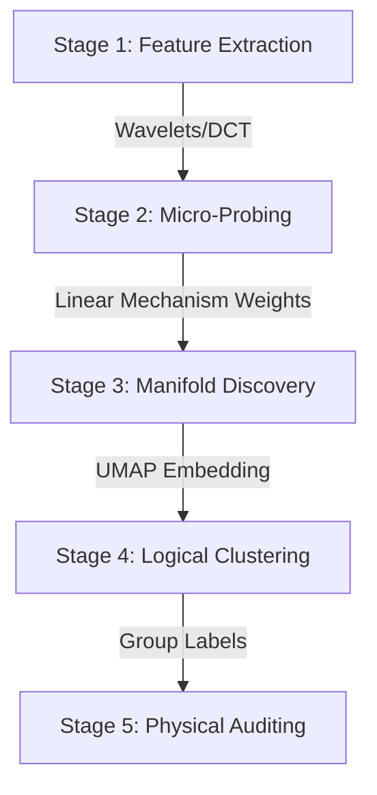

# Feature Extraction Pipeline for Synthetic Quasar Absorption Spectra
## Windowed DCT-II and Wavelet Decomposition for ML Classifiers

---

## Preliminary Decisions

### On Using 1 − F (Absorption Field)

Raw flux $F = e^{-\tau}$ ranges from 0 (complete absorption) to 1 (no absorption). The signal of interest—the absorbing gas—lives in the *deviations from 1*. Transforming to the absorption field **$A = 1 - F$** is cleaner for wavelets and essential for SVM kernel performance.

#### 1. Impact on Wavelet Coefficients
The DWT applies alternating low-pass and high-pass filters. High-pass filters (detail coefficients) respond to **changes** in the signal, not absolute levels. Because high-pass filter coefficients sum to zero ($\sum_k h(k) = 0$), they are "blind" to constant DC offsets.

| Component | Detail Coefficients ($D_n$) | Approximation Coefficients ($A_n$) |
|:---:|---|---|
| **Effect of 1-F** | Magnitudes are identical; signs flip. | Meaningfully different. |
| **Why?** | High-pass filters only see edges. | Low-pass filters average the signal level. |

**Approximation coefficients ($A_6$):**
- **With $F$:** The approximation is dominated by a large baseline ($\sim 0.8$). Features are small ($\sim 30\%$) deviations from a massive offset.
- **With $A$:** The approximation is zero in voids and positive at features. The absorption *is* the entire signal.

#### 2. Why This Matters for SVM Specifically
The SVM polynomial kernel (and RBF kernel) relies on the dot product $\mathbf{x}^\top \mathbf{x}'$. 

- **With $F$:** Two completely different spectra will have a large dot product simply because both share a large constant baseline ($0.8 \times 0.8$). This inflates similarity and "buries" the discriminative physical signal.
- **With $A$:** The dot product is near zero if absorption features do not overlap. The kernel measures **physically meaningful similarity** — it only fires when absorption peaks co-occur at the same scales and positions.

#### 3. Mathematical Example (Haar Wavelet)
Consider a signal with one absorption feature.

- **Flux $F$:** `[1.0, 1.0, 1.0, 0.3, 0.3, 1.0, 1.0, 1.0]`
- **Absorption $A$:** `[0.0, 0.0, 0.0, 0.7, 0.7, 0.0, 0.0, 0.0]`

Applying one level of Haar decomposition ($a_k = \frac{x_{2k} + x_{2k+1}}{\sqrt{2}}$, $d_k = \frac{x_{2k} - x_{2k+1}}{\sqrt{2}}$):

| Coefficient | $F$ Result | $A$ Result | Interpretation |
|---|---|---|---|
| **Approximation** | `[1.41, 0.92, 0.92, 1.41]` | `[0.00, 0.49, 0.49, 0.00]` | **A** has zero baseline. |
| **Detail** | `[0.00, 0.49, -0.49, 0.00]` | `[0.00, -0.49, 0.49, 0.00]` | **A** and **F** are equivalent in magnitude. |

**Summary:** For the SVM, $A = 1 - F$ ensures the kernel focus remains on the absorption structure, preventing the large flux baseline from swamping the variance of interest.

---

### On Ignoring Flux in the Range 0.95 − 1.0

Pixels with $F \in [0.95, 1.0]$ correspond to $A \in [0, 0.05]$ — very weak or no absorption. The question is whether zeroing these out (hard thresholding) is safe.

**Arguments for ignoring them:**
- These pixels are dominated by noise in real spectra
- For synthetic spectra they represent voids — physically uninteresting low-density regions
- Zeroing them out sharpens the contrast of absorption features

**Arguments against:**
- In synthetic spectra, noise is added artificially and controlled — weak absorption at $F = 0.97$ is a real physical signal, not noise
- Hard thresholding introduces discontinuities that create high-frequency artifacts in both DCT and wavelet coefficients — the sharp on/off boundary is itself a spurious feature
- The statistical distribution of weak absorption carries cosmological information (void statistics, UV background fluctuations)
- Soft thresholding or simply keeping all values is safer for an agnostic ML pipeline where you don't yet know what the classifier will use

**Recommendation:** Do not threshold for now. Keep all values of $A = 1 - F$. If later analysis shows that weak-absorption pixels add noise to classifier performance, apply **soft thresholding** (reduce values below a threshold toward zero gradually) rather than hard zeroing, to avoid spectral artifacts.

---

## The 5-Stage Discovery Pipeline

The discovery process is structured as a multi-stage flow to transform raw spectral realizations into auditable physical regimes.

### Stage 1: Feature Extraction (Wavelet/DCT)
- **Input**: Redshift-correlated spectral samples ($A = 1 - F$).
- **Process**: Decompose 2048 pixels into 512 Wavelet coefficients (scales) or 480 Windowed DCT coefficients.
- **Output**: Physical "building blocks" of the absorption profile.

### Stage 2: Micro-Classifier Probing (Linear Mechanism)
- **Input**: 4 physical realizations (NoFeedback, StellarWind, WindAGN, WindStrongAGN) for index $i$.
- **Process**: Train a **Linear SVM** to find the hyperplane separating these realizations.
- **Extraction**: Capture the raw coefficients ($w$) for 6 one-vs-one pairs.
- **Output**: A **3,078-dimensional "Mechanism Fingerprint"** representing the physical decision logic at index $i$.

### Stage 3: Manifold Discovery (UMAP)
- **Input**: 16,384 fingerprint vectors across the entire forest.
- **Process**: Apply **UMAP** to project the high-dimensional weight space into a dense manifold.
- **Goal**: Identify topological islands where different sightlines share the **same physical reasoning**.

### Stage 4: Logical Clustering (K-Means)
- **Input**: The UMAP-reduced manifold (or raw weights).
- **Process**: Apply **K-Means (k=2-20)** to categorize the forest indices.
- **Output**: Discovery labels assigned to every sightline coordinate.

### Stage 5: Physical Auditing & Visualization
- **Process**: Map cluster centroids back to the original Wavelet pixels.
- **Validation**: Demonstrate which physical scale (e.g., small-scale heating vs large-scale voids) defines each cluster.
- **Output**: A finalized discovery map of "Physical Regimes" in the Simulation Forest.

---

## Branch 2a: Windowed DCT-II

### Concept

Rather than applying DCT-II to all 2048 pixels globally, divide the spectrum into overlapping windows and apply DCT-II to each. This gives **joint position-frequency information** — you know both what frequency content is present and roughly where in the spectrum it appears. This is the same principle as MFCCs in speech processing.

### Exact Configuration

**Window function:** Hann window. Before applying DCT-II to each segment, multiply by a Hann window:

$$w(n) = 0.5 \left(1 - \cos\frac{2\pi n}{L-1}\right)$$

This tapers the segment smoothly to zero at the edges, suppressing the spectral leakage and Gibbs ringing that would otherwise be caused by the sharp boundaries of each window. Without this, DCT-II of a raw rectangular segment will produce spurious high-frequency coefficients at every window edge.

**Window length $L$:** 256 pixels. At 2048 pixels total this gives a reasonable trade-off:
- Long enough to resolve velocity structures down to ~few hundred km/s (depending on pixel scale)
- Short enough to provide spatial localization across the spectrum
- Power of 2, which is efficient for DCT computation

**Hop size (step between windows):** 128 pixels (50% overlap). Overlapping windows ensure that absorption features near window boundaries are well-captured rather than split between two windows with attenuated edge weights.

**Number of windows:** With $L = 256$, hop $= 128$, and 2048 pixels:

$$n_{\text{windows}} = \left\lfloor \frac{2048 - 256}{128} \right\rfloor + 1 = 15$$

**Coefficients per window:** Keep the first 32 DCT-II coefficients out of 256. The higher coefficients capture sub-pixel oscillations that are noise-dominated in any realistic setting. This is analogous to keeping 13 MFCCs in speech — the exact cutoff is a hyperparameter to tune, but 32/256 (~12%) is a reasonable starting point.

**Feature vector size:** $15 \times 32 = 480$ features per spectrum.

**DCT-II formula applied per window:**

$$y_k = \sum_{n=0}^{L-1} w(n) \cdot A(n) \cdot \cos\!\left(\frac{\pi k (2n+1)}{2L}\right), \quad k = 0, 1, \ldots, 31$$

with `norm='ortho'` so all coefficients are on the same scale.

### Expected Behavior

The feature matrix for a single spectrum will be a $15 \times 32$ array. Visualized as a heatmap (windows on x-axis, frequency index on y-axis):

- The **top rows** (low $k$) capture slowly varying absorption — broad troughs, DLA wings
- The **lower rows** (high $k$) capture narrow features — individual Lyman-alpha lines, sharp metal line systems
- **Columns** trace how these structures evolve along the spectrum (position axis)
- A **DLA** will appear as a broad high-amplitude smear in the low-$k$ rows, localized to the windows covering its position
- A **dense Lyman-alpha forest region** will show elevated power across many $k$ values in the corresponding windows
- A **void** (no absorption, $A \approx 0$) will appear as near-zero across all $k$ for those windows

For a classifier, the flattened 480-dimensional vector carries both spectral and spatial information. Two spectra with the same global power spectrum but different spatial arrangement of absorbers will have different windowed DCT feature vectors — an advantage over global DCT-II.

---

## Branch 2b: Wavelet Decomposition

### Concept

The Discrete Wavelet Transform (DWT) decomposes the signal into **approximation coefficients** (low-frequency, coarse structure) and **detail coefficients** (high-frequency, fine structure) at multiple scales simultaneously. It is naturally suited to signals with localized features of varying widths — exactly what absorption spectra are.

### Exact Configuration

**Wavelet family:** Daubechies 8 (`db8`). The choice matters:

- `db4` or `db8` are standard for spectroscopic signals — they have compact support (localized in space), vanishing moments (they are blind to smooth polynomial trends, suppressing continuum contributions), and good frequency localization
- `db8` has 8 vanishing moments, meaning it will not respond to smooth continuum variations up to 7th-order polynomials — desirable because residual continuum shape is not the signal of interest
- Haar (`db1`) is too blocky and produces many edge artifacts
- Higher orders like `db16` improve frequency localization but at the cost of spatial localization and longer filter support

**Decomposition depth:** 6 levels. With 2048 pixels and 6 levels:

| Level | Scale (pixels) | Length | Physical Interpretation |
|---|---|---|---|
| Detail 1 | 1–2 | 1024 | Sub-resolution noise |
| Detail 2 | 2–4 | 512 | Narrowest absorption lines |
| Detail 3 | 4–8 | 256 | Typical Lyman-alpha line widths |
| Detail 4 | 8–16 | 128 | Broad lines, blended systems |
| Detail 5 | 16–32 | 64 | Large-scale clustering, DLA wings |
| Detail 6 | 32–64 | 32 | Large-scale structure |
| Approximation 6 | 64+ | 32 | Continuum shape, mean flux |

The approximation coefficients at level 6 capture the slowly varying continuum — these may be less informative for classifiers that have already seen continuum-normalized spectra, but should be retained until you know the task.

**Boundary handling:** `mode='periodization'` — this minimizes coefficient count at each level (output length equals input length divided by 2 at each level) and avoids edge padding artifacts. At 2048 pixels with periodization, coefficient counts are exactly: 1024, 512, 256, 128, 64, 32, 32 (for D1 through D6 and A6), totaling 2048 — the DWT is a perfect orthogonal decomposition.

### Stage 1 Empirical Results — 16,384 Sightlines (db8, 6 levels)

> Source: `data/feature_discovery/experiments/wavelet_per_level/stage1_data_stats.csv`

| Level | Coeff Len | Total Dim | Mean | Std | Min | Max | Sparsity (`\|x\|<1e-4`) |
|:---:|---:|---:|---:|---:|---:|---:|---:|
| D1 | 1024 | 4096 | ≈ 0.000 | 0.000102 | -0.0368 | 0.0448 | **99.5%** |
| D2 | 512 | 2048 | ≈ 0.000 | 0.001112 | -0.2000 | 0.1875 | 78.8% |
| D3 | 256 | 1024 | ≈ 0.000 | 0.010451 | -0.5212 | 0.4914 | 45.3% |
| D4 | 128 | 512 | ≈ 0.000 | 0.057702 | -2.2631 | 1.2349 | 15.7% |
| D5 | 64 | 256 | ≈ 0.000 | 0.168914 | -3.0656 | 2.6027 | 2.3% |
| D6 | 32 | 128 | ≈ 0.000 | 0.319480 | -4.3922 | 4.5365 | 0.3% |
| A6 | 32 | 128 | 0.1770 | 0.543933 | -2.2452 | 9.5971 | 0.2% |

**Key Observations:**
- **D1 is dominated by noise** (99.5% of coefficients are below 1e-4). This level is unlikely to carry discriminative physics signal; dropping it reduces noise in the mechanism vectors.
- **D2–D3 transition** is where absorption line signal begins to emerge (sparsity drops from 79% → 45%). These capture narrowest Lyman-alpha lines.
- **D4–D6** have dense, large-amplitude coefficients — these are the primary carriers of broad-line, DLA-wing, and large-scale structure signals.
- **A6** has a non-zero mean (0.177) reflecting the mean absorption level $\langle A \rangle = \langle 1-F \rangle$ of the IGM. Its high max (9.6) likely corresponds to DLA-dominated sightlines.
- **Energy Per Level** — Your energy values across levels span 7 orders of magnitude. Mean energy $E_k = \sum_j w_{k,j}^2 $ per class (16,384 sightlines, `db8`, `mode='periodization'`). Computed by `scripts/stage1_energy_per_level.py`.

  | Level | NoFeedback | StellarWind | WindAGN | WindStrongAGN |
  |:---:|---:|---:|---:|---:|
  | D1 | 5.28e-7 | 1.50e-5 | 1.34e-5 | 1.36e-5 |
  | D2 | 2.86e-4 | 8.29e-4 | 7.13e-4 | 7.03e-4 |
  | D3 | 0.02669 | 0.03362 | 0.03095 | 0.02059 |
  | D4 | 0.4453 | 0.5035 | 0.4696 | 0.2864 |
  | D5 | 1.8619 | 2.1213 | 1.9869 | 1.3340 |
  | D6 | 3.1412 | 3.7842 | 3.5179 | 2.6213 |
  | A6 | 8.3881 | 13.734 | 11.928 | 7.830 |

**Feature vector construction:** Concatenate all detail coefficients and the approximation coefficients:

$$\mathbf{f} = [D_1, D_2, D_3, D_4, D_5, D_6, A_6]$$

This gives a 2048-dimensional vector — same size as the input. The DWT is an orthogonal transform so no information is lost at this stage.

**Dimensionality reduction options** (choose based on downstream task):

- Keep only $D_3$ through $D_6$ and $A_6$ (drop $D_1$ and $D_2$ as noise-dominated): reduces to 1024 features
- Apply energy thresholding per level: keep only coefficients whose squared magnitude exceeds a threshold (sparse representation)
- Apply PCA across the dataset to find the most discriminative directions

### Expected Behavior

Visualized as a multi-resolution plot (scalogram):

- **$D_1$, $D_2$:** dominated by noise — flat, near-Gaussian distribution across the spectrum
- **$D_3$, $D_4$:** individual absorption lines appear as localized spikes at their positions. The height of each spike is proportional to the line's equivalent width. A spectrum with dense Lyman-alpha forest will show many spikes distributed across the spectrum; a spectrum with a void will show near-zero coefficients in the corresponding region
- **$D_5$, $D_6$:** broad features — DLA wings produce large-amplitude, spatially extended coefficients. Redshift-space clustering of absorbers produces correlated groups of elevated coefficients
- **$A_6$:** smooth, slowly varying — captures the mean absorption level and any residual large-scale continuum shape

A **DLA** will be most visible as a large spike in $D_5$ and $D_6$ at its position, plus a characteristic pattern of suppressed $D_3$/$D_4$ coefficients in the saturated core region ($F \approx 0$, $A \approx 1$) flanked by elevated coefficients at the damping wing edges.

Two spectra from **different thermal histories** will differ primarily in the distribution of $D_3$/$D_4$ coefficient amplitudes — hotter IGM produces broader lines (larger $b$-parameters), shifting power from $D_3$ to $D_4$.

---

## Step 4: Post-processing (Shared)

**Coefficient selection:** (ignore for now)
- Windowed DCT-II: already truncated to 32 per window; tune this cutoff via cross-validation
- Wavelet: drop $D_1$ and $D_2$ as default; tune depth inclusion

**Optional PCA:** (ignore for now)
Apply PCA fitted on the training set only (never the test set) to reduce to 50–200 principal components. This both reduces dimensionality and removes correlated directions that carry no discriminative information.

**Normalization:** Apply L2 normalization (scale each feature vector to unit norm) before feeding to classifiers. This is important for distance-based classifiers (SVM, k-NN) and gradient-based models. Tree-based models (Random Forest, XGBoost) are scale-invariant and do not require this.

---

## Summary of Discovery Components

| Property | Windowed DCT-II | Wavelet (db8, 6 levels) |
|---|---|---|
| Feature vector size | 480 (15 windows × 32 coeffs) | 512 (Decimated DWT) |
| Position sensitivity | Moderate (window-level) | Fine-grained (per-scale) |
| Mechanism Dimension | 3078-dim (Linear Weights) | 3078-dim (Linear Weights) |
| Best for | Global spectral structure | Localized features, lines, DLAs |
| Interpretability | Window pos + freq index | Physical scale per level |
