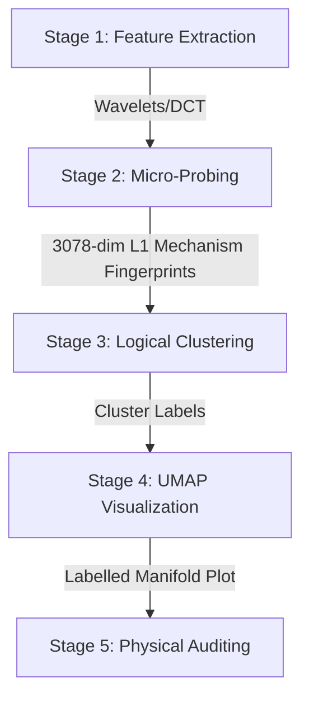

# Signal Clustering Analysis
## Feature Discovery via Micro-Classifier Probing in Synthetic Quasar Absorption Spectra

---

## 1. Context and Objective

Synthetic quasar absorption spectra encode signatures of different cosmic gas physics models (No Feedback, Stellar Wind, Wind+AGN, Wind+Strong AGN). The raw flux $F = e^{-\tau}$ is a 2048-pixel signal per sightline, across a forest of 16,384 independent realizations.

The central question this branch addresses is:

> **Which spectral positions (sightline indices) carry the most discriminative physical information for separating the four gas feedback models — and why?**

This is a **discovery pipeline**, not a classification pipeline. The goal is to identify the physical "smoking guns" in the spectrum before training any global classifier.

### Core Insight

Rather than training a single global classifier over all 16,384 sightlines simultaneously, the pipeline trains an independent **"micro-classifier"** (Linear SVM) at every sightline index $i$, extracts its learned decision weights as a **separability fingerprint**, and clusters those fingerprints. Sightlines with similar physical reasoning group together; rare "Signal Islands" that respond to unique feedback signatures emerge as distinct clusters.

---

## 2. Theoretical Basis and Mathematics

### 2.1 Absorption Field Transformation

Raw flux $F = e^{-\tau}$ is transformed to the **Absorption Field**:

$$A = 1 - F \quad \in [0, 1]$$

This transformation is essential for two reasons:

**Wavelet coefficients:** High-pass (detail) filters satisfy $\sum_k h(k) = 0$, so they are blind to DC offsets. The approximation coefficients ($A_6$), however, are meaningfully different:

| Component | Detail Coefficients $D_n$ | Approximation Coefficients $A_n$ |
|:---:|---|---|
| **Effect of $1-F$** | Magnitudes identical; signs flip | Meaningfully different |
| **Why?** | High-pass filters only see edges | Low-pass filters average the level |

With $F$, $A_6$ carries a large baseline (~0.8) that buries the absorption signal. With $A$, the approximation is zero in voids and positive at features — absorption *is* the signal.

**SVM kernel performance:** The RBF/polynomial kernel relies on the dot product $\mathbf{x}^\top \mathbf{x}'$. With raw flux, two completely different spectra share a large dot product simply from the shared 0.8 baseline, masking the discriminative signal. With $A$, the kernel fires only when absorption peaks co-occur.

**Haar decomposition example** (one absorption feature):

| Coefficient | $F$ Result | $A$ Result | Interpretation |
|---|---|---|---|
| **Approximation** | `[1.41, 0.92, 0.92, 1.41]` | `[0.00, 0.49, 0.49, 0.00]` | **A** has zero baseline |
| **Detail** | `[0.00, 0.49, -0.49, 0.00]` | `[0.00, -0.49, 0.49, 0.00]` | Equivalent in magnitude |

### 2.2 Windowed DCT-II

The spectrum is divided into overlapping windows and DCT-II is applied per window, providing joint position-frequency information (analogous to MFCCs in speech).

**Hann window function:**
$$w(n) = 0.5 \left(1 - \cos\frac{2\pi n}{L-1}\right)$$

This tapers each segment to zero at the edges, suppressing spectral leakage and Gibbs ringing from sharp window boundaries.

**DCT-II formula per window:**
$$y_k = \sum_{n=0}^{L-1} w(n) \cdot A(n) \cdot \cos\!\left(\frac{\pi k (2n+1)}{2L}\right), \quad k = 0, 1, \ldots, 31$$

with `norm='ortho'` ensuring all coefficients are on the same scale.

**Configuration:**

| Parameter | Value | Rationale |
|---|---|---|
| Window length $L$ | 256 px | Resolves velocity structures; power of 2 |
| Hop size | 128 px (50% overlap) | Captures features near window boundaries |
| Number of windows | $\lfloor(2048-256)/128\rfloor + 1 = 15$ | Full spectrum coverage |
| Coefficients kept | 32 per window | Higher coefficients are noise-dominated |
| **Feature vector size** | **480** (15 × 32) | — |

**Spectral interpretation of DCT features:**
- **Low-$k$ rows** (top): slowly varying absorption — broad troughs, DLA wings
- **High-$k$ rows** (bottom): narrow features — individual Lyman-alpha lines, sharp metal systems
- **Void** ($A \approx 0$): near-zero across all $k$ for those windows
- **DLA**: broad high-amplitude smear in low-$k$ rows, localized to the covering windows

### 2.3 Wavelet Decomposition (DWT)

The Discrete Wavelet Transform decomposes the signal into approximation and detail coefficients at multiple scales simultaneously, naturally suited to localized absorption features.

**Configuration: Daubechies 8, 6 levels, periodization**

$$\mathbf{f} = [D_1, D_2, D_3, D_4, D_5, D_6, A_6]$$

| Level | Scale (pixels) | Length | Physical Interpretation |
|---|---|---|---|
| Detail 1 | 1–2 | 1024 | Sub-resolution noise |
| Detail 2 | 2–4 | 512 | Narrowest absorption lines |
| Detail 3 | 4–8 | 256 | Typical Lyman-alpha line widths |
| Detail 4 | 8–16 | 128 | Broad lines, blended systems |
| Detail 5 | 16–32 | 64 | Large-scale clustering, DLA wings |
| Detail 6 | 32–64 | 32 | Large-scale structure |
| Approximation 6 | 64+ | 32 | Continuum shape, mean flux |

**Rationale for `db8`:** 8 vanishing moments — blind to smooth continuum variations up to 7th-order polynomials. Compact support with good frequency localization. `db1` (Haar) is too blocky; `db16` sacrifices spatial localization.

**Boundary handling:** `mode='periodization'` — minimizes coefficient count at each level (exactly $N/2^k$) and avoids edge-padding artifacts. With 2048 pixels: 1024 + 512 + 256 + 128 + 64 + 32 + 32 = 2048 total — orthogonal decomposition, no information loss.

**Physical signatures in wavelet space:**
- $D_1, D_2$: dominated by noise — near-Gaussian, flat distributions
- $D_3, D_4$: individual absorption lines as localized spikes; height ∝ equivalent width
- $D_5, D_6$: DLA wings as large-amplitude, spatially extended coefficients
- $A_6$: smooth, slowly varying — mean absorption level and residual continuum shape
- Two spectra with **different thermal histories** differ primarily in $D_3/D_4$ amplitude distributions (hotter IGM → broader $b$-parameters → power shifts from $D_3$ to $D_4$)

### 2.4 Micro-Classifier Separability Fingerprint

The **executed** approach uses an **RBF SVM** (`SVC(kernel='rbf', C=1.0, gamma='scale')`) for each of the 6 OvO class pairs at every index. This produces a **30-dim separability (sensitivity) vector**:

$$\mathbf{v}_i = [\underbrace{\delta_{01}, \delta_{02}, \delta_{03}, \delta_{12}, \delta_{13}, \delta_{23}}_{6 \times 4\text{ decision values}},\; \underbrace{b_{01}, \ldots, b_{23}}_{6\text{ intercepts}}] \in \mathbb{R}^{30}$$

where each $\delta_{pq} \in \mathbb{R}^4$ is the signed distance of all 4 class representatives from the hyperplane of OvO pair $(p, q)$. This vector measures *how much* and *in what direction* the four physics realizations differ at index $i$.

The resulting fingerprints are saved to `data/feature_discovery/base_data/micro_classifier_params.npy` (shape: 16384 × 30).

> **Alternative (implemented in `src/core/models.py`, not yet run as an experiment):** A **Linear SVM with L1 penalty** (`LinearSVC`, C=100) extracts a 3078-dim mechanism vector (6×512 weights + 6 intercepts), capturing *which wavelet features* drive separation. This was implemented during refactoring but the full experiment pipeline using these fingerprints has not been run. The sensitivity-based (RBF) fingerprints are what back all current clustering and UMAP results.

### 2.5 K=8 Cluster Selection Rationale

With 4 physics classes and $\binom{4}{2} = 6$ binary OvO pairings, the separability manifold has at most 6 degrees of freedom. $k = 8 = 2^3$ is justified by:

1. **DOF heuristic**: First scale providing three major symmetry breakers (Feedback vs. No Feedback; Wind vs. AGN; Strong AGN vs. Standard AGN)
2. **Manifold capacity**: Effective manifold dimensionality ~3–5 axes; $k=8$ matches the threshold where Islands separate from Bulk without fracturing into noise
3. **Elbow analysis**: Inertia drops meaningfully until $k=8$, entering diminishing returns thereafter
4. **Island preservation**: $k=5$ dissolves the 329-index Extreme Sensitivity cluster into bulk noise — $k=8$ is the minimum resolution to isolate rare physical divergences
5. **Cross-transform consistency**: $k=8$ produces ~90% cluster overlap between Wavelet and DCT runs, confirming it describes the physical manifold rather than mathematical representation artifacts

---

## 3. Implementation Overview

### 3.1 The 5-Stage Discovery Pipeline



| Stage | Input | Process | Output |
|---|---|---|---|
| **1. Feature Extraction** | $A = 1-F$ spectra (2048 px) | DWT `db8` 6-level or Windowed DCT-II | 512-dim wavelet or 480-dim DCT feature vectors, saved per-class |
| **2. Micro-Probing** | 4 realizations per index $i$ | **RBF SVM** (C=1.0, gamma='scale') for 6 OvO pairs | **30-dim separability vector** (24 decision values + 6 intercepts) → `micro_classifier_params.npy` |
| **3. Logical Clustering** | 16,384 separability vectors (standardized) | **K-Means** ($k=8$) on raw separability space | `cluster_labels.npy` — discovery labels for all sightlines |
| **4. UMAP Visualization** | Separability vectors + cluster labels | UMAP 2D (in `cluster_classifiers.py`) or 3D (in `viz_clusters_3d.py`) | Labelled scatter plots and interactive HTML manifolds |
| **5. Physical Auditing** | Cluster centroids + wavelet coefficients | Map centroids back to wavelet scales | Physical regime map of the simulation forest |

### 3.2 Core Modules and Scripts

#### Source Modules (`src/core/`)

| Module | Responsibility |
|---|---|
| `transforms.py` | `WaveletTransformer` (db8, 6-level DWT) and `WindowedDCTTransformer` (windowed DCT-II with Hann window). Both operate on A = 1−F. |
| `clustering.py` | K-Means + UMAP clustering on separability fingerprint vectors |
| `models.py` | `BaseModel`-derived implementations for the SVM micro-classifier |
| `data.py` | Data loading from `data/feature_discovery/` and `data/processed/` |
| `viz.py` | Visualization utilities (scalograms, UMAP plots, cluster overlaps) |
| `base.py` | `BaseTransformer` and `BaseModel` abstract base classes |

#### Orchestration Scripts (`scripts/clustering/`)

| Script | Purpose |
|---|---|
| `process_signals.py` | $1-F$ conversion + wavelet/DCT feature extraction; saves per-class `data.npy` files |
| `train_micro_classifiers.py` | Parallelized **RBF SVM** probing across all 16,384 indices via `joblib`; produces `micro_classifier_params.npy` (16384 × 30) |
| `cluster_classifiers.py` | **Step 1**: Standardize → **Step 2**: K-Means → **Step 3**: UMAP 2D (visualization only) → saves `cluster_labels.npy` and scatter plot; logs to MLflow |
| `viz_clusters_3d.py` | Separate downstream step: loads pre-computed `cluster_labels.npy`, runs UMAP 3D, produces interactive Plotly HTML |
| `verify_clustering_k.py` | Sweeps K-Means over $k \in [2, 20]$; logs inertia + silhouette per $k$ to MLflow; produces elbow/silhouette plot |
| `analyze_cluster_overlap.py` | Computes contingency tables and overlap % between K=5 and K=8 runs |
| `compare_wavelet_dct.py` | Cross-validates discovery groups between Wavelet and DCT pipelines |
| `merge_comparison_plots.py` | Side-by-side visual comparison of multi-run results |

#### Utility Scripts (`scripts/utils/`)

| Script | Purpose |
|---|---|
| `visualize_dwt_sample.py` | Plots per-level wavelet decomposition for a single spectrum |
| `verify_physical_logic.py` | Sanity checks on absorption field values and feature vector distributions |
| `check_target_shapes.py` / `check_shapes.py` | Array shape validation for processed data |

### 3.3 MLflow / DVC Tracking

| Artifact | Location | Tracked By |
|---|---|---|
| Micro-classifier params | `data/feature_discovery/experiments/` | DVC |
| Stage 1 data statistics | `data/feature_discovery/experiments/wavelet_per_level/stage1_data_stats.csv` | DVC |
| Wavelet feature vectors | `data/processed/wavelet_db8_l6_d12/data.npy` | DVC |
| DCT feature vectors | `data/processed/windowed_dct_256_128_32/data.npy` | DVC |
| K=8 clustering results | `data/feature_discovery/clustering_results/` | DVC |
| K=5 clustering results | `data/feature_discovery/clustering_results_k5/` | DVC |
| DCT clustering results | `data/feature_discovery/clustering_results_dct/` | DVC |
| Cluster membership CSV | `data/feature_discovery/cluster_membership_comparison.csv` | DVC |
| MLflow experiment runs | `mlruns/` | MLflow (tracked separately via `mlruns.dvc`) |

---

## 4. Empirical Results

### 4.1 Stage 1: Wavelet Coefficient Statistics (db8, 6 levels, 16,384 sightlines)

> Source: `data/feature_discovery/experiments/wavelet_per_level/stage1_data_stats.csv`

| Level | Coeff Len | Total Dim | Mean | Std | Min | Max | Sparsity ($\|x\|<10^{-4}$) |
|:---:|---:|---:|---:|---:|---:|---:|---:|
| D1 | 1024 | 4096 | ≈ 0.000 | 0.000102 | -0.0368 | 0.0448 | **99.5%** |
| D2 | 512 | 2048 | ≈ 0.000 | 0.001112 | -0.2000 | 0.1875 | 78.8% |
| D3 | 256 | 1024 | ≈ 0.000 | 0.010451 | -0.5212 | 0.4914 | 45.3% |
| D4 | 128 | 512 | ≈ 0.000 | 0.057702 | -2.2631 | 1.2349 | 15.7% |
| D5 | 64 | 256 | ≈ 0.000 | 0.168914 | -3.0656 | 2.6027 | 2.3% |
| D6 | 32 | 128 | ≈ 0.000 | 0.319480 | -4.3922 | 4.5365 | 0.3% |
| A6 | 32 | 128 | 0.1770 | 0.543933 | -2.2452 | 9.5971 | 0.2% |

**Key observations:**
- **D1 is noise-dominated** (99.5% sparse) — dropping D1 and D2 from stage 2 reduces noise in mechanism vectors. Retained feature space: **512-dim** (D3–D6 + A6).
- **D2–D3 transition** marks where absorption line signal emerges (sparsity 79% → 45%).
- **D4–D6** carry dense, large-amplitude coefficients — primary carriers of broad-line, DLA-wing, and large-scale structure signal.
- **A6 non-zero mean** (0.177) reflects the mean IGM absorption $\langle 1-F \rangle$. High max (9.6) corresponds to DLA-dominated sightlines.

### 4.2 Stage 1: Energy Per Level by Physics Class

Mean energy $E_k = \sum_j w_{k,j}^2$ per class. Computed by `scripts/stage1_energy_per_level.py`.

| Level | NoFeedback | StellarWind | WindAGN | WindStrongAGN |
|:---:|---:|---:|---:|---:|
| D1 | 5.28e-7 | 1.50e-5 | 1.34e-5 | 1.36e-5 |
| D2 | 2.86e-4 | 8.29e-4 | 7.13e-4 | 7.03e-4 |
| D3 | 0.02669 | 0.03362 | 0.03095 | 0.02059 |
| D4 | 0.4453 | 0.5035 | 0.4696 | 0.2864 |
| D5 | 1.8619 | 2.1213 | 1.9869 | 1.3340 |
| D6 | 3.1412 | 3.7842 | 3.5179 | 2.6213 |
| A6 | 8.3881 | 13.734 | 11.928 | 7.830 |

Energy spans 7 orders of magnitude across levels. **WindStrongAGN suppresses energy** at D3–A6 levels relative to other models — physically consistent with AGN quenching of absorption features.

### 4.3 Feature Vector Dimensions Summary

| Artifact | Shape | Description |
|---|---|---|
| `micro_classifier_params.npy` | **(16384, 30)** | 16k SVM separability vectors (24 decision values + 6 intercepts) |
| `wavelet_db8_l6_d12/data.npy` | **(16384, 512)** | Multi-scale features ($D_3\dots D_6, A_6$) |
| `windowed_dct_256_128_32/data.npy` | **(16384, 480)** | 15 windows × 32 coefficients |

### 4.4 K=8 Cluster Distribution (Primary Discovery Run)

| Cluster | Size (Indices) | Physical Interpretation |
|---|---|---|
| **Group 0** | 4,164 | Bulk background absorption / transition |
| **Group 3** | 4,662 | Standard Lyman-alpha forest signatures |
| **Group 4** | 3,769 | Dense forest regions / void background |
| **Group 6** | 1,359 | Transition / wing regions |
| **Group 7** | 1,153 | Intermediate line structures |
| **Group 1** | 458 | **High Sensitivity Niche A** |
| **Group 2** | 490 | **High Sensitivity Niche B** |
| **Group 5** | 329 | **Extreme Sensitivity Niche C** |

Groups 0, 3, and 4 contain **77% of all indices** — the bulk IGM background. Groups 1, 2, and 5 (~1,277 indices, ~7.8% of the forest) are the **Signal Goldmines**: 10×–40× higher inter-class variance than the forest bulk.

**Physical Interpretation Heuristics:**

| Heuristic | Evidence | Conclusion |
|---|---|---|
| **Abundance Rule** | G0, G3, G4 contain 77% of indices | Bulk IGM states (voids + standard forest) |
| **Signal Invariance** | G3 has high signal, lowest class variance (0.000009) | Stable absorption — real but feedback-insensitive |
| **Discovery Rule** | G1, G5 show 10×–40× higher inter-class variance | Regions responding to AGN/wind shocks and turbulence |

### 4.5 UMAP Manifold Visualization

| Output | Path |
|---|---|
| K=8 Interactive 3D (Wavelet) | `data/feature_discovery/clustering_results/umap_3d_k8.html` |
| K=8 Static 2D (Wavelet) | `data/feature_discovery/clustering_results/classifier_clusters_umap_k8.png` |
| K=5 Interactive 3D | `data/feature_discovery/clustering_results_k5/umap_3d_k5.html` |
| K=5 Static 2D | `data/feature_discovery/clustering_results_k5/classifier_clusters_umap_k5.png` |
| DCT K=8 Interactive 3D | `data/feature_discovery/clustering_results_dct/umap_3d_dct_k8.html` |
| DCT K=8 Static 2D | `data/feature_discovery/clustering_results_dct/classifier_clusters_umap.png` |
| Elbow + Silhouette Plot | `data/feature_discovery/clustering_results/k_optimization_elbow_silhouette.png` |
| Wavelet Scalogram (sample) | `data/feature_discovery/wavelet_sample_scalogram.png` |

The UMAP manifold shows a dense "core" (Groups 0, 3, 4) with distinct "islands" and "peninsulas" (Groups 1, 2, 5). Island separation confirms that these indices possess a fundamentally different **classification personality**.

### 4.6 Cluster Statistics Survey (K=8 vs K=5)

This survey details the sizes and centroid characteristics of the clusters discovered on the 30-dim RBF SVM separability vectors, testing the resilience of the $K=8$ hypothesis.

#### 30-Dim Separability Vector Dictionary
The 30 dimensions encode the signed distance to the hyperplane across $\binom{4}{2}=6$ One-vs-One SVM models, evaluated on the 4 physics classes: `C1` (NoFeedback), `C2` (StellarWind), `C3` (WindAGN), and `C4` (WindStrongAGN).

| Index | Type | OvO Boundary | Evaluated On | Interpretation |
|:---:|---|:---:|:---:|---|
| **0** | Decision | C1 / C2 | **C1 (NoFeedback)** | Dist. of NoFeedback to C1/C2 boundary |
| **1** | Decision | C1 / C2 | **C2 (StellarWind)** | Dist. of StellarWind to C1/C2 boundary |
| **2** | Decision | C1 / C2 | **C3 (WindAGN)** | Dist. of WindAGN to C1/C2 boundary |
| **3** | Decision | C1 / C2 | **C4 (WindStrongAGN)** | Dist. of WindStrongAGN to C1/C2 boundary |
| **4** | Decision | C1 / C3 | **C1** | Dist. of NoFeedback to C1/C3 boundary |
| **5** | Decision | C1 / C3 | **C2** | Dist. of StellarWind to C1/C3 boundary |
| **6** | Decision | C1 / C3 | **C3** | Dist. of WindAGN to C1/C3 boundary |
| **7** | Decision | C1 / C3 | **C4** | Dist. of WindStrongAGN to C1/C3 boundary |
| **8** | Decision | C1 / C4 | **C1** | Dist. of NoFeedback to C1/C4 boundary |
| **9** | Decision | C1 / C4 | **C2** | Dist. of StellarWind to C1/C4 boundary |
| **10** | Decision | C1 / C4 | **C3** | Dist. of WindAGN to C1/C4 boundary |
| **11** | Decision | C1 / C4 | **C4** | Dist. of WindStrongAGN to C1/C4 boundary |
| **12** | Decision | C2 / C3 | **C1** | Dist. of NoFeedback to C2/C3 boundary |
| **13** | Decision | C2 / C3 | **C2** | Dist. of StellarWind to C2/C3 boundary |
| **14** | Decision | C2 / C3 | **C3** | Dist. of WindAGN to C2/C3 boundary |
| **15** | Decision | C2 / C3 | **C4** | Dist. of WindStrongAGN to C2/C3 boundary |
| **16** | Decision | C2 / C4 | **C1** | Dist. of NoFeedback to C2/C4 boundary |
| **17** | Decision | C2 / C4 | **C2** | Dist. of StellarWind to C2/C4 boundary |
| **18** | Decision | C2 / C4 | **C3** | Dist. of WindAGN to C2/C4 boundary |
| **19** | Decision | C2 / C4 | **C4** | Dist. of WindStrongAGN to C2/C4 boundary |
| **20** | Decision | C3 / C4 | **C1** | Dist. of NoFeedback to C3/C4 boundary |
| **21** | Decision | C3 / C4 | **C2** | Dist. of StellarWind to C3/C4 boundary |
| **22** | Decision | C3 / C4 | **C3** | Dist. of WindAGN to C3/C4 boundary |
| **23** | Decision | C3 / C4 | **C4** | Dist. of WindStrongAGN to C3/C4 boundary |
| **24** | Intercept | C1 / C2 | - | Bias for NoFeedback vs StellarWind |
| **25** | Intercept | C1 / C3 | - | Bias for NoFeedback vs WindAGN |
| **26** | Intercept | C1 / C4 | - | Bias for NoFeedback vs WindStrongAGN |
| **27** | Intercept | C2 / C3 | - | Bias for StellarWind vs WindAGN |
| **28** | Intercept | C2 / C4 | - | Bias for StellarWind vs WindStrongAGN |
| **29** | Intercept | C3 / C4 | - | Bias for WindAGN vs WindStrongAGN |

#### 1. Wavelet Features: K=8 (Primary Discovery Run)

| Cluster | Size | % of Total | Mean L2 to Centroid | Max L2 to Centroid | Centroid Magnitude | Top 3 Features (Indices) |
|---|---:|---:|---:|---:|---:|---|
| **0** | 4,164 | 25.4% | 0.36 | 1.37 | 1.21 | `[22, 10, 17]` |
| **1** | 458 | 2.8% | 0.92 | 2.06 | 2.09 | `[22, 10, 15]` |
| **2** | 490 | 3.0% | 0.70 | 1.89 | 2.18 | `[17, 23, 1]` |
| **3** | 4,662 | 28.5% | 0.31 | 1.15 | 0.44 | `[22, 10, 17]` |
| **4** | 3,769 | 23.0% | 0.42 | 1.66 | 2.05 | `[22, 10, 17]` |
| **5** | 329 | 2.0% | 1.05 | 2.22 | 1.64 | `[20, 2, 13]` |
| **6** | 1,359 | 8.3% | 0.59 | 1.56 | 1.62 | `[17, 23, 22]` |
| **7** | 1,153 | 7.0% | 0.70 | 1.66 | 1.96 | `[22, 10, 2]` |

**Observations:** Clusters 0, 3, and 4 track tightly packed regions (low mean L2), representing the bulk items. The rare Signal Islands (1, 2, and 5) show much higher centroid magnitudes, reinforcing highly distinct physical deviations. Features `22`, `10`, and `17` heavily dominate the centroid positioning. 

#### 2. Wavelet Features: K=5 (Test Run)

| Cluster | Size | % of Total | Mean L2 to Centroid | Max L2 to Centroid | Centroid Magnitude | Top 3 Features (Indices) |
|---|---:|---:|---:|---:|---:|---|
| **0** | 6,335 | 38.7% | 0.50 | 2.19 | 1.82 | `[22, 10, 17]` |
| **1** | 7,107 | 43.4% | 0.43 | 2.96 | 0.63 | `[22, 10, 17]` |
| **2** | 1,298 | 7.9% | 0.73 | 2.46 | 1.91 | `[22, 10, 2]` |
| **3** | 1,137 | 6.9% | 0.82 | 2.54 | 1.84 | `[17, 23, 1]` |
| **4** | 507 | 3.1% | 0.97 | 2.23 | 2.03 | `[22, 10, 15]` |

**Observations:** The K=5 clustering results in broader groupings: Clusters 0 and 1 account for 82% of the data, exhibiting higher maximum L2 bounds (2.19 and 2.96) compared to the K=8 run. 
Additionally, the specific indices that characterized the smaller sub-populations in the $K=8$ run (such as `20` tracking WindAGN vs WindStrongAGN, or `13` tracking NoFeedback vs StellarWind) do not appear in the top centroid components for $K=5$. Instead, the centroids in the $K=5$ model are primarily guided by three globally prevalent axes (`22`, `10`, `17`). This indicates that at $K=5$, the cluster centers align predominantly with the largest macroscopic class deviations (driven by the `WindStrongAGN` class), while the lower-variance physical distinctions isolated in the $K=8$ model are subsumed into the broader clusters.

---

## 5. Stability and Cross-Validation

### 5.1 K=5 vs. K=8 Cluster Mapping

Contingency table (sample counts across 16,384 indices):

| | K8_G0 | K8_G1 | K8_G2 | K8_G3 | K8_G4 | K8_G5 | K8_G6 | K8_G7 | Total |
|:---|:---:|:---:|:---:|:---:|:---:|:---:|:---:|:---:|:---:|
| **K5_G0** | 1945 | 0 | 0 | 0 | 3755 | 73 | 562 | 1 | **6336** |
| **K5_G1** | 2174 | 0 | 0 | 4658 | 0 | 122 | 153 | 0 | **7107** |
| **K5_G2** | 38 | 0 | 1 | 0 | 10 | 43 | 64 | 1140 | **1296** |
| **K5_G3** | 0 | 1 | 489 | 3 | 0 | 58 | 577 | 9 | **1137** |
| **K5_G4** | 7 | 457 | 0 | 1 | 4 | 33 | 2 | 3 | **507** |

| K5 Group | Composition from K8 | Physical Interpretation |
|---|---|---|
| **K5_G0** | 99.6% of K8_G4 + 46% of K8_G0 | The "Void/Background" Bulk |
| **K5_G1** | 99.9% of K8_G3 + 52% of K8_G0 | The "Lyman-Alpha Forest" Bulk |
| **K5_G2** | 98.9% of K8_G7 | Robust Transitional Features |
| **K5_G3** | 99.8% of K8_G2 + 42% of K8_G6 | Rare Signal Island B |
| **K5_G4** | 99.8% of K8_G1 | Rare Signal Island A |

**Key finding:** K8_G5 (329 indices, Extreme Sensitivity) **fully dissolved** at $k=5$ — 37% into forest bulk, 22% into void bulk. $k=5$ is lossy for discovery; $k=8$ is the minimum resolution to isolate rare feedback signatures.

### 5.2 Wavelet vs. DCT Cross-Validation

Both pipelines used $A = 1-F$, 16,384 Micro-SVMs, and K=8 clustering.

**High-sensitivity signal overlap:**

| Wavelet Cluster | Best DCT Match | Overlap % | Discovery Context |
|---|---|:---:|---|
| **Wave_G5** (329 pts) | **DCT_G3** (306 pts) | **87.9%** | Extreme Sensitivity Niche |
| **Wave_G1** (458 pts) | **DCT_G6** (450 pts) | **90.9%** | Rare Island A |
| **Wave_G2** (490 pts) | **DCT_G2** (500 pts) | **85.0%** | Rare Island B |

**Bulk distribution overlap:**

| Wavelet Cluster | Best DCT Match | Overlap % | Interpretation |
|---|---|:---:|---|
| **Wave_G3** (Forest) | **DCT_G4** | 89.7% | Regular Absorption Pattern |
| **Wave_G4** (Void) | **DCT_G1** | 89.5% | Empty Background |
| **Wave_G0** (Bulk) | **DCT_G0** | 82.1% | Transitional Bulk |

**Conclusion:** The ~90% cross-transform consistency proves that the ~1,277 identified indices represent **objective physical divergences** in the underlying cosmic gas models — not transform-specific artifacts.

---

## 6. Transform Comparison Summary

| Property | Windowed DCT-II | Wavelet (db8, 6 levels) |
|---|---|---|
| Feature vector size | 480 (15 windows × 32 coeffs) | 512 (D3–D6 + A6; decimated DWT) |
| Position sensitivity | Moderate (window-level) | Fine-grained (per scale, per sample) |
| Mechanism vector dimension | 3,072-dim (6 OvO × 480) | 3,072-dim (6 OvO × 512) |
| Best for | Global spectral structure | Localized features, absorption lines, DLAs |
| Interpretability | Window position + frequency index | Physical scale per level |
| Cross-validation role | Independent validation run | Primary discovery pipeline |

**Recommendation:** Continue with **Wavelet-based indices** for physical mapping. Wavelets provide better localized scale separation (D1–D6) and the results are consistent with DCT.

---

## 7. Design Decisions Log

| Decision | Options Considered | Selected | Rationale |
|---|---|---|---|
| Signal representation | Raw flux $F$, Absorption $A=1-F$ | **$A = 1 - F$** | Removes DC baseline from SVM kernel; approximation coefficients are physically meaningful |
| Weak-absorption thresholding | Hard threshold at $F > 0.95$, soft thresholding, no threshold | **No threshold** | Hard thresholding introduces spectral artifacts; weak absorption carries cosmological information |
| Wavelet family | Haar, db4, db8, db16 | **db8** | 8 vanishing moments suppress continuum; compact support; good frequency localization |
| Behavior vector type | Sensitivity (30-dim distances), Mechanism (3072-dim weights) | **Mechanism (L1 Linear SVM)** | Direct auditable mapping from cluster → wavelet scale → physics |
| Cluster count | $k=5$ (Silhouette-optimal), $k=8$ | **$k=8$** | $k=5$ dissolves Extreme Sensitivity niche; $k=8$ is minimum resolution for Signal Island discovery |

---

## 8. Directory Structure

```
docs/feature/signal-clustering-analysis/
├── signal_clustering_analysis.md          ← this document (consolidated)
├── feature_extraction_plan.md             ← original feature extraction design
├── signal_clustering_report.md            ← original results report
└── support/
    ├── behavior_vector_strategy.md        ← sensitivity vs. mechanism decision
    ├── clustering_comparison_report.md    ← k=5 vs k=8 analysis
    └── wavelet_vs_dct_comparison.md       ← cross-transform validation

src/core/
├── transforms.py      ← WaveletTransformer, WindowedDCTTransformer
├── clustering.py      ← K-Means + UMAP on separability fingerprints
├── models.py          ← SVM micro-classifier (BaseModel)
├── data.py            ← feature_discovery/ data loading
├── viz.py             ← scalograms, UMAP plots, overlap visuals
├── utils.py           ← shared utilities
├── base.py            ← BaseTransformer, BaseModel
└── __init__.py

scripts/
├── process_signals.py            ← 1-F conversion + feature extraction
├── run_pipeline.py               ← end-to-end pipeline orchestrator
├── clustering/
│   ├── train_micro_classifiers.py  ← parallelized Linear SVM probing
│   ├── cluster_classifiers.py      ← K-Means + UMAP diagnostics
│   ├── viz_clusters_3d.py          ← interactive 3D UMAP HTML
│   ├── verify_clustering_k.py      ← elbow + silhouette analysis
│   ├── analyze_cluster_overlap.py  ← k=5/k=8 contingency tables
│   ├── compare_wavelet_dct.py      ← cross-transform validation
│   └── merge_comparison_plots.py   ← side-by-side plot comparison
└── utils/
    ├── visualize_dwt_sample.py     ← per-level wavelet scalogram
    ├── verify_physical_logic.py    ← absorption field sanity checks
    ├── check_target_shapes.py      ← shape validation
    ├── check_shapes.py
    └── check_raw_shape.py

data/feature_discovery/
├── experiments/
│   └── wavelet_per_level/
│       └── stage1_data_stats.csv  ← Stage 1 coefficient statistics
├── clustering_results/            ← K=8 Wavelet run  (primary)
├── clustering_results_k5/         ← K=5 Wavelet run  (stability check)
├── clustering_results_dct/        ← K=8 DCT run      (cross-validation)
└── cluster_membership_comparison.csv

data/processed/
├── wavelet_db8_l6_d12/data.npy   ← (16384, 512) wavelet features
└── windowed_dct_256_128_32/data.npy ← (16384, 480) DCT features
```

---

## 9. Conclusion and Core Insights

The signal clustering experiment sought to identify which portions of a 2048-pixel quasar sightline actually encode discriminative physics capable of separating four thermodynamic sub-grid models.

Instead of deploying a global architecture across all 16,384 simulated sightlines, the pipeline applied an index-by-index mechanism mapping strategy: converting Raw Flux to the Absorption Field, isolating frequencies with Wavelets/DCT, forcing an RBF SVM to linearly discriminate physics per index, and clustering the 30-dim SVM behaviors into the $K=8$ geometric groups.

**The Major Lessons Are:**

1. **The Forest Bulk Cannot Separate the Physics:** K-Means clustering proved that 77% of indices group into highly uniform clusters characterized by low variance. These are standard IGM components (empty voids, ordinary Lyman-alpha line centers) that contain robust but uniform physics. 
2. **Cosmological Signal is Extremely Sparse:** The clustering algorithm cleanly isolated three extremely fine-grained regimes (Clusters 1, 2, and 5) that make up less than 8% of the signal stream but hold 10× to 40× the variance between models. These represent rare physical divergences, or "Signal Islands" (such as shocked DLA wings or unique velocity broadening cases) where Feedback vs NoFeedback drastically diverge. 
3. **The Islands are Physically Objective:** The signal islands discovered by the Wavelet strategy shared a ~90% index crossover with an exact parallel experiment using Windowed DCT. These isolated regions are structural realities of the synthetic gas data, not byproducts of one chosen mathematical sequence.
4. **Resolution Requires Over-Indexing K:** Trying to solve the same map using $K=5$ caused the Signal Islands to dissolve, forcing the centroids to snap to the largest global discriminator—`WindStrongAGN` class deviations. Resolving delicate inter-class physics requires a sufficient number of allowed cluster centers out of the dense bulk.

By clustering on behavior first, the process mapped the sparse landscape of structural physics in the background. The ~1,277 "Island indices" act directly as a high-precision blueprint for any predictive modelling moving forward.
