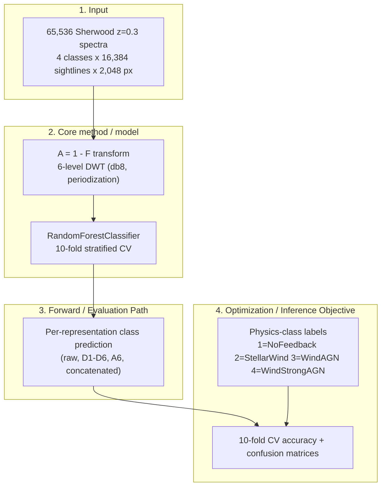

# LEDGER — baseline-random-forest

Reconstructed from repo artifacts. Every number, date, and run_id below traces to a file read in this repo
(`docs/feature/baseline-random-forest/baseline_rf_analysis.md`, `results/baseline_rf/`, and the MLflow
`Baseline_RF` experiment under `mlruns/634190318481942261/`). Unverifiable fields are marked
`not recorded in repo`.

## **Architecture Diagram (Mermaid)**

---

## 1. The Pulse (Progress & Roadmap)

Track status: **COMPLETED / HISTORICAL**. Branch `feature/baseline-random-forest`, tag `v0.2-baseline-rf`
(per the analysis doc). Superseded by the signal-clustering work.

| Stage | Focus Area | Status | Target Metric | Paper Section |
|:--- |:--- |:--- |:--- |:--- |
| **Stage 1** | Data prep — 65,536 spectra, A=1-F transform, 6-level db8 DWT | ✅ **DONE** | Representations materialized (raw, D1-D6, A6, concat) | not recorded in repo |
| **Stage 2** | RF training — 10-fold stratified CV per representation | ✅ **DONE** | CV accuracy recorded per representation | not recorded in repo |
| **Stage 3** | Evaluation — confusion matrices + accuracy summary | ✅ **DONE** | 9 confusion matrices + summary bar chart produced | not recorded in repo |
| **Stage 4** | Finding handoff — identify discriminative representation, motivate signal clustering | ✅ **DONE** | Resolution-gap finding documented | not recorded in repo |

### ✅ Completed Milestones
- **2026-02-27**: MLflow `Baseline_RF` experiment created (experiment_id `634190318481942261`,
  creation_time 2026-02-27T22:37:43 UTC) — earliest verifiable timestamp for this track.
- **Date not recorded in repo**: 10-fold CV completed across all 9 representations; raw spectra best at 0.4514.
- **Date not recorded in repo**: Confusion matrices + `baseline_summary.png` written to `results/baseline_rf/`
  (filesystem mtime 2026-04-03, which reflects checkout/sync, not the original run).
- **Date not recorded in repo**: "Resolution gap" finding documented; motivated the signal-clustering approach.

---

## 2. Methodology & Architecture

### Random Forest baseline classifier
- Source: `docs/feature/baseline-random-forest/baseline_rf_analysis.md`.
- **Model**: `RandomForestClassifier` evaluated with 10-fold stratified cross-validation.
  Hyperparameters (n_estimators, max_depth, etc.): **not recorded in repo**.
- **Input**: 65,536 spectra = 4 physics classes x 16,384 sightlines x 2,048 pixels.
- **Transform**: absorption field A = 1 - F, then a 6-level discrete wavelet transform (db8 wavelet,
  periodization mode). For the A=1-F and wavelet theory the doc cross-references
  `docs/feature/signal-clustering-v1/feature_extraction_plan.md`.
- **Representations classified** (9 total): Raw Spectra; Concatenated Wavelet; per-level detail
  coefficients D1-D6; approximation coefficients A6.
- **Output**: per-representation class prediction over the 4 feedback classes; reported as CV accuracy
  and confusion matrices.

### Physics classes
- 1 = NoFeedback, 2 = StellarWind, 3 = WindAGN, 4 = WindStrongAGN.

### Legacy / code provenance
- The original training script (`scripts/baseline/train_rf_baseline.py`) and the model class
  `src/core/models.py:BaselineRFClassifier` were **removed during cleanup** (per the doc's Legacy Notes).
  Verified in this reconstruction: `src/core/models.py` does **not** exist on disk and the
  `BaselineRFClassifier` symbol is **not** present anywhere under `src/` or `scripts/`.
- The baseline is superseded by the v2 pipeline's per-cluster RF in `src/core/models/rf_classifier.py`
  (this file exists on disk).

---

## 3. The Logic (Decision Log)

- **[D-01] Use Random Forest as the classification baseline**: RF over raw spectra and per-level wavelet
  coefficients establishes a benchmark that validates multi-scale sensitivity and sets the performance
  floor for future methods (analysis doc, Objective).
- **[D-02] Transform flux to absorption A = 1 - F before wavelet decomposition**: classification operates
  on the absorption field rather than raw transmitted flux (analysis doc, Method).
- **[D-03] Use 6-level db8 DWT with periodization**: provides per-scale detail bands D1-D6 plus an
  approximation band A6, enabling a per-scale sensitivity sweep (analysis doc, Method).
- **[D-04] Evaluate with 10-fold stratified cross-validation**: per-representation CV accuracy + std dev
  is the gating comparison metric (analysis doc, Results table; corroborated by MLflow `fold_0..9_acc`,
  `mean_accuracy`, `std_accuracy` metrics on each run).
- **[D-05] Track with MLflow nested parent-child runs**: experiment "Baseline_RF" with a parent run and
  one child run per representation (analysis doc; verified parent run_id `eb8d7bc738b6497c881492049715893c`
  referenced by the 9 child runs).
- **[D-06] Pivot from global classification to signal clustering**: because accuracy peaks at D1 and decays
  to D6, the discriminative signal lives in high-frequency morphology; rather than train a global
  classifier, identify which spectral positions carry the signal and classify within those regions
  (analysis doc, Key Finding). This is the forward connection to the signal-clustering track.

---

## 4. The Data (Lineage & Governance)

**Primary data source**: Sherwood simulation, z=0.3. 65,536 spectra (4 physics classes x 16,384 sightlines
x 2,048 pixels). Upstream URI / DVC hash: **not recorded in repo** (this LEDGER documents only the
baseline track outputs; raw-data lineage lives in the DVC-managed `data/` tree, not cited in the doc).

| Implementation Area | Primary Data File | Tracking Metadata |
|:--- |:--- |:--- |
| Raw flux input | (Sherwood z=0.3 spectra) | shape 65,536 x 2,048; exact path not recorded in this doc |
| MLflow experiment | `mlruns/634190318481942261/` | experiment_id `634190318481942261`, name `Baseline_RF`, created 2026-02-27T22:37:43 UTC |
| Parent run | (MLflow nested parent) | run_id `eb8d7bc738b6497c881492049715893c` (referenced by children; parent dir not present on disk) |
| RF — Raw Spectra | child run | run_id `de9a1c8b87da4eecb614ce55cba3635f` (additional un-parented re-runs: `67deed07...`, `c1bba05f...`, `eba6c9ef...`) |
| RF — Concatenated Wavelet | child run | run_id `e244d5221ebf4e818a1311ffa393865b` |
| RF — Wavelet D1 | child run | run_id `82d7421e7f5b406a937eb93139a0d5ea` |
| RF — Wavelet D2 | child run | run_id `d7eafafc6e5643e9af047f5143f89102` |
| RF — Wavelet D3 | child run | run_id `aa759eab4a844a3781c1424b37559bf1` |
| RF — Wavelet D4 | child run | run_id `b4df236c868c452db42b5c5c5e282cf4` |
| RF — Wavelet D5 | child run | run_id `30341fe4a2cd46128bc5562dad1497ce` |
| RF — Wavelet D6 | child run | run_id `895d55c283e645d1b4483b5dd813d98c` |
| RF — Wavelet A6 | child run | run_id `08a22ac362944cceac2f3c208b8b8460` (un-parented duplicate: `17dd9689...`) |
| Baseline Summary Report | MLflow run | run_id `a03dc38f86654d8c987bb53120371199` |

### Responsibility Matrix
- **Infrastructure Manager**: lock binary volumes (read-only), manage the artifact-versioning remote and the MLflow registry.
- **Data Engineer**: validate loader coordinate scaling and physical/empirical ranges.
- **PI Orchestrator**: scientific sign-off on snapshots and settings selected for optimization.

---

## 5. Evaluation Plan

### Primary metric (the gating set)
- **10-fold stratified CV accuracy (mean ± std)** per representation — the comparison metric reported in
  the analysis doc and stored per run in MLflow (`mean_accuracy`, `std_accuracy`, `fold_0..9_acc`).

Results (from `baseline_rf_analysis.md`; D1 spot-checked against MLflow run
`82d7421e...` → mean 0.3232, std 0.0031, exact match):

| Experiment | Accuracy | Std Dev |
|:--- |:--- |:--- |
| **RF — Raw Spectra** | **0.4514** | 0.0023 |
| RF — Concatenated Wavelet | 0.3139 | 0.0030 |
| RF — Wavelet D1 | 0.3232 | 0.0031 |
| RF — Wavelet D2 | 0.2946 | 0.0031 |
| RF — Wavelet D3 | 0.2745 | 0.0043 |
| RF — Wavelet D4 | 0.2334 | 0.0028 |
| RF — Wavelet D5 | 0.2154 | 0.0021 |
| RF — Wavelet D6 | 0.2094 | 0.0031 |
| RF — Wavelet A6 | 0.2177 | 0.0015 |

### Diagnostic metrics (tracked but non-gating)
- Per-class confusion matrices for each representation (one PNG each — see §6).

### Headline finding ("The Resolution Gap")
- Accuracy peaks at D1 (~0.32) and drops monotonically to D6 (~0.21) → the classification signal resides
  in **high-frequency morphology**.
- Raw spectra remain superior (0.4514), suggesting fixed-basis db8 wavelets lose localized information vs.
  learnable convolutional filters.
- Forward connection: this motivated the signal-clustering approach — locate discriminative spectral
  positions, then classify within those regions (doc, Key Finding section).

### Validation datasets
- Training/dev: 10-fold stratified CV over the full 65,536-spectrum set.
- OOD / held-out generalization split: **not recorded in repo**.

---

## 6. Visualization & Artifacts

All artifacts live in `results/baseline_rf/` (verified on disk; no `.csv` score files present —
accuracy numbers exist only in the analysis doc and in MLflow metric files).

| Artifact | File | Takeaway |
|:--- |:--- |:--- |
| Accuracy comparison bar chart | `results/baseline_rf/baseline_summary.png` | Summary across all representations; raw spectra highest (per doc). |
| Confusion matrix — Raw Spectra | `results/baseline_rf/cm_rf_-_raw_spectra.png` | Per-class confusion for the best (0.4514) representation. |
| Confusion matrix — Concatenated Wavelet | `results/baseline_rf/cm_rf_-_concatenated_wavelet.png` | takeaway not stated in doc |
| Confusion matrix — Wavelet D1 | `results/baseline_rf/cm_rf_-_wavelet_d1.png` | Best wavelet level (~0.32); high-frequency signal. |
| Confusion matrix — Wavelet D2 | `results/baseline_rf/cm_rf_-_wavelet_d2.png` | takeaway not stated in doc |
| Confusion matrix — Wavelet D3 | `results/baseline_rf/cm_rf_-_wavelet_d3.png` | takeaway not stated in doc |
| Confusion matrix — Wavelet D4 | `results/baseline_rf/cm_rf_-_wavelet_d4.png` | takeaway not stated in doc |
| Confusion matrix — Wavelet D5 | `results/baseline_rf/cm_rf_-_wavelet_d5.png` | takeaway not stated in doc |
| Confusion matrix — Wavelet D6 | `results/baseline_rf/cm_rf_-_wavelet_d6.png` | Lowest detail-band accuracy (~0.21); coarsest scale. |
| Confusion matrix — Wavelet A6 | `results/baseline_rf/cm_rf_-_wavelet_a6.png` | Approximation band (~0.22). |

(9 confusion-matrix PNGs + 1 summary PNG = 10 files, matching the directory listing.)

---

## 7. Session History & Next Handoff

### **Session Snapshot: LEDGER reconstruction — 2026-05-26**
- Reconstructed this LEDGER from `baseline_rf_analysis.md`, the `results/baseline_rf/` figure set, and the
  MLflow `Baseline_RF` experiment (`mlruns/634190318481942261/`).
- Verified the legacy `BaselineRFClassifier` and `scripts/baseline/train_rf_baseline.py` are removed
  (consistent with the doc's Legacy Notes); the surviving RF code is `src/core/models/rf_classifier.py`.
- Cross-checked one accuracy (Wavelet D1) between the doc (0.3232 ± 0.0031) and MLflow metrics — exact match.

### **Original track activity (historical)**
- MLflow `Baseline_RF` experiment created 2026-02-27; 14 runs recorded (9 canonical children under parent
  `eb8d7bc7...`, plus a Baseline Summary Report run and 4 un-parented re-runs).
- Exact training dates beyond the experiment creation timestamp: **not recorded in repo**
  (figure file mtimes of 2026-04-03 reflect checkout/sync, not the original run).

### **Immediate Next Steps**
- None for this completed track. Forward work is the signal-clustering line (see [D-06]).

### **Blockers**
- None.

---

### Reconstruction gaps — "not recorded in repo"
- RF hyperparameters (n_estimators, max_depth, criterion, random seed).
- Exact original training dates (only the MLflow experiment creation timestamp, 2026-02-27, is verifiable).
- Raw-data upstream URI / DVC hash and on-disk path for the 65,536-spectrum input.
- Held-out / OOD generalization split (only 10-fold CV is documented).
- Per-CM takeaways for representations not called out in the doc (D2-D5, concatenated wavelet).
- No `.csv` score file exists; accuracies come from the analysis doc and MLflow metric files only.
