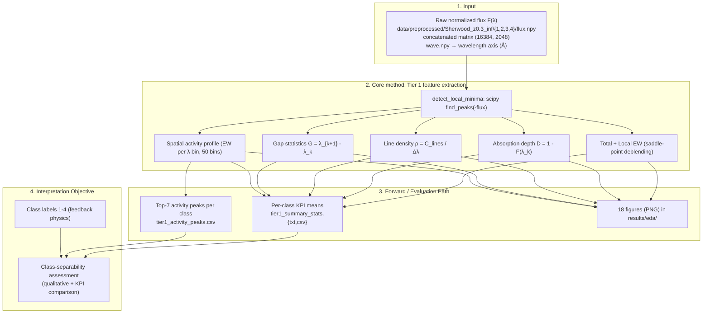

# LEDGER — eda-sherwood

> Exploratory Data Analysis of the Sherwood simulation (z=0.3), Tier 1 spectral
> features across 4 physics feedback classes (1=NoFeedback, 2=StellarWind,
> 3=WindAGN, 4=WindStrongAGN). Reconstructed from repo artifacts; every figure,
> table, and number below traces to a file actually present in the repo.

## Architecture Diagram (Mermaid)

---

## 1. The Pulse (Progress & Roadmap)

| Stage | Focus Area | Status | Target Metric | Paper Section |
|:--- |:--- |:--- |:--- |:--- |
| **Stage 1** | Data ingestion & shape audit (`value_print.txt`) | ✅ **DONE** | Flux matrix shape confirmed (16384, 2048) | EDA report §1 |
| **Stage 2** | Tier 1 feature extraction (EW, depth, density, gap, activity) | ✅ **DONE** | 5 KPI means computed per class | EDA report §3, §11 |
| **Stage 3** | Visualization playbook (representative spectra, greyscale stacks, 2x2 panels) | ✅ **DONE** | 18 figures generated in `results/eda/` | EDA report §2–§12 |
| **Stage 4** | Findings & class-separability conclusions | ✅ **DONE** | Class hierarchy documented (2≈3>1>>4) | EDA report §13 |

### ✅ Completed Milestones
- **2026 (date not recorded in repo as a milestone log)**: Tier 1 EDA completed for all 4 Sherwood z=0.3 classes; KPI table, top-7 activity peaks, and 18 figures produced. (Artifact file mtimes: figures/CSVs 2026-03-22; `tier1_summary_stats.txt` and `value_print.txt` 2026-04-03; `EDA_report.md` 2026-04-03 — these are filesystem timestamps, not a recorded experiment date.)

---

## 2. Methodology & Architecture

### Tier 1 feature extractor (`scripts/eda_sherwood.py`)
- Loads concatenated flux via `src.core.data.DataIngestor(base_path, filename="flux.npy", num_classes=4)`; wavelength axis read from `data/preprocessed/Sherwood_z0.3_inf/1/wave.npy` (falls back to pixel indices if absent).
- Absorption-line centers found with `scipy.signal.find_peaks(-flux)` (local minima of flux).
- Constants: `ABS_THRESH = 0.05`, `EPS = 1e-12`.
- 50 wavelength bins (`np.linspace(λmin, λmax, 51)`) used for the spatial activity profile.
- Input: normalized flux `F(λ)` per sightline, `F=1.0` continuum, `F=0.0` total absorption (per `TIER1_METRIC_DEFINITIONS.md`).
- Output: per-class KPI means (CSV/TXT), top-7 activity peaks (CSV), and 18 PNG figures.

### Metric definitions (from `results/eda/TIER1_METRIC_DEFINITIONS.md`)
- **Total EW**: `EW_total = ∫ (1 - F(λ)) dλ` over the full spectral range.
- **Local EW**: `EW_local,k = ∫_{λ_L}^{λ_R} (1 - F) dλ`, bounds set by neighboring saddle points (local maxima) — the "Saddle Point Splitting" deblending.
- **Depth**: `D_k = 1 - F(λ_k)` at each local minimum.
- **Line density**: `ρ = C_lines / (λ_max - λ_min)`.
- **Gap**: `G_j = λ_{k+1} - λ_k` between adjacent minima.
- Class-level KPIs are means over all spectra in a class (formulas in the definitions doc §3).

### Deblending (Saddle Point Splitting)
- Implemented in `local_equivalent_widths()`: between adjacent minima the integration boundary is placed at the local flux maximum (`np.argmax` of the inter-minimum segment); outer edges walk outward while `flux < 1.0`. Integrand is `1.0 - flux` via `np.trapezoid` (no clamping; noted in code comments).

### Coordinate / unit convention
- Wavelength axis in Ångström (Å), sourced from `wave.npy` (loader source-of-truth: `scripts/eda_sherwood.py` lines 171–177).
- All logarithmic plot scales use **base 2** (`set_xscale('log', base=2)`), per the report's "Log Base 2" refinement (EDA report §1).

---

## 3. The Logic (Decision Log)

- **[D-01] Base-2 log scaling on all log axes**: All log scales use base 2 "for clearer interpretation of doubling/halving trends" (EDA report §1; implemented as `base=2` throughout the script).
- **[D-02] Saddle-point deblending for local EW**: Overlapping absorption features are split at the local-maximum (saddle) flux point between adjacent minima, to avoid the "mega-feature" problem of overlapping lines artificially inflating EW (EDA report §5; `local_equivalent_widths()` in the script).
- **[D-03] Top-7 local maxima reported per class activity profile**: The activity-profile peak detector keeps the 7 highest local maxima per class (`np.argsort(peak_heights)[-7:]`) and records them to `tier1_activity_peaks.csv` (EDA report §11; script lines ~511–524).
- **[D-04] Fixed/global axis limits for cross-class comparison**: Global per-metric limits are computed across all classes so 2x2 panels share axes, enabling direct magnitude comparison; a localized-limit variant is used for the Mean-Gap-vs-Density plot to avoid whitespace (EDA report §8, §10, §12; `global_limits` block in the script).
- **[D-05] Greyscale stack capped at 100 spectra per class**: Each per-class greyscale visualization stacks the first 100 spectra (`X[mask][:100]`) for legibility (EDA report §3 "Greyscale Stacks"; script line ~189).
- **[D-06] EPS floor on log-axis lower bounds**: Lower limits for `total_ew`, `line_density`, `local_ew`, `gap` are floored at `EPS = 1e-12` to keep log axes valid (script lines 260–262).

---

## 4. The Data (Lineage & Governance)

**Primary data source**: Sherwood simulation, z=0.3 snapshot (`data/preprocessed/Sherwood_z0.3_inf/`), 4 physics feedback classes in directories `1/`, `2/`, `3/`, `4/` (1=NoFeedback, 2=StellarWind, 3=WindAGN, 4=WindStrongAGN). Upstream URI: not recorded in repo.

| Implementation Area | Primary Data File | Tracking Metadata |
|:--- |:--- |:--- |
| **Raw flux ingestion** | `data/preprocessed/Sherwood_z0.3_inf/{1,2,3,4}/flux.npy` | Concatenated matrix shape **(16384, 2048)** = sightlines × pixels (per `value_print.txt`); loaded by `DataIngestor.load()`. Per-class split not separately recorded in the EDA artifacts. |
| **Wavelength axis** | `data/preprocessed/Sherwood_z0.3_inf/1/wave.npy` | Axis in Å; range printed at runtime (exact min/max not recorded in repo files); activity peaks span ~1583–1608 Å. |
| **KPI summary** | `results/eda/tier1_summary_stats.txt` + `.csv` | 4 rows (one per class), 5 KPIs each; git-tracked small CSV. |
| **Activity peaks** | `results/eda/tier1_activity_peaks.csv` | Top-7 peaks × 4 classes; columns Class, Rank, Bin_Center, Bin_Range, Activity_Value. |
| **Shape audit** | `results/eda/value_print.txt` + `.csv` | Pretty-printed sample of the (16384, 2048) flux matrix (head/tail rows + selected columns). |
| **Figures** | `results/eda/*.png` | 18 PNG files (see §6). |
| **Experiment tracking (MLflow)** | — | No MLflow run_id recorded in repo for this track; `scripts/eda_sherwood.py` does not instrument MLflow. **not recorded in repo**. |

### Responsibility Matrix
- **Infrastructure Manager**: lock binary volumes (read-only `data/`, DVC-managed), manage the artifact-versioning remote and experiment-tracker registry.
- **Data Engineer**: validate `DataIngestor` loading and wavelength scaling; confirm flux normalization (F∈[0,1], continuum at 1.0).
- **PI Orchestrator**: scientific sign-off on the class-separability conclusions and the selected Tier 1 feature set.

---

## 5. Evaluation Plan

This track is exploratory/descriptive — it has no trained model and no gating pass/fail threshold. "Evaluation" here means the descriptive KPIs and qualitative separability assessment that were actually produced.

### Computed KPIs (per-class means, from `tier1_summary_stats.txt`)

| Class | Mean Total EW (Å) | Mean Depth | Mean Line Density (lines/Å) | Mean Gap (Å) | Mean Abs. Line Count |
|:---:|:---:|:---:|:---:|:---:|:---:|
| 1 (NoFeedback) | 0.6208 | 0.0416 | 1.8006 | 0.5594 | 51.70 |
| 2 (StellarWind) | 0.7321 | 0.0521 | 1.8005 | 0.5601 | 51.69 |
| 3 (WindAGN) | 0.7121 | 0.0494 | 1.7498 | 0.5755 | 50.24 |
| 4 (WindStrongAGN) | 0.4758 | 0.0445 | 1.3013 | 0.7837 | 37.36 |

### Top activity peak (most discriminative channel)
- Bin center **1594.44 Å** (range 1594.15–1594.73 Å) is the rank-1 activity peak for every class. Activity values: Class 1 = 0.0163, Class 2 = 0.0190, Class 3 = 0.0186, Class 4 = 0.0120 (`tier1_activity_peaks.csv`).
- Top 6 peaks occur at identical wavelengths across all classes; amplitudes scale Class 2 > Class 3 > Class 1 > Class 4 (EDA report §11).

### Qualitative findings (EDA report §13)
- **Class hierarchy**: Class 2 ≈ Class 3 > Class 1 >> Class 4 in absorption strength and density.
- Class 4 is a sparse/void-like environment (lowest EW, lowest line density, largest gap — ~40% larger than Classes 1–3).
- Local feature distributions (EW, depth) overlap substantially among Classes 1–3, suggesting they are harder to separate with these features alone.

### Diagnostic metrics (tracked but non-gating)
- Depth dispersion vs line density (weak positive correlation); EW vs density (~linear in log₂); gap ∝ density⁻¹ power law.

### Validation datasets
- Single snapshot only: Sherwood z=0.3, all 4 classes. No train/dev/OOD split (descriptive analysis).

---

## 6. Visualization & Artifacts

All artifacts in `results/eda/` (file mtimes 2026-03-22 for figures, 2026-04-03 for `tier1_summary_stats.txt`/`value_print.txt`). Scientific takeaways are quoted only where the report states them.

| Artifact | Type | Scientific takeaway (per EDA report) |
|:--- |:--- |:--- |
| `tier1_representative_spectra_2x2.png` | Fig (§2) | Classes 1–3 show deep absorption dips (~0.2–0.4 flux); Class 4 shallower and sparser; continuum recovers to ~1.0. |
| `tier1_representative_spectra_overlap.png` | Fig (§2) | Same λ regions show features across classes but with very different depths/widths. |
| `greyscale_class_1.png` | Fig (§3) | Dense vertically-aligned dark bands → coherent absorption lines. |
| `greyscale_class_2.png` | Fig (§3) | Dense coherent dark bands (strongest class). |
| `greyscale_class_3.png` | Fig (§3) | Dense coherent dark bands. |
| `greyscale_class_4.png` | Fig (§3) | Lighter, scattered features → confirms sparse nature. |
| `tier1_ew_vs_density_2x2.png` | Fig (§4) | Strong positive EW–density correlation; Class 4 lower-left; doubling density ≈ doubling EW. |
| `tier1_local_ew_dist_2x2.png` | Fig (§5) | Right-skewed local-EW distributions; Class 4 narrowest/lowest; Classes 2–3 broader. |
| `tier1_local_ew_kde_overlap.png` | Fig (§5) | Clear separation of Class 4 from 1–3; Class 2 shifted toward higher EW. |
| `tier1_depth_vs_ew_2x2.png` | Fig (§6) | Positive depth–EW correlation; depth bounded by saturation, EW spans ~2⁻⁶–2⁰ Å. |
| `tier1_gap_dist_2x2.png` | Fig (§7) | Exponential-like gap decay; Class 4 flatter (more large gaps); median gap ~0.5–0.7 Å (with CDF overlay). |
| `tier1_mean_gap_vs_density_2x2.png` | Fig (§8) | Strong negative correlation; power law gap ∝ density⁻¹; optimized ranges to avoid whitespace. |
| `tier1_depth_disp_vs_density_2x2.png` | Fig (§9) | Weak positive correlation; Class 2 broadest dispersion range; large scatter. |
| `tier1_activity_profile_2x2.png` | Fig (§10) | Structured peaks at consistent λ (~1594, 1596, 1608 Å); top-7 peaks marked; Class 2 highest amplitudes. |
| `tier1_activity_overlap.png` | Fig (§10) | Peak locations align across classes; amplitudes scale 2 > 3 > 1 > 4. |
| `tier1_activity_vs_density_binned_2x2.png` | Fig (§12) | Per-bin positive density–activity correlation; Class 4 tighter/lower; viridis colors = bin index. |
| `tier1_activity_peaks.csv` | Data (§11) | Top-7 activity peaks per class; rank-1 = 1594.44 Å for all classes. |
| `tier1_summary_stats.txt` / `.csv` | Data (§3) | Per-class KPI means (table in §5 above). |
| `value_print.txt` / `.csv` | Data (§1) | Flux matrix shape audit (16384, 2048) with sample rows/cols. |
| `TIER1_METRIC_DEFINITIONS.md` | Doc | Mathematical definitions of all Tier 1 metrics. |

Note: `tier1_summary_stats.csv` uses a non-ASCII placeholder ("?") where the Å symbol should be in its header — cosmetic encoding artifact, values match the `.txt`.

---

## 7. Session History & Next Handoff

### **Session Snapshot: 2026 (reconstruction; exact session dates not recorded in repo)**
- Reconstructed this LEDGER from existing artifacts: `docs/feature/eda-sherwood/EDA_report.md`, `scripts/eda_sherwood.py`, `results/eda/TIER1_METRIC_DEFINITIONS.md`, `tier1_summary_stats.{txt,csv}`, `value_print.{txt,csv}`, `tier1_activity_peaks.csv`, and the 18 figures in `results/eda/`.
- Confirmed the track is complete: all Tier 1 features extracted, KPIs and peaks tabulated, 18 figures produced, and conclusions written (EDA report §13).

### **Immediate Next Steps** (from EDA report §13 "Next Steps")
- **Tier 2 features**: power spectra, autocorrelation, higher-order statistics.
- **Feature selection**: identify the minimal Tier 1 feature set for robust classification.
- **Model training**: feed Tier 1 features into ML classifiers (links forward to the baseline-RF / signal-clustering tracks).

### **Blockers**
- None recorded.

### Items not recorded in repo (honest-reporting gaps)
- MLflow run_id(s) for this track — **not recorded in repo** (the EDA script is not MLflow-instrumented).
- Upstream dataset URI/version for the Sherwood z=0.3 snapshot — **not recorded in repo**.
- Exact wavelength axis min/max (printed at runtime only) — **not recorded in repo files**.
- Exact experiment/session calendar dates — **not recorded in repo** (only filesystem mtimes available: 2026-03-22 figures, 2026-04-03 summary/report).
- Per-class sightline counts — **not recorded in the EDA artifacts**; only the concatenated (16384, 2048) total shape is documented in `value_print.txt`.
