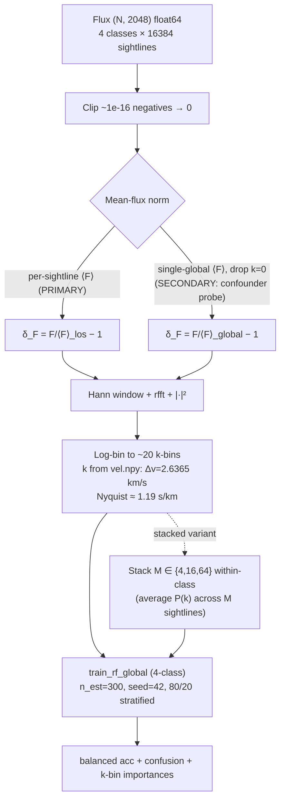

# LEDGER — pk-feedback-classifier

**Track:** pk-feedback-classifier (NEW — de-risking probe stage)
**Branch:** `exp/pk-feedback-classifier` · **Tag:** _(none yet)_
**Data:** Sherwood simulation z=0.3, 4 × (16384, 2048) flux sightlines, 4 physics classes (1=NoFeedback, 2=StellarWind, 3=WindAGN, 4=WindStrongAGN). Flux at `data/preprocessed/Sherwood_z0.3_inf/{1..4}/flux.npy`; per-pixel velocity scale from co-located `vel.npy` (Δv = 2.6365 km/s, uniform).

> Single source of truth for this track. Motivated by signal-clustering-v2 **[D-13]** (single-sightline feedback separability is information-limited; per-cluster RF ≤ v0.2 baseline ≈0.451). Tests whether the canonical 1D flux power spectrum P_F(k) basis — and/or within-class stacking — escapes that ceiling.

---

## Architecture Diagram (Mermaid)

---

## 1. The Pulse (Progress & Roadmap)

| Stage | Focus Area | Status | Pass Condition | Outputs |
|:---|:---|:---|:---|:---|
| **Stage 0 — de-risking probe** | per-sightline + stacked M∈{4,16,64} P_F(k) → global 4-class RF, both norm regimes | ⏳ **PENDING** | **PASS** = balanced test acc ≥ 0.55 per-sightline OR ≥ 0.70 stacked (M=64), **AND** k-bin importance concentrates at high-k (not low-k/DC, per [D-03]). **NULL** = ties ~0.45 with flat accuracy-vs-M (valid end state, rule 7). Bar to beat: v0.2 baseline ≈0.451; chance 0.25. | `results/pk_feedback_classifier/`: balanced-acc table, per-class confusion matrices, accuracy-vs-M curve, k-bin importance plots |

### Milestones
- **2026-05-26**: Track opened; PI-committed de-risking probe spec (see §3 [D-01]–[D-04]).

---

## 2. Methodology & Architecture

- **Input.** Flux F ∈ [0,1] for all 4 classes, (16384, 2048) **float64** (NOT float32). Clip ~1e-16 float-underflow negatives to 0 before any normalization. F ≈ e^{−τ} with a small mean-preserving LSF/noise stage (not bit-exact).
- **Velocity scale.** Δv read from co-located `vel.npy` (NOT hardcoded). Uniform 2.6365 km/s/pixel across all 4 classes (assert); span 5396.92 km/s, z=0.30–0.32.
- **Normalization.** Per-sightline ⟨F⟩ is **primary** (δ_F = F/⟨F⟩_los − 1; forces classifier onto P(k) *shape*). Single-global ⟨F⟩ with k=0 dropped is the **flagged secondary** (confounder probe; see [D-02]/[D-03]). Per-class ⟨F⟩ is **REJECTED** (label-leaky).
- **P_F(k) transform.** `FluxPowerSpectrum(BaseTransformer)` in `src/core/transforms.py`: Hann window → `np.fft.rfft` → `|·|²` → log-bin into ~20 k-bands. k-axis: k = 2π·rfftfreq(2048, d=Δv); Nyquist ≈ 1.19 s/km; k_min ≈ 1.16e-3 s/km; 1024 raw positive bins log-binned to 20.
- **Stacking (within-class).** Average P(k) across M ∈ {4, 16, 64} disjoint random groups within each class (seed=42); SNR-correct operation for a power spectrum (P_F(k) variance falls ~1/M for independent sightlines).
- **Classifier.** `train_rf_global(X, y)` — thin sibling to `train_rf_for_cluster` in `src/core/models/rf_classifier.py`. `RandomForestClassifier(n_estimators=300, random_state=42, n_jobs=-1)`. Stratified 80/20 hold-out (`random_state=42`). **No** GridSearchCV, **no** MLflow for the probe.
- **Probe script.** `experiments/pk-feedback-classifier/run_probe.py` — single self-contained CPU script, **no DVC stage**. Runs both normalization regimes × all variants {per-sightline, stacked M∈{4,16,64}}; emits to `results/pk_feedback_classifier/`.

---

## 3. The Logic (Decision Log)

> This track starts its own decision numbering at **[D-01]** per experiment-isolation. The motivating [D-13] lives in `experiments/signal-clustering-v2/LEDGER.md` §3.

- **[D-01] Labelled supervised P_F(k)→RF classifier track, isolated from signal-clustering-v2; opens with a single de-risking probe, not a pipeline commit.** Motivated by signal-clustering-v2 **[D-13]**: single-sightline feedback separability is information-limited (per-cluster RF ≤ v0.2 baseline ≈0.451 across both representations; "signal islands" are representation-disagreement, not physics-separation). [D-13]'s honest reading — *information-limited, not representation-limited* — falsifies the "better per-sightline features recover separability" prior at high confidence. Per the falsified-prior cascade (project-architect rule 2), the prior under test here — *"the P_F(k) basis breaks the ceiling"* — is hedged at **lowered confidence**: the highest-leverage of the remaining candidate bases (P_F(k) is the conventional sufficient statistic for the IGM thermal/pressure-smoothing structure feedback modifies), physically motivated but not yet tested. Split into a **low-confidence per-sightline arm** (likely inherits the same ceiling; P(k) discards phase) and a **moderate-confidence stacked arm** (population statistic; SNR falls ~1/M; a genuinely different problem setup, NOT the per-sightline problem). The probe is one self-contained script (no DVC stage, no MLflow), goes flux→P(k)→RF directly with labels, and does NOT use the micro-probing/separability/clustering machinery. PI-only sign-off, deferred-panel-review tracked in §7. PI sign-off is **not provisional** (rule 15 satisfied: data, [D-13], baseline, insertion points all independently re-verified this session).

- **[D-02] Normalization: per-sightline ⟨F⟩ PRIMARY; per-class ⟨F⟩ REJECTED (leaky); single-global ⟨F⟩ with k=0 dropped is the flagged SECONDARY serving as the mean-flux-confounder probe.** Per-class ⟨F⟩ = {C1 0.9784, C2 0.9745, C3 0.9752, C4 0.9834} — ~0.9% spread (data-engineer-confirmed this session) — is a real label-correlated shortcut. Per-class normalization is circular (normalizes by a label-correlated quantity) and is rejected. Per-sightline normalization (δ_F = F/⟨F⟩_los − 1) forces the classifier onto P(k) *shape*. The global secondary is retained only as a confounder triangulation: low-k-dominated importance under the secondary but not the primary localizes the mean-flux shortcut explicitly.

- **[D-03] Anti-degeneracy gate: a PASS requires k-bin feature-importance concentrated at the high-k cutoff, NOT RF accuracy alone.** RF balanced-accuracy leaves *which-k-band-drives-separation* unconstrained, and when the 4-class signal is weak (the expected per-sightline regime) the RF will silently prefer any surviving DC/low-k mean-flux channel. The probe must emit RF feature-importance over the ~20 log-spaced k-bins. PASS criterion: concentration at the high-k cutoff (the physically-predicted feedback suppression channel from thermal Doppler broadening + pressure/Jeans smoothing). A high accuracy whose importance sits at the lowest-k bins (especially under the global secondary) is the mean-flux confounder and is **NOT a PASS**. (Anti-degeneracy line item, project-architect rule 3.)

- **[D-05] Dispatch the de-risking probe to UTD Juno HPC (CPU partition `normal`) rather than local laptop; compute target switch only — no scientific change from the [D-01]–[D-04] spec.** Motivation: the local-laptop CPU budget for the full (regime × M ∈ {1, 4, 16, 64}) sweep at 65,536 sightlines × 300-tree RF is ~1 day, which monopolises the workstation; Juno is zero-marginal-cost institutional CPU on a Fairshare allocation with a 2-day `normal`-partition wallclock that comfortably fits the budget. **Transplant scope** (one-time infrastructure, NOT scientific): `.claude/skills/juno-hpc/SKILL.md` (CPU-focused, local-data-via-rsync, MLflow-free per [D-01], full rewrite from CosmoGasVision upstream); `scripts/submit_juno_probe.sh` (sbatch with PCV asserting the full [D-03] artifact set — `balanced_acc_summary.csv` + ≥1 `confusion_*.csv` + ≥1 `kbin_importance_*.csv` + ≥1 PNG — with distinct FATAL exit codes 2–6); `scripts/sync_{data_to,results_from}_juno.sh` (rsync wrappers; ad-hoc scp used for the first mirror because rsync was absent on the local Git Bash); `.env.example` + local `.env` JUNO_* block; `.claude/agents/infrastructure-manager.md` updated compute-targets table; CLAUDE.md skills index updated. **Inheritance:** [D-01]–[D-04] are unchanged; the spec, normalization regimes, k-binning, PASS/NULL bars, and anti-degeneracy gate are bit-identical to the local-run sign-off at tree state `5877f3e`. The transplant adds files; it does NOT modify `experiments/pk-feedback-classifier/run_probe.py`, `src/core/transforms.py`, or `src/core/models/rf_classifier.py`. **Rule-15 verification list (this session):** (i) SSH key auth silent (`ssh juno hostname` → `juno-l-01`); (ii) partition `normal*` default, 2-day wallclock, 86/90 idle nodes (`sinfo -s`); (iii) repo at `/work/sxh240010/CosmoGasPeruser` on `exp/pk-feedback-classifier` HEAD-matched to origin; (iv) conda env `/work/sxh240010/envs/cosmogasperuser` python=3.12; (v) `uv sync` completed exit-0, sklearn + numpy imports green; (vi) data mirror complete at `${JUNO_SCRATCH}/data/preprocessed/Sherwood_z0.3_inf/{1..4}/{flux,vel}.npy` (~1.1 GB, integrity sanity-checked at first FFT via `_validate_data` + `np.all(np.isfinite(Z))`); (vii) queue empty (`squeue --me`). **PCV contract:** `scripts/submit_juno_probe.sh` hard-asserts the producer-side output set with explicit `exit N` per missing-artifact class; no `2>/dev/null || true` on artifact paths (per `infrastructure-manager.md` §28–§40). **Compute-plan completeness ("Economic compute"):** (a) instance = Juno `normal` partition CPU, 1 node × 16 cores × 24 GB; (b) hours = 1-day wallclock cap; (c)/(d) cost = $0 marginal (shared-institutional Fairshare; Fairshare-aware queueing substitutes for $-ceiling discipline) — *recorded, not omitted*; (e) auto-stop = SLURM wallclock + `set -euo pipefail` cleanup; (f) lifecycle = scratch run dir wiped post copy-out, results land at `${JUNO_WORK}/cloud_runs/${RUN_TAG}/` on MFS (no 45-day purge), pulled to local via `scripts/sync_results_from_juno.sh <RUN_TAG>` for PI review. **Scientific drift audit:** Python 3.12 same minor; identical `uv.lock` → byte-identical wheel resolution; `n_jobs=-1` against `OMP/MKL/OPENBLAS_NUM_THREADS=16` cap with `random_state=42` → RF result-stable under threading per sklearn; BLAS-version FFT digit-level drift non-material at 2-sig-fig PASS bars. **Rollback:** local-laptop run path unmodified; FATAL surfaces via `pkprobe-<jobid>.{out,err}`. **Sign-off provenance:** PI-only per rule 6 — no new paper-text claim, NULL still a valid end state (rule 7), external anchor 0.451 still not self-defined, zero $ marginal cost. **NOT provisional** per rule 15(c) — independent re-verification of (i)–(vii) above performed this session. Deferred-panel-review tracked here as a follow-up before any full-pipeline-commit decision (carried forward from [D-01]). **Note:** the deferred lowest-log-bin amendment flagged in PI's pre-run code review will land as **[D-06]** post-run (after the empirical evidence is in hand, not before).
- **[D-04] Physical k-axis derived from `vel.npy`, not hardcoded; P_F(k) reported in s/km (no Mpc/h conversion).** Δv read from `data/preprocessed/Sherwood_z0.3_inf/{class}/vel.npy` (uniform 2.6365 km/s/pixel across all 4 classes; total span 5396.92 km/s; z=0.30–0.32; data-engineer-confirmed this session). k = 2π·rfftfreq(2048, d=Δv): Nyquist ≈ 1.19 s/km, k_min ≈ 1.16e-3 s/km. Box size in Mpc/h is not on disk and not needed (Lyα P_F(k) is conventionally reported in s/km).

---

## 4. The Data (Lineage & Governance)

| Implementation Area | Primary Data File | Shape / dtype / Notes |
|:---|:---|:---|
| Raw flux (input) | `data/preprocessed/Sherwood_z0.3_inf/{1..4}/flux.npy` | 4 × (16384, 2048), **float64**, F ∈ [~0, 1]; ~1e-16 negative underflow to be clipped; no NaN/Inf |
| Per-pixel velocity (authoritative Δv) | `data/preprocessed/Sherwood_z0.3_inf/{1..4}/vel.npy` | (2048,) float64; uniform 2.6365 km/s/pixel; identical across all 4 classes (assert) |
| τ (optional cross-check) | `data/preprocessed/Sherwood_z0.3_inf/{1..4}/tau.npy` | (16384, 2048) float64; F ≈ e^{−τ} with small mean-preserving LSF/noise (not bit-exact) |
| P_F(k) features (per-sightline) | (in-memory; not persisted unless cached) | (N, ~20 k-bins) float64 |
| P_F(k) features (stacked, M∈{4,16,64}) | (in-memory; ~16384/M groups per class) | (N_stacks, ~20 k-bins) float64 |

### Responsibility Matrix
- **PI (project-architect):** scientific sign-off on [D-01]–[D-04]; stage-gate verdict against §1 pass condition. PI-only sign-off + deferred-panel-review for the *full-pipeline-commit* decision that follows the probe (§7).
- **core-implementer:** `FluxPowerSpectrum` transform, `train_rf_global` sibling, probe script.
- **data-engineer:** within-class stacking helper; confirm `vel.npy` uniformity assertion; ensure a flux-only loader path through `src/core/data.py`.
- **infrastructure-manager:** N/A at probe stage (no DVC stage, no MLflow run).
- **paper-author:** **NOT dispatched.** Per the user-triggered-only paper rule (CLAUDE.md / PI settings), no paper work until explicitly triggered.

---

## 5. Evaluation Plan

### Primary metrics (the gating set)

1. **Balanced test accuracy (headline gate).** `sklearn.metrics.balanced_accuracy_score` on a stratified 80/20 hold-out (`random_state=42`). Bar to beat: **0.451** (v0.2 global baseline); chance = 0.25. Reported per regime (per-sightline-⟨F⟩ primary, global-⟨F⟩ secondary) × per variant (per-sightline, stacked M∈{4,16,64}).
2. **Per-class confusion matrix.** Row-normalized 4×4 (true-class rows), one per regime/variant; diagnoses which feedback classes collapse (e.g., does the ~0.9% mean-flux spread make C4/WindStrongAGN the only separable class?).
3. **Accuracy-vs-M curve.** Balanced test accuracy vs stack depth M ∈ {1 (per-sightline), 4, 16, 64}, per regime. Smooth monotone rise still climbing at M=64 = SNR-limited (→ stacked-pipeline GO); flat within noise = NULL signature.
4. **k-bin feature-importance (anti-degeneracy gate, [D-03]).** RF `feature_importances_` over the ~20 log-spaced k-bins, mapped to physical k (s/km) via the recorded bin edges. PASS criterion: concentration at high-k. Confounder flag: concentration at low-k/DC under the global secondary.

### Outcome bands (pre-committed)

| Band | Condition | Decision |
|:---|:---|:---|
| **Clear PASS** | ≥ 0.55 per-sightline OR ≥ 0.70 stacked (M=64) **AND** high-k importance concentration | GO to full-track scoping |
| **Ambiguous / SNR-limited** | per-sightline ≈ baseline; smooth monotone accuracy-vs-M rise still climbing at M=64 | conditional GO; spec a STACKED-pipeline track, not per-sightline |
| **NULL** | per-sightline ties ~0.45 AND stacked shows no monotone lift | **VALID END STATE** (rule 7); NO-GO on the full track; record finding for the eventual [D-13] paper when the user triggers paper writing |

### Validation datasets
- Full 16,384 × 4 = 65,536 sightlines of Sherwood z=0.3. No OOD/generalization test at probe stage.

---

## 6. Visualization & Artifacts

- Tracker: **none for the probe** (no MLflow run; the probe is gated below the pipeline-commit threshold per [D-01]). On a Clear PASS or Ambiguous outcome, the follow-on full pipeline track will adopt the project's standard MLflow branch-aware naming (`CosmoGasPeruser/exp/pk-feedback-classifier`).
- Planned figures (Stage 0 outputs to `results/pk_feedback_classifier/figs/`):
  - `fig_acc_vs_M_<regime>.png` — balanced acc vs M ∈ {1,4,16,64}, both regimes
  - `fig_confusion_<regime>_<variant>.png` — per-class confusion matrices
  - `fig_kbin_importance_<regime>_<variant>.png` — k-bin importance bars, with high-k cutoff marker
- Planned CSVs (Git-tracked):
  - `results/pk_feedback_classifier/balanced_acc_summary.csv` — (regime, variant, M, balanced_acc)
  - `results/pk_feedback_classifier/confusion_<regime>_<variant>.csv`
  - `results/pk_feedback_classifier/kbin_importance_<regime>_<variant>.csv`

---

## 7. Session History & Next Handoff

### Session Snapshot
- **2026-05-26** (Track opened, PI-committed spec): branched `exp/pk-feedback-classifier` from `feature/signal-clustering-v2` after the v0.4 doc-commit run (including the new [D-13]). Data prerequisites independently re-verified by data-engineer (flux PRESENT all 4 classes, **float64** — spec-corrected from float32; **Δv = 2.6365 km/s/pixel** uniform, derived from co-located `vel.npy`; physical k-axis in s/km fully derivable on disk, no external Sherwood metadata needed; **per-class ⟨F⟩ leak confirmed** at ~0.9% spread → per-sightline-⟨F⟩ chosen as PRIMARY normalization, global-⟨F⟩-with-k=0-dropped as flagged SECONDARY confounder probe; no blockers; cosmetic DVC drift in `data/preprocessed.dvc` is the known signal-clustering-v2 [D-12] item and does not affect probe inputs). PI seeded [D-01]–[D-04] and Stage 0 pass conditions. Dispatched core-implementer (transform + RF + probe script) and data-engineer (stacking helper + flux loader). PI sign-off is **NOT provisional** (rule 15 satisfied: data, [D-13], baseline, and insertion points all independently re-verified this session); deferred-panel-review is tracked here as a follow-up before any full-pipeline-commit decision.

### Immediate Next Steps
- **core-implementer** → `FluxPowerSpectrum` in `src/core/transforms.py` (Hann window, log-binned ~20 k-bins, reads Δv from `vel.npy`, `norm ∈ {"per_sightline", "global"}`); `train_rf_global` sibling in `src/core/models/rf_classifier.py` (n_est=300, seed=42, stratified 80/20, balanced acc + confusion + importances); `experiments/pk-feedback-classifier/run_probe.py` (runs both regimes × {per-sightline, stacked M∈{4,16,64}}; emits to `results/pk_feedback_classifier/`).
- **data-engineer** → within-class stacking helper (default: average P(k) across M sightlines; random disjoint grouping, seed=42); flux-only loader path through `src/core/data.py` if `SignalClusteringData` does not already expose raw flux per class; assert `vel.npy` uniformity across the 4 classes.
- **PI (stage-gate review)** → on owners' completion, read `results/pk_feedback_classifier/` against §1 PASS condition and §5 outcome bands; record verdict (PASS / Ambiguous / NULL) as a §7 History entry; record decision (GO / conditional GO / NO-GO) as a new D-XX entry.

### Blockers
- None at probe stage. (Cosmetic DVC drift in `data/preprocessed.dvc` is the known signal-clustering-v2 [D-12] item and does NOT affect probe inputs.)
