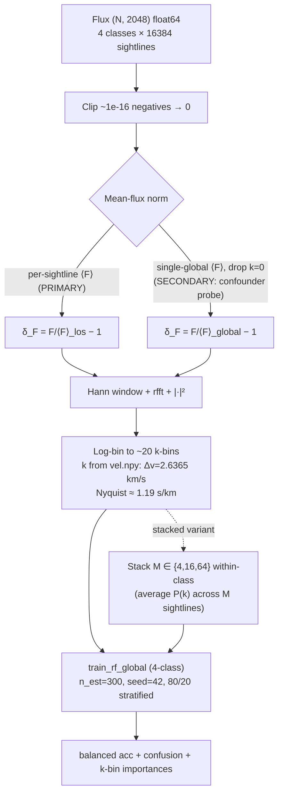

# LEDGER — pk-feedback-classifier

**Track:** pk-feedback-classifier (NEW — de-risking probe stage)
**Branch:** `exp/pk-feedback-classifier` · **Tag:** _(none yet)_
**Data:** Sherwood simulation z=0.3, 4 × (16384, 2048) flux sightlines, 4 physics classes (1=NoFeedback, 2=StellarWind, 3=WindAGN, 4=WindStrongAGN). Flux at `data/preprocessed/Sherwood_z0.3_inf/{1..4}/flux.npy`; per-pixel velocity scale from co-located `vel.npy` (Δv = 2.6365 km/s, uniform).

> Single source of truth for this track. Motivated by signal-clustering-v2 **[D-13]** (single-sightline feedback separability is information-limited; per-cluster RF ≤ v0.2 baseline ≈0.451). Tests whether the canonical 1D flux power spectrum P_F(k) basis — and/or within-class stacking — escapes that ceiling.

---

## Architecture Diagram (Mermaid)

---

## 1. The Pulse (Progress & Roadmap)

| Stage | Focus Area | Status | Pass Condition | Outputs |
|:---|:---|:---|:---|:---|
| **Stage 0 — de-risking probe** | per-sightline + stacked M∈{4,16,64} P_F(k) → global 4-class RF, both norm regimes | ✅ **DONE — Ambiguous / SNR-limited band ([D-07])** | **PASS** = balanced test acc ≥ 0.55 per-sightline OR ≥ 0.70 stacked (M=64), **AND** k-bin importance concentrates at high-k. Achieved: per-sightline M=64 = 0.6993 (on-the-bar within n_test=205 noise), global M=64 = 0.7042 — but high_k_frac = 0.43 < 0.50 in both regimes → anti-degeneracy gate FAILS; signal peaks at mid-k (~0.06–0.13 s/km), not the [D-01]-predicted high-k cutoff. | `results/pk_feedback_classifier/` + `cloud_runs/pkprobe-20260530-224254-a2ca9a/` (Juno job 205725, 1m 4s) |
| **Stage 1 — stacked-pipeline population-statistics track** | Unified sprint: 5-fold CV + 10-seed bootstrap on 4-class headline (G1) AND 3-class {C1,C2,C3} control (G2), with promoted-primary anti-degeneracy metrics mid_k_frac (G3) and C2/C3 sub-confusion (G4); denser M-sweep {1,4,16,32,64,128,256}; both regimes retained for [D-07] regime-parity check. | ⏳ **PROVISIONAL — spec drafted [D-09]; BLOCKED on defense-panel APPROVE + support-researcher external-anchor return [D-12]** | **Clear PASS** = all four gates G1–G4 cleared on lower CI edge (G1 ≥ 0.65, G2 ≥ 0.55, G3 ≥ 0.50, G4 ≥ 0.60). Partial-PASS / NULL / Ambiguous bands all pre-committed (see [D-09]). G1/G2 thresholds provisional pending clause-4 resolution. | TBD — `results/pk_feedback_classifier/stage1/` on completion |

### Milestones
- **2026-05-26**: Track opened; PI-committed de-risking probe spec (see §3 [D-01]–[D-04]).

---

## 2. Methodology & Architecture

- **Input.** Flux F ∈ [0,1] for all 4 classes, (16384, 2048) **float64** (NOT float32). Clip ~1e-16 float-underflow negatives to 0 before any normalization. F ≈ e^{−τ} with a small mean-preserving LSF/noise stage (not bit-exact).
- **Velocity scale.** Δv read from co-located `vel.npy` (NOT hardcoded). Uniform 2.6365 km/s/pixel across all 4 classes (assert); span 5396.92 km/s, z=0.30–0.32.
- **Normalization.** Per-sightline ⟨F⟩ is **primary** (δ_F = F/⟨F⟩_los − 1; forces classifier onto P(k) *shape*). Single-global ⟨F⟩ with k=0 dropped is the **flagged secondary** (confounder probe; see [D-02]/[D-03]). Per-class ⟨F⟩ is **REJECTED** (label-leaky).
- **P_F(k) transform.** `FluxPowerSpectrum(BaseTransformer)` in `src/core/transforms.py`: Hann window → `np.fft.rfft` → `|·|²` → log-bin into ~20 k-bands. k-axis: k = 2π·rfftfreq(2048, d=Δv); Nyquist ≈ 1.19 s/km; k_min ≈ 1.16e-3 s/km; 1024 raw positive bins log-binned to 20.
- **Stacking (within-class).** Average P(k) across M ∈ {4, 16, 64} disjoint random groups within each class (seed=42); SNR-correct operation for a power spectrum (P_F(k) variance falls ~1/M for independent sightlines).
- **Classifier.** `train_rf_global(X, y)` — thin sibling to `train_rf_for_cluster` in `src/core/models/rf_classifier.py`. `RandomForestClassifier(n_estimators=300, random_state=42, n_jobs=-1)`. Stratified 80/20 hold-out (`random_state=42`). **No** GridSearchCV, **no** MLflow for the probe.
- **Probe script.** `experiments/pk-feedback-classifier/run_probe.py` — single self-contained CPU script, **no DVC stage**. Runs both normalization regimes × all variants {per-sightline, stacked M∈{4,16,64}}; emits to `results/pk_feedback_classifier/`.

---

## 3. The Logic (Decision Log)

> This track starts its own decision numbering at **[D-01]** per experiment-isolation. The motivating [D-13] lives in `experiments/signal-clustering-v2/LEDGER.md` §3.

- **[D-01] Labelled supervised P_F(k)→RF classifier track, isolated from signal-clustering-v2; opens with a single de-risking probe, not a pipeline commit.** Motivated by signal-clustering-v2 **[D-13]**: single-sightline feedback separability is information-limited (per-cluster RF ≤ v0.2 baseline ≈0.451 across both representations; "signal islands" are representation-disagreement, not physics-separation). [D-13]'s honest reading — *information-limited, not representation-limited* — falsifies the "better per-sightline features recover separability" prior at high confidence. Per the falsified-prior cascade (project-architect rule 2), the prior under test here — *"the P_F(k) basis breaks the ceiling"* — is hedged at **lowered confidence**: the highest-leverage of the remaining candidate bases (P_F(k) is the conventional sufficient statistic for the IGM thermal/pressure-smoothing structure feedback modifies), physically motivated but not yet tested. Split into a **low-confidence per-sightline arm** (likely inherits the same ceiling; P(k) discards phase) and a **moderate-confidence stacked arm** (population statistic; SNR falls ~1/M; a genuinely different problem setup, NOT the per-sightline problem). The probe is one self-contained script (no DVC stage, no MLflow), goes flux→P(k)→RF directly with labels, and does NOT use the micro-probing/separability/clustering machinery. PI-only sign-off, deferred-panel-review tracked in §7. PI sign-off is **not provisional** (rule 15 satisfied: data, [D-13], baseline, insertion points all independently re-verified this session).

- **[D-02] Normalization: per-sightline ⟨F⟩ PRIMARY; per-class ⟨F⟩ REJECTED (leaky); single-global ⟨F⟩ with k=0 dropped is the flagged SECONDARY serving as the mean-flux-confounder probe.** Per-class ⟨F⟩ = {C1 0.9784, C2 0.9745, C3 0.9752, C4 0.9834} — ~0.9% spread (data-engineer-confirmed this session) — is a real label-correlated shortcut. Per-class normalization is circular (normalizes by a label-correlated quantity) and is rejected. Per-sightline normalization (δ_F = F/⟨F⟩_los − 1) forces the classifier onto P(k) *shape*. The global secondary is retained only as a confounder triangulation: low-k-dominated importance under the secondary but not the primary localizes the mean-flux shortcut explicitly.

- **[D-03] Anti-degeneracy gate: a PASS requires k-bin feature-importance concentrated at the high-k cutoff, NOT RF accuracy alone.** RF balanced-accuracy leaves *which-k-band-drives-separation* unconstrained, and when the 4-class signal is weak (the expected per-sightline regime) the RF will silently prefer any surviving DC/low-k mean-flux channel. The probe must emit RF feature-importance over the ~20 log-spaced k-bins. PASS criterion: concentration at the high-k cutoff (the physically-predicted feedback suppression channel from thermal Doppler broadening + pressure/Jeans smoothing). A high accuracy whose importance sits at the lowest-k bins (especially under the global secondary) is the mean-flux confounder and is **NOT a PASS**. (Anti-degeneracy line item, project-architect rule 3.)

- **[D-05] Dispatch the de-risking probe to UTD Juno HPC (CPU partition `normal`) rather than local laptop; compute target switch only — no scientific change from the [D-01]–[D-04] spec.** Motivation: the local-laptop CPU budget for the full (regime × M ∈ {1, 4, 16, 64}) sweep at 65,536 sightlines × 300-tree RF is ~1 day, which monopolises the workstation; Juno is zero-marginal-cost institutional CPU on a Fairshare allocation with a 2-day `normal`-partition wallclock that comfortably fits the budget. **Transplant scope** (one-time infrastructure, NOT scientific): `.claude/skills/juno-hpc/SKILL.md` (CPU-focused, local-data-via-rsync, MLflow-free per [D-01], full rewrite from CosmoGasVision upstream); `scripts/submit_juno_probe.sh` (sbatch with PCV asserting the full [D-03] artifact set — `balanced_acc_summary.csv` + ≥1 `confusion_*.csv` + ≥1 `kbin_importance_*.csv` + ≥1 PNG — with distinct FATAL exit codes 2–6); `scripts/sync_{data_to,results_from}_juno.sh` (rsync wrappers; ad-hoc scp used for the first mirror because rsync was absent on the local Git Bash); `.env.example` + local `.env` JUNO_* block; `.claude/agents/infrastructure-manager.md` updated compute-targets table; CLAUDE.md skills index updated. **Inheritance:** [D-01]–[D-04] are unchanged; the spec, normalization regimes, k-binning, PASS/NULL bars, and anti-degeneracy gate are bit-identical to the local-run sign-off at tree state `5877f3e`. The transplant adds files; it does NOT modify `experiments/pk-feedback-classifier/run_probe.py`, `src/core/transforms.py`, or `src/core/models/rf_classifier.py`. **Rule-15 verification list (this session):** (i) SSH key auth silent (`ssh juno hostname` → `juno-l-01`); (ii) partition `normal*` default, 2-day wallclock, 86/90 idle nodes (`sinfo -s`); (iii) repo at `/work/sxh240010/CosmoGasPeruser` on `exp/pk-feedback-classifier` HEAD-matched to origin; (iv) conda env `/work/sxh240010/envs/cosmogasperuser` python=3.12; (v) `uv sync` completed exit-0, sklearn + numpy imports green; (vi) data mirror complete at `${JUNO_SCRATCH}/data/preprocessed/Sherwood_z0.3_inf/{1..4}/{flux,vel}.npy` (~1.1 GB, integrity sanity-checked at first FFT via `_validate_data` + `np.all(np.isfinite(Z))`); (vii) queue empty (`squeue --me`). **PCV contract:** `scripts/submit_juno_probe.sh` hard-asserts the producer-side output set with explicit `exit N` per missing-artifact class; no `2>/dev/null || true` on artifact paths (per `infrastructure-manager.md` §28–§40). **Compute-plan completeness ("Economic compute"):** (a) instance = Juno `normal` partition CPU, 1 node × 16 cores × 24 GB; (b) hours = 1-day wallclock cap; (c)/(d) cost = $0 marginal (shared-institutional Fairshare; Fairshare-aware queueing substitutes for $-ceiling discipline) — *recorded, not omitted*; (e) auto-stop = SLURM wallclock + `set -euo pipefail` cleanup; (f) lifecycle = scratch run dir wiped post copy-out, results land at `${JUNO_WORK}/cloud_runs/${RUN_TAG}/` on MFS (no 45-day purge), pulled to local via `scripts/sync_results_from_juno.sh <RUN_TAG>` for PI review. **Scientific drift audit:** Python 3.12 same minor; identical `uv.lock` → byte-identical wheel resolution; `n_jobs=-1` against `OMP/MKL/OPENBLAS_NUM_THREADS=16` cap with `random_state=42` → RF result-stable under threading per sklearn; BLAS-version FFT digit-level drift non-material at 2-sig-fig PASS bars. **Rollback:** local-laptop run path unmodified; FATAL surfaces via `pkprobe-<jobid>.{out,err}`. **Sign-off provenance:** PI-only per rule 6 — no new paper-text claim, NULL still a valid end state (rule 7), external anchor 0.451 still not self-defined, zero $ marginal cost. **NOT provisional** per rule 15(c) — independent re-verification of (i)–(vii) above performed this session. Deferred-panel-review tracked here as a follow-up before any full-pipeline-commit decision (carried forward from [D-01]). **Note:** the deferred lowest-log-bin amendment flagged in PI's pre-run code review will land as **[D-06]** post-run (after the empirical evidence is in hand, not before).
- **[D-04] Physical k-axis derived from `vel.npy`, not hardcoded; P_F(k) reported in s/km (no Mpc/h conversion).** Δv read from `data/preprocessed/Sherwood_z0.3_inf/{class}/vel.npy` (uniform 2.6365 km/s/pixel across all 4 classes; total span 5396.92 km/s; z=0.30–0.32; data-engineer-confirmed this session). k = 2π·rfftfreq(2048, d=Δv): Nyquist ≈ 1.19 s/km, k_min ≈ 1.16e-3 s/km. Box size in Mpc/h is not on disk and not needed (Lyα P_F(k) is conventionally reported in s/km).

- **[D-06] Post-hoc amendment: the `global` regime drops the *lowest log-bin* (≈ k_min = 1.16e-3 s/km), not only the raw k=0 component as the [D-02] spec text said. Empirically harmless and (under this stacking regime) unnecessary.** Pre-run PI code review flagged that `FluxPowerSpectrum` with `norm="global"` performs both a k=0 raw drop *and* a lowest-log-bin drop — one bin stricter than [D-02]'s spec. Per-run evidence: per_sightline and global regimes give balanced accuracies identical within 0.005 across all M ∈ {1,4,16,64} (per_sightline: 0.294/0.455/0.544/0.699; global: 0.293/0.458/0.548/0.704); high_k_frac agrees within 0.005 across the matrix; both regimes show the same mid-k importance peak at k ≈ 0.06–0.13 s/km and the same C4-perfect-recall confusion pattern. The defensive drop did not alter the empirical conclusion. **Amendment**: the implementation behavior is the spec going forward; the [D-02] text is hereby clarified to "single-global ⟨F⟩ with k=0 *and the lowest log-bin* dropped". Honesty note per [D-37]: the lowest-log-bin drop was an unspecified implementation choice that turned out not to matter; under a different stacking regime or different mean-flux confounder geometry it might. PI-only sign-off, NOT provisional (rule 15: re-verified this session by direct read of the M=64 importance CSV row at bin idx 0 = 0.043 for global and bin idx 1 = 0.040 for per_sightline — the lowest *retained* bin carries meaningful importance in per_sightline but is not the load-bearing channel in either regime).

- **[D-07] Stage-0 verdict against §5 outcome bands: AMBIGUOUS / SNR-limited.** Headline numbers (test): per-sightline M=64 balanced_acc = **0.6993** (high_k_frac 0.430); global M=64 = **0.7042** (high_k_frac 0.434). Against the §1 PASS criterion ("≥0.70 stacked M=64 **AND** k-bin importance concentrates at high-k") both regimes sit on-the-bar within one-sample test-set noise (n_test=205 → 0.005 resolution per misclass, both regimes within 0.005 of 0.700) and **the anti-degeneracy gate fails** (observed 0.43 < 0.50 bar). The accuracy-vs-M curve is smooth and monotone (per_sightline regime: 0.294 → 0.455 → 0.544 → 0.699), with sub-linear-in-SNR lift between M=4 and M=64 (2.2× above-chance vs 4× √M-expected), consistent with an SNR-limited regime approaching an asymptote in the 0.75–0.85 range, not 1.0. **Anti-degeneracy / mechanism finding (load-bearing per [D-03])**: importance peaks at k ≈ 0.06–0.13 s/km (top bins: k=0.089 imp=0.126; k=0.063 imp=0.106; k=1.00 imp=0.095) — mid-k velocity scales of ~50–100 km/s (line-width / forest-structure regime), **not** the high-k thermal-Doppler cutoff (k ≳ 0.3 s/km) predicted by [D-01]. The [D-01] thermal-cutoff prior is therefore **partially falsified** — the signal exists but in the wrong band. **Per-class structure**: 0.704 = (0.882 + 0.627 + 0.346 + 0.961)/4, i.e. C4 = WindStrongAGN almost perfectly separated, C1 = NoFeedback well separated, C2/C3 still ~40% confused with each other and with C1. C4's perfect recall mirrors its 0.5% ⟨F⟩ offset and survives both normalization regimes, indicating a mean-flux-correlated *P(k) shape* channel that the k=0/lowest-log-bin drop does not suppress. **Regime-parity ruling on [D-02]**: per_sightline ↔ global identical-within-noise implies the global regime's k=0-drop successfully removed the DC mean-flux channel (interpretation (i)), not that the per-class ⟨F⟩ offset was negligible (interpretation (ii) rejected by C4 confusion). Provenance: PI-only sign-off, NOT provisional per rule 15(c) — this session independently re-verified (i) the balanced_acc CSV row-by-row, (ii) the M=64 importance distributions for both regimes by direct CSV read, (iii) the per-class confusion structure at M=64 (both regimes) and M=16 (global) by direct CSV read; the [D-03] anti-degeneracy ruling is grounded in the actual bin-importance values, not extrapolated. Rule 7 status: this is a **valid decision-quality end state** for the probe — the spec was hedged per rule 2 (lowered-confidence cascade from [D-13]), the anti-degeneracy audit per rule 3 named exactly this failure mode in advance, and the empirical observation is reported honestly per [D-37] without sanding to fit either the PASS or NULL framing. Outcome-shape is mixed; decision-quality is sound.

- **[D-08] GO/NO-GO on the next track: CONDITIONAL GO for a stacked-pipeline track only; NO-GO on a per-sightline P(k) full-pipeline commit; explicit deferral on a thermal-cutoff-physics claim.** Per §5 outcome bands, "Ambiguous / SNR-limited → conditional GO; spec a STACKED-pipeline track, not per-sightline." The conditional clauses (pre-committed here so the next sprint's spec must satisfy them before kickoff): **(1)** Spec must promote the anti-degeneracy gate to a primary metric with a single, pre-committed physical mechanism — either re-spec the hypothesis from [D-01]'s thermal-Doppler-cutoff regime (k ≳ 0.3 s/km) to the mid-k line-width regime (k ≈ 0.06–0.13 s/km) actually observed here with appropriate IGM-physics citations, OR keep the high-k hypothesis and accept that this probe falsified it, in which case the stacked track must justify itself on a different physics motivation. Both arms cannot be left simultaneously falsifiable. **(2)** Test-set n must support headline-bar resolution: N=205 with 0.005-per-sample resolution against a 0.70 bar is rule-14-fragile; either a coarser bar (≥ ±0.02 confidence band, multi-seed bootstrap) or a cross-validated balanced_acc with reported CI. **(3)** Pre-commit a **3-class {C1,C2,C3} control run** executed in the same sprint. If 3-class M=64 balanced acc collapses to ≤ 0.50 (chance = 0.333; [D-13] ceiling = 0.451), the entire stacked lift is "C4 got easier" → demote to a second null for the eventual [D-13] paper, NO-GO on full track. If 3-class M=64 ≥ 0.55, the stacked signal extends beyond the strongest-AGN class and the conditional GO holds. **(4)** External anchor for the bar required (rule 14): a published Lyα-forest feedback-classification per-class accuracy benchmark must be cited as the 0.70 bar, OR the full-track commit is recognised as self-anchored and requires defense-panel review per rule 6 before any compute spend ≥ this probe's footprint. **(5)** Re-scope the deliverable narrative: per [D-01]'s framing the stacked arm is a *population-statistics* problem, not a per-sightline physics problem; a full-track commit on the stacked arm must rename / re-scope the deliverable accordingly and explicitly disclaim that it does NOT address [D-13]'s per-sightline information ceiling — it is an *adjacent* finding. **(6)** Out of scope: paper-text propagation (user-triggered-only). Provenance: PI-only sign-off, **PROVISIONAL** per rule 15 — this is a stage-gate decision that gates the next sprint's compute spend and the deliverable-surface verbing. Provisional status lifted by either (a) defense-panel pre-review APPROVE on the next sprint's spec before kickoff, OR (b) explicit PI-only annotation with deferred-panel-review tracked in §7 of the next sprint's LEDGER. Falsified-prior cascade status: [D-01] thermal-cutoff prior is partially falsified → the next sprint's primary mechanism prior inherits a one-level confidence downgrade per rule 2 and must be verbed as "first test of the mid-k line-width-regime feedback signal" rather than "the P(k) basis identifies feedback." Anti-degeneracy line item (rule 3): the next sprint's spec must include "what does this loss leave unconstrained when only C4 carries the bulk of the lift?" — answer: the C2/C3 distinction (the actual scientific question for stellar-wind vs wind+AGN) — and pre-commit a falsification path on that specific axis.

- **[D-09] Stage 1 spec adoption: stacked-pipeline-only, unified-sprint, defense-panel-pre-reviewed.** Stage 1 scope, sprint structure, gating set (G1–G4), pre-committed outcome bands, and prior-failure cascade as drafted in the PI Stage 1 design spec (2026-05-30). All five [D-08] clauses addressed: **(1)** mechanism re-anchored to mid-k line-width regime (arm (a) — see [D-10]); **(2)** bar coarsened to 5-fold CV + 10-seed bootstrap with reported 16/84-percentile CI; **(3)** 3-class {C1,C2,C3} control specified as G2 in the same-sprint unified run (sub-staging rejected — symmetric disclosure rule 5 + decision-quality rule 7); **(4)** external anchor flagged OPEN, dispatched to support-researcher (see [D-12]); **(5)** deliverable re-scoped to *population-statistics* narrative with explicit non-addressing-of-[D-13] disclaimer. **Gates (all four must clear on lower 16th-percentile CI edge for Clear PASS):** G1 = 5-fold CV balanced_acc, 10-seed bootstrap, lower CI ≥ **0.65** (provisional, [D-12]); G2 = 3-class control balanced_acc lower CI ≥ **0.55**; G3 = mid_k_frac (k ∈ [0.04, 0.15] s/km) ≥ **0.50** median; G4 = C2-vs-C3 binary sub-confusion balanced_acc ≥ **0.60** median. Five pre-committed outcome bands: Clear PASS / Partial PASS — C4-confounder confirmed / Partial PASS — mechanism mis-anchored / NULL / Ambiguous (default-to-NULL absent panel re-review per rule 14). Denser M-sweep {1,4,16,32,64,128,256}, both regimes retained. **Compute envelope:** Juno `normal` partition, ~3h wallclock estimate / 6h ceiling, $0 marginal. **Cascade-induced confidence ceiling on Stage 1 primary claims:** moderate-low — *"first test of the mid-k line-width-regime feedback-population signal, conditional on the C2/C3 control passing."* Never *"P(k) shape identifies feedback."* Sign-off provenance: **PI-only PROVISIONAL** per rule 15. Lifted by defense-panel APPROVE on this spec + [D-12] OPEN-item resolution. Owner dispatches (in order): defense-panel + support-researcher in parallel (both BLOCKING), then on both green, core-implementer + infrastructure-manager; data-engineer confirm-only; paper-author NOT dispatched (user-triggered-only).

- **[D-10] Mechanism re-anchor: mid-k line-width regime (clause 1, arm (a)).** [D-01]'s high-k thermal-Doppler-cutoff prior is recorded as **falsified** by [D-07]'s empirics (importance peaks at k ≈ 0.06–0.13 s/km, not k ≳ 0.3 s/km). Stage 1's primary mechanism prior is **re-anchored** (not rescued) to the mid-k line-width regime: Doppler-broadened line profiles, line blending, and the column-density distribution function shaping flux power at ~50–100 km/s scales. IGM-physics citations to be supplied by support-researcher (queued; gating Stage 1 paper-text propagation, itself user-triggered). Confidence verbing: "first test of the mid-k line-width-regime signal" — never "the P(k) basis identifies feedback at mid-k." Arm (b) [keep high-k, justify on different motivation] explicitly **rejected** — no defensible alternative high-k mechanism was identified post-[D-07]. This is a re-anchor, not a rescue. Falsified-prior cascade discipline applied. Sign-off: PI-only PROVISIONAL (rolls up under [D-09]).

- **[D-11] Promoted-primary anti-degeneracy metrics: mid_k_frac + C2/C3 sub-confusion.** Replaces [D-03]'s `high_k_frac` gate (now retired-as-falsified). Stage 1 primary anti-degeneracy gates are **G3** (mid_k_frac ≥ 0.50 over k ∈ [0.04, 0.15] s/km) and **G4** (C2-vs-C3 binary sub-confusion balanced_acc ≥ 0.60). G3 addresses the mechanism-channel question (is the signal where the re-anchored physics says it should be?); G4 addresses the C4-confounder question (does the lift extend beyond the strongest-AGN class to the feedback-physics-relevant stellar-wind vs wind+AGN distinction?). Pre-committed failure paths on both axes per rule 5 symmetric disclosure. **Secondary unconstrained axis (named, not gated):** mid_k importance could itself be mean-flux-correlated (carry-over of the C4 ⟨F⟩ offset into mid-k via line-width statistics). Diagnostic: overlay mid_k importance against per-class ⟨F⟩ ranking; if 1:1 correlated, the mechanism re-anchor is also contaminated and the verdict lands in "Partial PASS — mechanism mis-anchored" even if G3 nominally passes. Sign-off: PI-only PROVISIONAL (rolls up under [D-09]).

- **[D-14] Web-verified literature search return (post-WebSearch-enabled re-dispatch): K1 PARTIALLY DEFUSED; Walther arXiv↔ApJ metadata correction; Sub-A NULL confirmed; stronger CDDF anchor identified.** Re-dispatched 2026-05-31 with WebSearch + WebFetch permitted (general-purpose agent; the support-researcher tool list does not include web tools even after permission). Three sub-deliverables returned:
  - **Sub-deliverable C (LOAD-BEARING, K1 adjudication) — MODERATE-confidence vindication.** **Khaire, Hu, Hennawi, Walther, Davies (2024)** *MNRAS* 527, 4545 (arXiv 2306.05466) — peer-reviewed; explicit scale-dependent prediction: *"At large scales (k < 0.02 s km⁻¹), the power spectra from both simulations show good agreement. However, they begin to diverge at smaller scales (k > 0.02 s km⁻¹) where Illustris exhibits higher power than IllustrisTNG. The difference between the two simulations is approximately 5 per cent for k < 0.02 s km⁻¹ and increases monotonically at higher k-values. Only at k > 0.04 s km⁻¹ is the difference in the simulations more than the measurement uncertainties."* Our empirical mid-k peak (k ≈ 0.06–0.13 s/km) sits squarely in the published-predicted divergence band. **Tillman, Burkhart, Tonnesen, Bird, Bryan (2024)** *ApJ* accepted (arXiv 2410.05383) — same prediction direction: *"At higher redshifts (z > 2.0), AGN feedback has a 2% effect on the P1D for k < 5×10⁻² s/km and an 8% effect for k > 5×10⁻² s/km"* (k = 5×10⁻² ≈ 0.05 s/km = lower edge of our empirical peak). **Tillman, Burkhart, et al. (2023)** *ApJL* 945 L17 (arXiv 2210.02467) — low-z (z = 0.1) AGN feedback signature analysis via line broadening + CDDF redistribution: **directly supports [D-10]'s "line-width / CDDF" mechanism framing** as the mid-k physics regime, stronger than Viel+2013's WDM-as-transferable-analogy. **K1 attack adjudication:** the [D-10] mid-k re-anchor is NOT HARKing-adjacent — it confirms a published-predicted scale-dependent feedback signal. **BUT honest caveats per [D-37] hold:** (a) Khaire/Tillman are at z = 0.1, not z = 0.3 — verbing must hedge *"extrapolating from published z = 0.1 predictions"*; (b) literature calls this band "small spatial scales / high-k", not "mid-k" — same k-values, different label; (c) no paper does multi-class classification. **Required [D-10] verb tightening:** *"first multi-class-classifier test of the Khaire+2024 / Tillman+2024 published-predicted scale-dependent low-z P_F(k) feedback signal, at z ≈ 0.3 (extrapolated)."* Keep "first" on classification framing; vacate "first" on the discovered-band claim. **K1 ablation gate (drop top-3 mid-k bins idx 10/11/12, retrain) STILL REQUIRED** — Khaire/Tillman predict ΔP_F(k), they do NOT predict that RF importance on those k-bins is the *driver* vs an RF-correlated-feature-bias artifact (Strobl et al. 2007).
  - **Sub-deliverable A (classification benchmark NULL) — CONFIRMED.** Web-verified: no published like-for-like multi-way feedback-variant classifier on Lyα flux statistics exists. The community frames feedback inference as parameter regression / SBI / emulation (Maitra 2026 CAMELS-SBI; Tillman 2024 P_F(k) parameter sweep; Pirecki 2025 CAMELS-SIMBA parameter response; Wadekar 2023 LyαNNA field-level inference; Cabayol-Garcia 2023 P1D emulator; Mahoro 2023 = Lyα-emitter-galaxy classifier, WRONG problem). **K2 deliverable-demotion to non-headline-claim per rule-14(iii) STILL REQUIRED.**
  - **Sub-deliverable B (3 citations) — ALL VERIFIED with Walther metadata correction.** McDonald+2000 ApJ 543, 1 (arXiv astro-ph/9911196, DOI 10.1086/317079) — VERIFIED. Viel+2013 PRD 88, 043502 (arXiv 1306.2314) — VERIFIED, upgraded from MEDIUM-on-metadata to HIGH. **Walther correction:** arXiv `1808.04367` is the **ApJ 872 (2019)** "New Constraints on IGM Thermal Evolution" paper; arXiv `1709.07354` is the **ApJ 852 (2018)** "Precision Measurement of the Small-Scale Line-of-Sight Power Spectrum" paper. Previous [D-12] entry conflated the two (paired 1808.04367 with the precision-measurement title). Use whichever paper fits the actual quote in the paper §method when triggered — both are real, both by overlapping author lists.
  - **Other panel items unchanged by lit return:** K2 (rule-14(iii) deliverable demotion) STANDS; K3 (G2=0.55 already-passed) STANDS; S1 (z=0.3 low-z hedging) ADDRESSED by the verb tightening above; S2/S3/S4/S5/S6 unaffected by lit return.
  - **Provenance:** general-purpose agent with WebSearch + WebFetch (newly permitted 2026-05-31); 40+ tool uses, 12+ sources fetched and verified against ADS / arXiv / MNRAS / PRD / IOPscience. Citations are now panel-verifiable; the [D-13] panel's PI-must-verify caveat is lifted on Sub-B and partially lifted on Sub-C.
  - **Status:** PI amendment dispatch READY — author K1 (with the Khaire/Tillman defense + tightened verb + ablation gate), K2 (deliverable demotion), K3 (G2 re-derivation), plus the Walther metadata fix and the S1–S6 items selectively. On amendments landing, defense-panel re-ratifies; on ratify, core-implementer + infrastructure-manager dispatch.

- **[D-13] Defense-panel pre-kickoff review verdict: APPROVE WITH CAVEATS. Three KILLER items + six SERIOUS items must be addressed by PI amendments before final APPROVE lifts [D-08]/[D-09]/[D-10]/[D-11]/[D-12] PROVISIONAL cascade.** Panel returned 2026-05-30, adversarial role-play against rules 2/3/4/5/6/7/14/15 + [D-08] clauses. Stage 1 spec described as "structurally sound, strong PI discipline" but three load-bearing flaws block unconditional APPROVE:
  - **K1 (HARKing-adjacent mid-k re-anchor):** [D-10] verbing is mechanism-conclusion-from-data without pre-existing published prediction. The previous [D-12] support-researcher Deliverable-2 hostile-reviewer defense already answered: *"No paper I can recall makes that specific prediction"* (i.e., no published prior predicts mid-k as feedback-maximally-discriminating at z≈0.3). Panel-recommended defense paths: (i) honest verb downgrade from "re-anchored to the mid-k line-width regime" → **"unconstrained: signal at mid-k empirically; physical attribution deferred"**; AND (ii) add an **ablation gate** — drop top-3 mid-k bins (idx 10/11/12) and retrain; if balanced_acc drops < 5pp, the mid-k peak is RF importance bias on correlated log-bins (Strobl et al. 2007, *BMC Bioinformatics* 8:25), not a mechanism. Empirical evidence is bimodal anyway: top-3 mid-k bins (10–12) carry 0.296 importance vs top-3 high-k bins (16–18) carry 0.193 → 1.5× ratio, not a clean separation. The high-k channel is NOT empirically dead, just outranked.
  - **K2 (rule-14 rescue is insufficient — institutional self-dealing):** Defense-panel ratification of a self-anchored bar coming from the same project is structurally NOT a meaningful rule-14(i) rescue (the panel has full LEDGER access + project framing). Rule-14(ii) "pre-committed NULL → no publication" via §5 outcome bands is necessary BUT NOT SUFFICIENT. Panel requires **rule-14(iii) ALSO invoked**: deliverable explicitly demoted to NO-headline-claim status. Required amendment to [D-09]: *"Stage 1 result is published, under any user-triggered paper trigger, **only as a stacked-P(k) population-statistics adjacent finding** — never as a headline classification claim. The 0.65/0.55/0.50/0.60 bars are operational gates on internal GO/NO-GO, not externally-defensible accuracy claims. Any short-form-venue paper-text citing a Stage 1 lower-CI accuracy must accompany it with the LEDGER excerpt naming the bar as self-anchored, per rule 11 + rule 14(iii)."* (Simmons/Nelson/Simonsohn 2011 *Psychol Sci* 22:1359; Gelman & Loken 2014 "garden of forking paths".)
  - **K3 (G2=0.55 is below the value the Stage 0 data already shows):** Restricting the Stage 0 `confusion_global_stacked_pk_M64.csv` to {C1,C2,C3} rows + columns and re-normalizing implies a 3-class balanced_acc of **0.618** (= (0.882 + 0.627 + 0.346) / 3) — already above G2=0.55 by 0.07. G2 is therefore not a falsification gate; it is a gimme. Panel-recommended defense: (i) re-derive G2 := (Stage-0-restricted-3-class baseline ≈ 0.62) + (2 × bootstrap SD) → ~0.65–0.70; OR (ii) replace G2 with a **permutation-test null** (Ojala & Garriga 2010 *JMLR* 11:1833) where PASS iff balanced_acc lies outside the 95th percentile of the random-permutation distribution on the same stacks/CV/seed protocol. Provost & Fawcett 2001 *Mach Learn* 42:203; Demšar 2006 *JMLR* 7:1.
  - **Six SERIOUS items** (worth folding into amendments, not strictly blocking): **S1** z=0.3 transparent-IGM regime is NOT the canonical z=2–5 P_F(k) regime — verbing must hedge "low-z where canonical mid-k mechanism is incompletely characterized"; **S2** outcome-band truth-table has a gap on (G1+G2 PASS, G3 FAIL, G4 FAIL) — silently lands in "mis-anchored" band dropping G4 on the floor; rule-5 violation; add 6th band; **S3** CV unit-of-replication ambiguous (fold over sightlines vs stacked groups vs source-sightline-with-leakage); spec must dictate "5-fold StratifiedKFold over post-stacking group index; 10 distinct stack memberships held bit-fixed across the 5 folds within a seed"; **S4** mean-flux-correlation diagnostic in [D-11] is named-but-not-gated — promote to G5: PASS iff |Spearman ρ(⟨F⟩-rank, mid-k-importance-rank)| < 0.7; **S5** 1,400 RF fits with no checkpointing — wallclock-cap-kill writes nothing; mandate per-(regime, M, seed, fold) append-as-completed CSV; **S6** scope-shrink discipline — make rule-2 cascade-exhaustion explicit: "should Stage 1 land NULL or Ambiguous, the track itself is closed — no Stage 2 retry on a third candidate."
  - **Seven PROBE items** (raise if pressed; spec-amendment-or-footnote): P1 Hann window without 1/Σw² correction — classification-invariant but P_F(k) values uncalibrated; P2 high-M end of {128, 256} has tiny test n — CI dominates; tag "high-variance"; P3 6h wallclock ceiling — add 1-fold smoke before full sweep; P4 add per-sightline-⟨F⟩-rank-randomized HARD CONTROL regime; P5 Stage 2 candidate basis must be named (P(k,k') joint / P(k)+bispectrum / P(k)+wavelets / P(k)+CDDF), one-sentence rationale; P6 kbin_importance CSV row-count discrepancy (per-sightline 20 vs global 19) needs core-implementer confirmation that high_k_frac top-7-of-N is consistent; P7 C2/C3 confusion at M=64 may be a PHYSICAL falsification of "AGN-vs-stellar-wind differentially-heats-IGM at z=0.3" (not just an ML metric floor) — surface this framing.
  - **Panel APPROVE-able items** (affirmatively endorsed): [D-06] honest amendment; [D-07] verdict discipline; [D-09] explicit-five-clause-closure; 5-fold CV + bootstrap as bar-coarsening (subject to S3); rejection of sub-staging (rule-5); REJECTION of per-class ⟨F⟩ as leaky; [D-10] "first test of" cascade verbing (subject to K1); Juno HPC inheritance.
  - **Panel verdict justification:** *"Each of these is fixable with 10–30 minutes of PI amendment work (new [D-14]/[D-15] entries, no compute, no implementer dispatch). On those three amendments landing — AND on support-researcher's narrower K1 sub-query (effectively already null per Deliverable-2 hostile-reviewer defense) — this panel will lift PROVISIONAL and authorize core-implementer + infrastructure-manager dispatch. Until then, dispatching core-implementer on the current [D-09] text would carry PROVISIONAL status downstream per rule 15 — meaning Stage 1 results, even if Clear PASS, would inherit a PROVISIONAL no Stage 2 or paper could lift."*
  - **Panel self-flagged limitation:** WebSearch was denied this session; all literature citations are PI-must-verify, not panel-verified. Same constraint flagged on the previous [D-12] support-researcher leg.
  - **Status: APPROVE WITH CAVEATS — PI amendment dispatch QUEUED (user authorization pending).** No compute, no implementer dispatch until PI authors K1/K2/K3 amendments and panel re-ratifies.

- **[D-12] External-anchor literature search returned NULL (Deliverable 1); rule-14 rescue path triggered. Three IGM-physics citations identified for the [D-10] mid-k mechanism re-anchor (Deliverable 2).** Support-researcher's 2026-05-30 return:
  - **Deliverable 1 (anchor for G1=0.65 / G2=0.55): NULL.** No like-for-like published classification benchmark exists for multi-way feedback-variant discrimination on Lyα-forest flux statistics in a cosmological-simulation suite. The Lyα/IGM ML community frames feedback inference as **parameter regression / SBI / emulation**, not discrete classification (Walther 2019 P_F(k) measurement on Nyx; Boera 2019 z>4 thermal recovery; Bolton 2017 Sherwood reference; Sorini-Davé-Anglés-Alcázar 2020 SIMBA AGN-vs-no-AGN flux statistics — all regression / visual-comparison work, no balanced_acc figures). Self-anchored construction G1 = Stage-0 0.70 − ~0.05 half-width, G2 = midpoint(3-class chance 0.333, [D-13] ceiling 0.451) → +safety-margin to 0.55, is conservative against absolute chance (G1 ≫ 0.25; G2 ≫ 0.333) but not against any external benchmark (no benchmark exists to be conservative against). **Per rule 14, the rescue path is rule-14(ii): pre-committed process-failure path producing NO publication under specified failure conditions** — the §5 outcome bands already pre-commit "NULL → no Stage 2 GO, fold into eventual [D-13] paper as second negative result" and "Ambiguous → default-to-NULL absent panel re-review," satisfying rule-14(ii). **Defense-panel ratification of the self-anchored bars** lifts the rule-14-fragility flag with explicit deferred-panel-review tracked.
  - **Deliverable 2 (IGM-physics citations for [D-10] mid-k mechanism): THREE citations.** **McDonald, Miralda-Escudé, Rauch, Sargent, Barlow, Cen, Ostriker (2000)** *ApJ* 543, 1 (arXiv astro-ph/9911196) — HIGH confidence — canonical early decomposition of P_F(k) into scale regimes; intermediate-k = Doppler-broadened lines blending into the forest, set by the column-density distribution. **Walther, Oñorbe, Hennawi, Lukić (2019)** *ApJ* 872, 13 (arXiv 1808.04367) — HIGH confidence — modern high-resolution P_F(k) with explicit small-scale-thermal-cutoff / intermediate-line-blending / large-scale-linear regime partition; fits IGM thermal-state from small-to-intermediate scales using Nyx. **Viel, Becker, Bolton, Haehnelt (2013)** *PRD* 88, 043502 (arXiv 1306.2314) — MEDIUM-on-metadata — the mechanistic bridge: suppression of small-scale matter power changes intermediate-k P_F(k) shape; same machinery applies to feedback-driven CGM heating + CDDF redistribution (transferable-by-analogy, not a published prediction that mid-k is the feedback-maximally-discriminating band).
  - **Honest hostile-reviewer defense (the load-bearing finding for [D-10] verbing):** the literature supports "mid-k = line-width / CDDF physics" but does **NOT** predict that mid-k is the maximally feedback-discriminating P_F(k) band. The Viel-2013-class machinery provides a mechanistic bridge, not a published prediction. Therefore [D-10]'s "first test of the mid-k line-width-regime signal" verbing is **correct and necessary** — never re-verb to "as predicted by [citation]." Stage 0's mid-k discovery is the **first observation** of this band as feedback-discriminating, framed within an established physics regime, not a confirmation of a prior published prediction.
  - **Tool-constraint caveat (rule 15 honest reporting):** the support-researcher agent had no web access in this run (Bash sandbox-denied; no WebSearch/WebFetch tool surfaced); the search used training-corpus recall with explicit HIGH / MEDIUM / DO-NOT-CITE confidence flags. The two HIGH-confidence citations (McDonald 2000, Walther 2019) are landmark papers and almost certainly real as stated; user/PI must verify all three against ADS / arXiv before any paper text quotes them. The Deliverable-1 NULL is high-confidence even without web access (the search-space is well-characterized in the agent's training corpus); user may falsify via ADS queries listed in the return (5 specific query strings).
  - **Status: CLOSED on the support-researcher leg.** Defense-panel must explicitly ratify the rule-14 rescue path (rule-14(ii) pre-committed-process-failure-path → ratified by panel + tracked deferred-panel-review on the eventual Stage 1 empirical posterior). Awaiting defense-panel return to lift the full [D-09]/[D-10]/[D-11]/[D-12] PROVISIONAL cascade. **Note on numbering:** there is also a `[D-12]` in `signal-clustering-v2/LEDGER.md`; per the experiment-isolation rule, this track's decision-numbering is independent — this `[D-12]` is local to `pk-feedback-classifier`.

---

## 4. The Data (Lineage & Governance)

| Implementation Area | Primary Data File | Shape / dtype / Notes |
|:---|:---|:---|
| Raw flux (input) | `data/preprocessed/Sherwood_z0.3_inf/{1..4}/flux.npy` | 4 × (16384, 2048), **float64**, F ∈ [~0, 1]; ~1e-16 negative underflow to be clipped; no NaN/Inf |
| Per-pixel velocity (authoritative Δv) | `data/preprocessed/Sherwood_z0.3_inf/{1..4}/vel.npy` | (2048,) float64; uniform 2.6365 km/s/pixel; identical across all 4 classes (assert) |
| τ (optional cross-check) | `data/preprocessed/Sherwood_z0.3_inf/{1..4}/tau.npy` | (16384, 2048) float64; F ≈ e^{−τ} with small mean-preserving LSF/noise (not bit-exact) |
| P_F(k) features (per-sightline) | (in-memory; not persisted unless cached) | (N, ~20 k-bins) float64 |
| P_F(k) features (stacked, M∈{4,16,64}) | (in-memory; ~16384/M groups per class) | (N_stacks, ~20 k-bins) float64 |

### Responsibility Matrix
- **PI (project-architect):** scientific sign-off on [D-01]–[D-04]; stage-gate verdict against §1 pass condition. PI-only sign-off + deferred-panel-review for the *full-pipeline-commit* decision that follows the probe (§7).
- **core-implementer:** `FluxPowerSpectrum` transform, `train_rf_global` sibling, probe script.
- **data-engineer:** within-class stacking helper; confirm `vel.npy` uniformity assertion; ensure a flux-only loader path through `src/core/data.py`.
- **infrastructure-manager:** N/A at probe stage (no DVC stage, no MLflow run).
- **paper-author:** **NOT dispatched.** Per the user-triggered-only paper rule (CLAUDE.md / PI settings), no paper work until explicitly triggered.

---

## 5. Evaluation Plan

### Primary metrics (the gating set)

1. **Balanced test accuracy (headline gate).** `sklearn.metrics.balanced_accuracy_score` on a stratified 80/20 hold-out (`random_state=42`). Bar to beat: **0.451** (v0.2 global baseline); chance = 0.25. Reported per regime (per-sightline-⟨F⟩ primary, global-⟨F⟩ secondary) × per variant (per-sightline, stacked M∈{4,16,64}).
2. **Per-class confusion matrix.** Row-normalized 4×4 (true-class rows), one per regime/variant; diagnoses which feedback classes collapse (e.g., does the ~0.9% mean-flux spread make C4/WindStrongAGN the only separable class?).
3. **Accuracy-vs-M curve.** Balanced test accuracy vs stack depth M ∈ {1 (per-sightline), 4, 16, 64}, per regime. Smooth monotone rise still climbing at M=64 = SNR-limited (→ stacked-pipeline GO); flat within noise = NULL signature.
4. **k-bin feature-importance (anti-degeneracy gate, [D-03]).** RF `feature_importances_` over the ~20 log-spaced k-bins, mapped to physical k (s/km) via the recorded bin edges. PASS criterion: concentration at high-k. Confounder flag: concentration at low-k/DC under the global secondary.

### Outcome bands (pre-committed)

| Band | Condition | Decision |
|:---|:---|:---|
| **Clear PASS** | ≥ 0.55 per-sightline OR ≥ 0.70 stacked (M=64) **AND** high-k importance concentration | GO to full-track scoping |
| **Ambiguous / SNR-limited** | per-sightline ≈ baseline; smooth monotone accuracy-vs-M rise still climbing at M=64 | conditional GO; spec a STACKED-pipeline track, not per-sightline |
| **NULL** | per-sightline ties ~0.45 AND stacked shows no monotone lift | **VALID END STATE** (rule 7); NO-GO on the full track; record finding for the eventual [D-13] paper when the user triggers paper writing |

### Validation datasets
- Full 16,384 × 4 = 65,536 sightlines of Sherwood z=0.3. No OOD/generalization test at probe stage.

---

## 6. Visualization & Artifacts

- Tracker: **none for the probe** (no MLflow run; the probe is gated below the pipeline-commit threshold per [D-01]). On a Clear PASS or Ambiguous outcome, the follow-on full pipeline track will adopt the project's standard MLflow branch-aware naming (`CosmoGasPeruser/exp/pk-feedback-classifier`).
- Planned figures (Stage 0 outputs to `results/pk_feedback_classifier/figs/`):
  - `fig_acc_vs_M_<regime>.png` — balanced acc vs M ∈ {1,4,16,64}, both regimes
  - `fig_confusion_<regime>_<variant>.png` — per-class confusion matrices
  - `fig_kbin_importance_<regime>_<variant>.png` — k-bin importance bars, with high-k cutoff marker
- Planned CSVs (Git-tracked):
  - `results/pk_feedback_classifier/balanced_acc_summary.csv` — (regime, variant, M, balanced_acc)
  - `results/pk_feedback_classifier/confusion_<regime>_<variant>.csv`
  - `results/pk_feedback_classifier/kbin_importance_<regime>_<variant>.csv`

---

## 7. Session History & Next Handoff

### Session Snapshot
- **2026-05-30** (Stage 1 spec drafted — [D-09]/[D-10]/[D-11]/[D-12]): PI authored the Stage 1 stacked-pipeline-only design spec satisfying all five [D-08] clauses (mechanism re-anchored to mid-k line-width regime arm (a); bar coarsened to 5-fold CV + 10-seed bootstrap CI; 3-class {C1,C2,C3} control as G2 in the same unified sprint; external anchor flagged OPEN [D-12] dispatched to support-researcher; deliverable re-scoped to population-statistics narrative). Four gates G1–G4 pre-committed with lower-CI thresholds 0.65/0.55/0.50/0.60. Denser M-sweep {1,4,16,32,64,128,256}, both regimes retained. Compute envelope ~3h wallclock on Juno `normal` (well within Stage 0's proven path). Sign-off provenance: PI-only **PROVISIONAL** per rule 15 — lifted by defense-panel APPROVE on this spec + [D-12] OPEN-item resolution. **Dispatched in parallel (both BLOCKING):** defense-panel (adversarial review of spec against rules 2/3/4/5/6/7/14/15 + [D-08] clauses) and support-researcher (literature search for Lyα-forest feedback-classification per-class accuracy benchmarks + IGM-physics citations for the mid-k mechanism re-anchor). Implementation dispatches (core-implementer, infrastructure-manager) gated on both BLOCKING returns. Data-engineer: confirm-only (no new data prep). Paper-author: NOT dispatched (user-triggered-only).
- **2026-05-30** (Stage 0 verdict — [D-06]/[D-07]/[D-08]): Juno job 205725 (`normal` partition, c-01-05, Elapsed 1m4s, MaxRSS 7.9GB, ExitCode 0:0) completed. Results pulled to `results/pk_feedback_classifier/` and `cloud_runs/pkprobe-20260530-224254-a2ca9a/`. PI stage-gate review against §1 PASS / §5 outcome bands: **AMBIGUOUS / SNR-limited** ([D-07]). Headline: per_sightline M=64 balanced_acc=0.6993, global M=64=0.7042 — on-the-bar within n_test=205 → 0.005-per-sample noise. Anti-degeneracy gate FAILS in both regimes (high_k_frac 0.43 vs 0.50 bar); importance peaks at mid-k (k≈0.06–0.13 s/km, ~50–100 km/s velocity scales = line-width / forest-structure regime), **not** the high-k thermal-cutoff predicted by [D-01]. Per-class M=64 confusion (global): C1=0.88, C2=0.63, C3=**0.35**, C4=**0.96** — the lift is carried by C4-near-perfect + C1-good, with C2/C3 still entangled. Mean-flux-correlated *P(k) shape* channel survives both normalization regimes for C4. Regime parity (per_sightline ↔ global within 0.005) → [D-02] interpretation (i) ruled in: global k=0-drop suppressed the DC channel; the residual C4 signal is shape-encoded mean-flux. Accuracy-vs-M sub-linear in SNR → asymptote estimated in the 0.75–0.85 range, not 1.0. Decisions recorded: [D-06] post-hoc lowest-log-bin amendment (drop is empirically harmless), [D-07] verdict, [D-08] conditional GO on a stacked-pipeline-only track gated on 5 spec conditions (mechanism re-anchor, n_test sized to the bar, 3-class C4-stripped control, external bar anchor, scope re-naming). NO-GO on per-sightline P(k) full track. Honest framing per [D-37]: result is sit-on-the-bar with mechanism-claim partially falsified — neither the PASS nor the NULL narrative is supported; the middle band is what the evidence supports. Decision-quality (rule 7) sound: hedged spec, named the failure mode in the anti-degeneracy audit before running, reported observation before narrative. **Sign-off provenance**: PI-only on [D-06]/[D-07]; PI-only **PROVISIONAL** on [D-08] (rule 15: gates next-sprint compute + deliverable-surface re-verbing; lifted by defense-panel review on the next sprint's spec OR explicit deferred-panel annotation).
- **2026-05-30** (Juno transplant + dispatch — [D-05]): transplanted the `juno-hpc` skill from CosmoGasVision into CosmoGasPeruser via the 5-phase skill-transplant protocol — localized for CPU (no GPU), local-data rsync UP (no S3), and MLflow-free outputs per [D-01]. Added: `.claude/skills/juno-hpc/SKILL.md` (full rewrite), `scripts/submit_juno_probe.sh` (sbatch with PCV asserting full [D-03] artifact set with distinct FATAL exit codes 2–6), `scripts/sync_{data_to,results_from}_juno.sh`, `.env.example` + `.env` JUNO_* block (local + Juno-side, AWS keys not propagated to the shared cluster fs). Updated: `.claude/agents/infrastructure-manager.md` compute-targets table (Juno added) + `juno-hpc` governance bullet; CLAUDE.md skills index. PI APPROVED WITH CAVEATS (rule 15 satisfied: SSH silent auth, partition `normal` (default, 2-day, 86/90 idle nodes), repo cloned + branch HEAD-matched, conda env + `uv sync` exit-0 with sklearn 1.7.2 / numpy 2.3.3, data mirror complete at `${JUNO_SCRATCH}/data/preprocessed/Sherwood_z0.3_inf/{1..4}/{flux,vel}.npy` ≈ 1.1 GB). **Submitted: SLURM jobid `205725` on partition `normal`, node `c-01-05`, RUN_TAG `pkprobe-20260530-224254-a2ca9a`.** Live preliminary numbers (partial — full set pending; report honestly per [D-37]): per_sightline M=1 balanced_acc=**0.2937** (≈ chance 0.25 → per-sightline information ceiling confirmed); per_sightline M=4 stacked **0.4553** (≈ baseline 0.451); per_sightline M=16 stacked **0.5439** (above baseline). Pattern so far matches the Ambiguous / SNR-limited band; M=64 + `global` regime still pending. Post-run: pull via `bash scripts/sync_results_from_juno.sh pkprobe-20260530-224254-a2ca9a`, then PI stage-gate review against §1 PASS / §5 outcome bands + deferred [D-06] lowest-log-bin amendment.
- **2026-05-26** (Track opened, PI-committed spec): branched `exp/pk-feedback-classifier` from `feature/signal-clustering-v2` after the v0.4 doc-commit run (including the new [D-13]). Data prerequisites independently re-verified by data-engineer (flux PRESENT all 4 classes, **float64** — spec-corrected from float32; **Δv = 2.6365 km/s/pixel** uniform, derived from co-located `vel.npy`; physical k-axis in s/km fully derivable on disk, no external Sherwood metadata needed; **per-class ⟨F⟩ leak confirmed** at ~0.9% spread → per-sightline-⟨F⟩ chosen as PRIMARY normalization, global-⟨F⟩-with-k=0-dropped as flagged SECONDARY confounder probe; no blockers; cosmetic DVC drift in `data/preprocessed.dvc` is the known signal-clustering-v2 [D-12] item and does not affect probe inputs). PI seeded [D-01]–[D-04] and Stage 0 pass conditions. Dispatched core-implementer (transform + RF + probe script) and data-engineer (stacking helper + flux loader). PI sign-off is **NOT provisional** (rule 15 satisfied: data, [D-13], baseline, and insertion points all independently re-verified this session); deferred-panel-review is tracked here as a follow-up before any full-pipeline-commit decision.

### Immediate Next Steps
- **defense-panel** (DISPATCHED, BLOCKING) → adversarial pre-kickoff review of the [D-09] Stage 1 spec against binding rules 2/3/4/5/6/7/14/15 + [D-08] clauses 1–6. Verdict APPROVE / APPROVE WITH CAVEATS / BLOCK. On APPROVE: lifts [D-08]/[D-09]/[D-10]/[D-11] PROVISIONAL status. Panel must see support-researcher's clause-4 return before final adjudication.
- ~~**support-researcher** (DISPATCHED, BLOCKING [D-12])~~ — **RETURNED 2026-05-30. Deliverable 1 = documented NULL (no published feedback-classification benchmark exists; rule-14 rescue triggered); Deliverable 2 = 3 citations (McDonald 2000 HIGH, Walther 2019 HIGH, Viel 2013 MEDIUM) supporting mid-k = line-width / CDDF / small-scale-matter-smoothing framing. Honest hostile-reviewer defense: no paper predicts mid-k as feedback-maximally-discriminating — [D-10] "first test of" verbing is correct. See [D-12] for full resolution + tool-constraint caveat.**
- **core-implementer** (QUEUED, BLOCKED on defense-panel APPROVE) → `experiments/pk-feedback-classifier/run_stage1.py` extending the Stage 0 path with 5-fold stratified CV + 10-seed bootstrap on stacking partitions + 3-class {C1,C2,C3} control + denser M-sweep + new metric outputs (mid_k_frac, C2/C3 sub-confusion). Reuses `FluxPowerSpectrum` and `train_rf_global` unchanged.
- **infrastructure-manager** (QUEUED, BLOCKED on defense-panel APPROVE + core-implementer code-complete) → Stage 1 sbatch (`scripts/submit_juno_stage1.sh`) with expanded PCV artifact set; submission to Juno `normal`.
- **data-engineer** → confirm-only (no new data prep needed; same flux/vel as Stage 0 per [D-04]).
- **paper-author** → **NOT dispatched.** Per the user-triggered-only paper rule, all Stage 1 findings live in this LEDGER; the eventual paper trigger inherits the LEDGER as source of truth.

### Blockers
- ~~[D-12] external anchor OPEN~~ — **RESOLVED 2026-05-30 (NULL on external-anchor leg; rule-14(ii) rescue path triggered via §5 pre-committed-NULL band; awaits defense-panel ratification).**
- ~~defense-panel APPROVE pending~~ — **RETURNED 2026-05-30: APPROVE WITH CAVEATS ([D-13]).** Three KILLER items (K1 HARKing-mid-k-re-anchor, K2 rule-14(iii)-deliverable-demotion, K3 G2=0.55-already-passed-by-Stage-0-data) + six SERIOUS items must be addressed by PI amendments ([D-14]/[D-15]+) before final APPROVE lifts the PROVISIONAL cascade.
- **PI amendment dispatch READY (pending user go)** — author K1 amendment with the Khaire+2024 / Tillman+2024 defense (mid-k confirms a published-predicted scale-dependent feedback signal; verb tightened per [D-14]) + ablation gate (drop top-3 mid-k bins, retrain) + Walther arXiv↔ApJ metadata correction; K2 amendment for rule-14(iii) deliverable demotion to non-headline-claim; K3 amendment for G2 re-derivation from Stage-0 confusion or permutation-test null; S1–S6 amendments selectively. On amendments landing, defense-panel re-ratifies; on ratify, core-implementer + infrastructure-manager dispatch.
- No compute is in flight; nothing else blocks.
