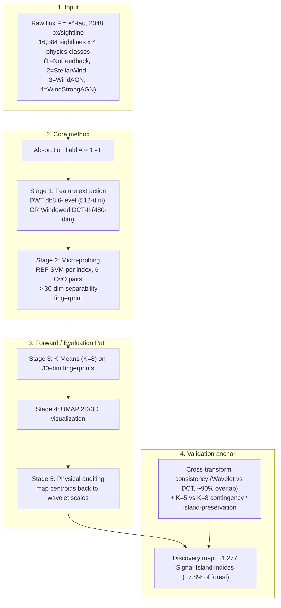

# LEDGER — signal-clustering-v1 (Exploratory Discovery Phase)

> **Track status:** HISTORICAL / COMPLETED. This is the *first version* of the micro-probing + clustering
> approach to discover the separability landscape across the 4 physics feedback classes.
> Branch: `feature/signal-clustering-analysis` · Tag: `v0.3-clustering-v1`.
> **Terminology note:** v1 docs use the term **"fingerprint"** (a 30-dim *sensitivity/separability vector*)
> and a default of **K=8**. v2 later renamed "fingerprint" → "separability vector", dropped the 6 intercepts
> (30-dim → 24-dim), and settled on **K=5** (with a K-sweep). This ledger preserves v1's own facts; v2 changes
> are noted only where the v1 README itself states them.

## **Architecture Diagram (Mermaid)**

---

## 1. The Pulse (Progress & Roadmap)

| Stage | Focus Area | Status | Pass Condition (as documented) | Paper Section |
|:--- |:--- |:--- |:--- |:--- |
| **Stage 1** | Feature extraction — A=1-F + DWT db8 6-level (512-dim) / Windowed DCT-II (480-dim) | ✅ **DONE** | Per-level coefficient stats computed over 16,384 sightlines | not recorded in repo |
| **Stage 2** | Micro-probing — RBF SVM (C=1.0, gamma='scale'), 6 OvO pairs/index | ✅ **DONE** | `micro_classifier_params.npy` shape (16384, 30) | not recorded in repo |
| **Stage 3** | Logical clustering — K-Means K=8 on 30-dim fingerprints | ✅ **DONE** | `cluster_labels.npy` for all 16,384 indices | not recorded in repo |
| **Stage 4** | UMAP visualization (2D + interactive 3D) | ✅ **DONE** | Labelled scatter plots + interactive HTML manifolds produced | not recorded in repo |
| **Stage 5** | Physical auditing — centroids mapped back to wavelet scales | ✅ **DONE** | Signal Islands isolated (G1, G2, G5) | not recorded in repo |

### ✅ Completed Milestones
- **Date not recorded in repo**: Stage 1 wavelet coefficient statistics computed (db8, 6 levels, 16,384 sightlines).
- **Date not recorded in repo**: 16,384 RBF-SVM micro-classifiers trained; 30-dim fingerprints saved as `micro_classifier_params.npy` (16384, 30).
- **Date not recorded in repo**: K=8 K-Means run completed; 3 rare Signal Islands (G1, G2, G5; ~1,277 indices, ~7.8%) isolated from the bulk.
- **Date not recorded in repo**: K=5 vs K=8 stability check and Wavelet vs DCT cross-validation completed (~90% island overlap).
- Track checkpointed at tag `v0.3-clustering-v1` (commit SHA not recorded in repo).

---

## 2. Methodology & Architecture

> Methodology preserves v1's own terminology ("fingerprint", "30-dim", "K=8").

### Core method — Micro-Classifier Separability Fingerprint
- **Executed approach:** an **RBF SVM** (`SVC(kernel='rbf', C=1.0, gamma='scale')`) is trained for each of the 6 one-vs-one (OvO) class pairs at **every** sightline index, across all 16,384 indices.
- Output per index is a **30-dim separability (sensitivity) "fingerprint"**: 24 signed decision distances (6 OvO pairs × 4 class representatives) + 6 OvO intercepts.
- Vector form: `v_i = [delta_01, delta_02, delta_03, delta_12, delta_13, delta_23 (each in R^4), b_01 … b_23 (6 intercepts)] ∈ R^30`.
- Saved to `data/feature_discovery/base_data/micro_classifier_params.npy` — shape **(16384, 30)**.
- Intuition (sensitivity vector): "How much / in what direction do the four physics realizations differ at index i?"

### Stage 1 — Feature extraction inputs (A = 1 − F)
- **Absorption field transform:** `A = 1 − F ∈ [0,1]`. Removes the ~0.8 DC baseline that would otherwise inflate the SVM dot-product kernel and bury the discriminative signal; also makes wavelet approximation coefficients physically meaningful.
- **No weak-absorption thresholding** (keep all values of A; hard thresholding at F>0.95 would introduce spectral artifacts and discard cosmological information).
- **Wavelet branch (primary):** Daubechies-8 (`db8`), 6 levels, `mode='periodization'`. Orthogonal decomposition `[D1,D2,D3,D4,D5,D6,A6]` = 2048 coeffs; retained feature space **512-dim** (D3–D6 + A6, dropping noise-dominated D1/D2).
- **DCT branch (cross-validation):** Windowed DCT-II with Hann window, window length L=256, hop=128 (50% overlap), 15 windows, first 32 coefficients per window kept → **480-dim** (`norm='ortho'`).

### 5-Stage discovery pipeline (v1)
1. **Feature Extraction** (Wavelet/DCT on A=1−F) → 512-dim or 480-dim feature vectors per class.
2. **Micro-Probing** (RBF SVM, 6 OvO) → 30-dim separability fingerprint per index → `micro_classifier_params.npy`.
3. **Logical Clustering** (K-Means, K=8, on standardized 30-dim fingerprints) → `cluster_labels.npy`.
4. **UMAP Visualization** (2D static + 3D interactive HTML).
5. **Physical Auditing** (map cluster centroids back to wavelet scales → physical regime map).

### Bounded outputs / validity domain
- Absorption field `A = 1 − F` is bounded to `[0, 1]` by construction.
- Cluster labels are integers in `[0, K-1]`; all 16,384 indices assigned (verified by contingency tables summing to 16,384).

### Alternative method (selected on paper, NOT run as an experiment)
- A **Mechanism-based** vector: **L1-penalized Linear SVM** (`LinearSVC`, C=100), 3072-dim (6 OvO × 512 wavelet weights; note one v1 doc says 3078-dim incl. 6 intercepts). Intuition: "*Why* do the realizations differ?" — sparse, auditable mapping cluster → wavelet scale → physics.
- The v1 README explicitly records that this L1-Linear/mechanism approach "was selected but never implemented as an experiment; v2 continued with sensitivity-based (RBF) vectors." All v1 clustering/UMAP results are backed by the RBF sensitivity fingerprints.

---

## 3. The Logic (Decision Log)

- **[D-01] Signal representation — use absorption field A = 1 − F (not raw flux F):** removes the large DC baseline that inflates the SVM kernel dot-product and makes wavelet approximation coefficients physically meaningful. (Options considered: raw flux F vs A=1−F.)
- **[D-02] No weak-absorption thresholding:** keep all values of A. Hard thresholding at F>0.95 introduces high-frequency spectral artifacts and discards cosmological information (void statistics, UV background). If needed later, use soft thresholding. (Options: hard threshold, soft threshold, none.)
- **[D-03] Wavelet family = db8:** 8 vanishing moments suppress smooth continuum up to 7th-order polynomials; compact support with good frequency localization. (Options: Haar/db1 — too blocky; db4; db8; db16 — sacrifices spatial localization.)
- **[D-04] Behavior-vector strategy — Mechanism (L1 Linear SVM) selected on paper over Sensitivity:** `behavior_vector_strategy.md` selects the 3072-dim L1-Linear "mechanism/saliency" vector ("*why* they differ", auditable to wavelet scale) over the 30-dim geometric sensitivity vector ("*how much* they differ"). NOTE: per the README, the executed v1 experiments used the **sensitivity (RBF, 30-dim)** vectors; the mechanism approach was never run.
- **[D-05] Cluster count K = 8 (over silhouette-optimal K=5):** justified by (1) Power-of-2 / degrees-of-freedom heuristic — 2^3 gives three symmetry breakers (Feedback vs NoFeedback, Wind vs AGN, Strong AGN vs Standard AGN); (2) manifold capacity ~3–5 axes; (3) elbow analysis — inertia drops meaningfully until K=8; (4) **island preservation** — K=5 dissolves the 329-index Extreme Sensitivity niche (K8_G5); (5) cross-transform consistency (~90% Wavelet↔DCT overlap). Silhouette peaks at K=5 (global "continent" stability) but K=8 chosen for local discovery.
- **[D-06] Clustering algorithm = K-Means on raw standardized fingerprint space; UMAP used for visualization only:** clustering runs on the standardized 30-dim space; UMAP (2D/3D) is a visualization/manifold-structure step, not the clustering input.
- **[D-07] Dual-transform cross-validation (Wavelet primary, DCT independent check):** run the identical 16,384-micro-SVM + K=8 pipeline through both transforms to test whether discovered islands are physical vs mathematical artifacts. Recommendation: continue with Wavelet indices for physical mapping (better localized scale separation, consistent with DCT).

> **Forward note (from v1 README):** v1 → v2 design changes — 30-dim → 24-dim (drop intercepts); manual standalone scripts → 6-stage DVC pipeline; K=8 → K=5 + empirical K-sweep [2,20]; formal dual-run (wavelet + raw absorption) with cross-run audit.

---

## 4. The Data (Lineage & Governance)

**Primary data source:** Sherwood simulation, z=0.3, synthetic quasar absorption spectra. 4 physics feedback classes (1=NoFeedback, 2=StellarWind, 3=WindAGN, 4=WindStrongAGN). Forest of 16,384 sightlines × 2048 pixels. Upstream URI: not recorded in repo.

| Implementation Area | Primary Data File | Tracking Metadata |
|:--- |:--- |:--- |
| Stage 1 — Wavelet features | `data/processed/wavelet_db8_l6_d12/data.npy` | shape (16384, 512); DVC-tracked |
| Stage 1 — DCT features | `data/processed/windowed_dct_256_128_32/data.npy` | shape (16384, 480); DVC-tracked |
| Stage 1 — coefficient stats | `data/feature_discovery/experiments/wavelet_per_level/stage1_data_stats.csv` | DVC-tracked |
| Stage 2 — micro-classifier params | `data/feature_discovery/base_data/micro_classifier_params.npy` (also referenced under `data/feature_discovery/experiments/`) | shape (16384, 30); DVC-tracked |
| Stage 3 — K=8 clustering (primary, Wavelet) | `data/feature_discovery/clustering_results/` (`cluster_labels.npy`) | DVC-tracked |
| Stage 3 — K=5 clustering (stability) | `data/feature_discovery/clustering_results_k5/` | DVC-tracked |
| Stage 3 — DCT clustering (cross-val) | `data/feature_discovery/clustering_results_dct/` | DVC-tracked |
| Audit — membership comparison | `data/feature_discovery/cluster_membership_comparison.csv` | DVC-tracked |
| Experiment tracking | `mlruns/` | MLflow, tracked separately via `mlruns.dvc` |

> **Path caveat (from v1 README):** these v1 file paths reference script locations (`scripts/clustering/`, `src/core/clustering.py`) and data layout (`data/feature_discovery/…`) that no longer exist in the current codebase. They are recorded here as historical lineage.

### Responsibility Matrix
- **Infrastructure Manager:** lock binary volumes (read-only), manage the DVC remote and MLflow registry.
- **Data Engineer:** validate A=1−F conversion and feature-vector shape/range checks.
- **PI Orchestrator:** scientific sign-off on K selection and the Signal-Island interpretation.

---

## 5. Evaluation Plan

> v1 is a **discovery** pipeline, not a classification pipeline — "evaluation" = stability/consistency of discovered clusters, not predictive accuracy. Metrics below are those the docs actually report.

### Primary (gating) evidence used to validate discovery
- **Cross-transform island overlap (Wavelet vs DCT, K=8):** documented overlaps — Wave_G5↔DCT_G3 **87.9%**, Wave_G1↔DCT_G6 **90.9%**, Wave_G2↔DCT_G2 **85.0%**; bulk: Wave_G3↔DCT_G4 89.7%, Wave_G4↔DCT_G1 89.5%, Wave_G0↔DCT_G0 82.1%. Headline: "~90% overlap" → islands are physical, not transform artifacts.
- **K=5 vs K=8 island preservation:** contingency table over 16,384 indices; K8_G5 (329 indices, Extreme Sensitivity) **fully dissolves at K=5** (37%→Forest bulk K5_G1, 22%→Void bulk K5_G0). Conclusion: K=5 is lossy; K=8 is the minimum resolution for discovery.
- **Inter-class variance contrast:** Signal Islands (G1, G2, G5) show **10×–40×** higher inter-class variance than the forest bulk. Forest cluster G3 has the lowest class variance (**0.000009**) → stable but feedback-insensitive.

### Diagnostic (tracked, non-gating)
- **Inertia + silhouette over K ∈ [2, 20]** (elbow/silhouette plot). Silhouette peaks at **K=5**; inertia knee near **K=8**. (Numeric silhouette/inertia values per K: not recorded in repo.)
- Per-cluster centroid stats (K=8 and K=5): size, % of total, mean/max L2 to centroid, centroid magnitude, top-3 feature indices — full tables in `clustering_comparison_report.md` and `signal_clustering_analysis.md` §4.6.

### Validation datasets
- **Primary discovery run:** Wavelet (db8) features, 16,384 sightlines, K=8.
- **Stability split:** same Wavelet features re-clustered at K=5.
- **Cross-transform check:** Windowed DCT-II features, same 16,384-micro-SVM + K=8 pipeline.

---

## 6. Visualization & Artifacts

> No `results/signal_clustering_v1/` figure directory exists in the current repo — **not recorded in repo** as Git-tracked results. The v1 docs reference figures stored under DVC-tracked `data/feature_discovery/clustering_results*/` (paths below are historical and may no longer exist on disk).

### K=8 cluster distribution (primary discovery run, 16,384 indices)

| Cluster | Size | % | Role |
|:---|---:|---:|:---|
| G0 | 4,164 | 25.4% | Bulk background / transition |
| G3 | 4,662 | 28.5% | Standard Lyman-alpha forest |
| G4 | 3,769 | 23.0% | Dense forest / void background |
| G6 | 1,359 | 8.3% | Transition / wing regions |
| G7 | 1,153 | 7.0% | Intermediate line structures |
| **G1** | **458** | **2.8%** | **High Sensitivity Niche A (Signal Island)** |
| **G2** | **490** | **3.0%** | **High Sensitivity Niche B (Signal Island)** |
| **G5** | **329** | **2.0%** | **Extreme Sensitivity Niche C (Signal Island)** |

G0+G3+G4 = **77%** of indices (bulk IGM). Signal Islands G1+G2+G5 ≈ **1,277 indices (~7.8%)** — the headline discovery.

### Referenced figure paths (historical, DVC; not Git-tracked in this repo)
- K=8 interactive 3D (Wavelet): `data/feature_discovery/clustering_results/umap_3d_k8.html`
- K=8 static 2D (Wavelet): `data/feature_discovery/clustering_results/classifier_clusters_umap_k8.png`
- K=5 interactive 3D / static 2D: `data/feature_discovery/clustering_results_k5/umap_3d_k5.html`, `…/classifier_clusters_umap_k5.png`
- DCT K=8 3D / 2D: `data/feature_discovery/clustering_results_dct/umap_3d_dct_k8.html`, `…/classifier_clusters_umap.png`
- Elbow + silhouette: `data/feature_discovery/clustering_results/k_optimization_elbow_silhouette.png`
- Wavelet scalogram sample: `data/feature_discovery/wavelet_sample_scalogram.png`

### Tracker run_ids
- MLflow run_ids: **not recorded in repo** (docs note runs were logged to `mlruns/` via `cluster_classifiers.py` / `verify_clustering_k.py`, but no specific run_id is given).

---

## 7. Session History & Next Handoff

### **Session Snapshot: date not recorded in repo (Exploratory Discovery Phase, v1)**
- Built the 5-stage discovery pipeline (A=1−F → wavelet/DCT → 16,384 RBF micro-SVMs → 30-dim fingerprints → K=8 K-Means → UMAP → physical audit).
- Discovered 3 rare Signal Islands (G1, G2, G5; ~1,277 indices, ~7.8% of the forest) with 10×–40× higher inter-class variance than the bulk.
- Validated robustness: ~90% Wavelet↔DCT cross-transform overlap; K8_G5 dissolves at K=5 (island-preservation argument for K=8).
- Found the 6 SVM intercepts encode margin-center position (scaling artifact), not class-arrangement geometry.
- Checkpointed at tag `v0.3-clustering-v1` on branch `feature/signal-clustering-analysis`.

### How v1 connects forward to v2 (from v1 README)
- **30-dim → 24-dim:** drop the 6 intercepts, keep only the 24 decision distances (finding: intercepts add noise).
- **Manual scripts → DVC pipeline:** v1's 8 standalone scripts formalized into a 6-stage `dvc.yaml` pipeline.
- **K=8 → K=5 + sweep:** v2 runs an empirical K-sweep [2,20] and adopts K=5 as default after elbow analysis on the cleaned 24-dim vectors.
- **Dual-run validation:** v2 runs both wavelet and raw-absorption inputs through one 24-dim pipeline with cross-run audit.
- **Terminology:** v2 renames "fingerprint" → "separability vector".

### **Immediate Next Steps (historical — superseded by v2)**
- (Optionally) implement the selected-but-never-run L1-Linear mechanism (saliency) fingerprint experiment — `behavior_vector_strategy.md` D-04. v2 instead continued with RBF sensitivity vectors.

### **Blockers**
- None recorded. Track is complete and superseded by signal-clustering-v2.
