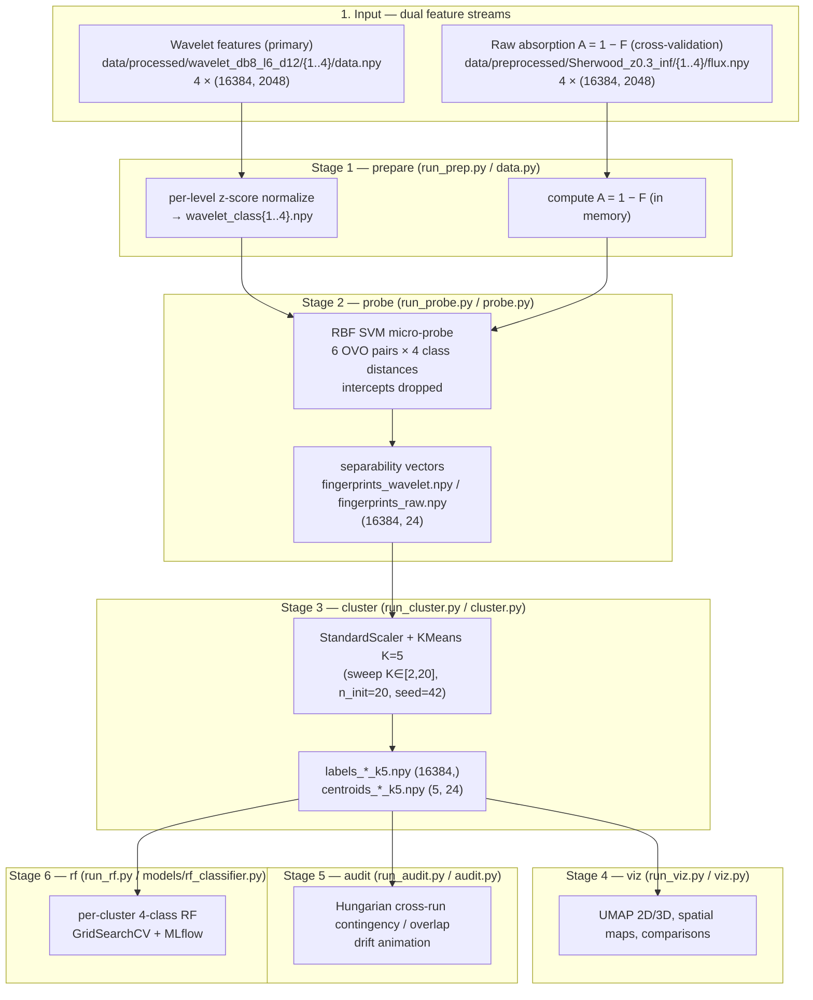

# LEDGER — signal-clustering-v2

**Track:** signal-clustering-v2 (ACTIVE — production pipeline)
**Branch:** `feature/signal-clustering-v2` · **Tag:** `v0.4-clustering-v2`
**Data:** Sherwood simulation z=0.3, 16,384 sightlines × 2,048 pixels, 4 physics classes (1=NoFeedback, 2=StellarWind, 3=WindAGN, 4=WindStrongAGN)

> Single source of truth for the active track. Every number below traces to a file in `results/signal_clustering_v2/`, `dvc.yaml`, or the docs under `docs/feature/signal-clustering-v2/`. Items not present in the repo are marked **not recorded in repo**.

---

## Architecture Diagram (Mermaid)

---

## 1. The Pulse (Progress & Roadmap)

| Stage | Focus Area | Status | Target / Pass Condition | Outputs verified in `results/` |
|:--- |:--- |:--- |:--- |:--- |
| **Stage 1 — prepare** | Normalize wavelet features, build raw absorption field | ⚠️ **PARTIAL** | `stage1_input_summary.csv` metric emitted | Metric CSV **MISSING** from `results/`; `wavelet_class{1..4}.npy` outputs **MISSING** from `data/feature_discovery/` |
| **Stage 2 — probe** | 24-dim separability vectors, both runs | ✅ **DONE** | `(16384, 24)` arrays + summary CSV | `fingerprints_{wavelet,raw}.npy`, `stage2_separability_vector_summary.csv` present |
| **Stage 3 — cluster** | K-sweep + KMeans K=5, both runs | ✅ **DONE** | sweep + cluster_stats CSVs | `sweep_{wavelet,raw}.csv`, `cluster_stats_{wavelet,raw}_k5.csv`, `labels_*_k5.npy`, `centroids_*_k5.npy` present |
| **Stage 4 — viz** | UMAP 2D/3D, spatial maps, comparisons | ✅ **DONE** | figure set in `figs/` | 11 figures present (see §6) |
| **Stage 5 — audit** | Cross-run contingency + overlap, drift animation | ✅ **DONE** | contingency + overlap CSVs | `cross_run_contingency_k5.csv`, `cross_run_overlap_summary.csv`, drift gif/mp4 present |
| **Stage 6 — rf** | Per-cluster Random Forest, both flavors | ✅ **DONE** | `rf_summary_{wavelet,raw}_k5.csv` | Both CSVs present (wavelet CSV is untracked per `git status`) |

### ✅ Completed Milestones
- **2026-03-09**: Full 6-stage pipeline marked complete in project plan v4 "Execution Summary" (date as recorded in `signal_clustering_project_plan_v4.md`).
- **(date not recorded in repo)**: Tag `v0.4-clustering-v2` cut for this track.

> Discrepancy logged: the results report (§6, §9) states `rf_summary_wavelet_k5.csv` was *not generated*. The file is now present in `results/` (untracked in `git status`, mtime Apr 3). The wavelet RF numbers below are read directly from that file; the report's narrative predates it.

---

## 2. Methodology & Architecture

### Separability vector (24-dim)
- Per sightline `i`, for each of the **6 one-vs-one class pairs**, fit `SVC(kernel='rbf', C=1.0, gamma='scale')` on the 2 class feature vectors, then call `decision_function` on **all 4 class representatives** → 4 signed distances per pair. 6 × 4 = **24 dims**. (`src/core/probe.py`, `probe_sightline`.)
- **Intercepts dropped** (30-dim → 24-dim): intercepts encode margin-center position / feature scaling, not class arrangement.
- OVO pair order (`OVO_PAIRS` in `probe.py`): (0,1),(0,2),(0,3),(1,2),(1,3),(2,3) = C1vC2, C1vC3, C1vC4, C2vC3, C2vC4, C3vC4.
- Output shape: **(16384, 24)**, `np.float64`. Outer loop parallelized via `joblib.Parallel(n_jobs=-1)`.

### Dual feature inputs
- **Wavelet (primary):** full 7-level db8 DWT (D1–D6 + A6), per-level z-score normalized.
- **Raw (cross-validation):** absorption field A = 1 − F, clipped to [0,1], full 2048-px spectral context. `gamma='scale'` auto-adjusts to 2048-dim input; no hyperparameter change between runs.

### Clustering (K-Means, K=5)
- `StandardScaler().fit_transform` then `KMeans(n_clusters=5, random_state=42, n_init=20)` (`src/core/cluster.py`, `fit_kmeans`).
- K-sweep: K ∈ [2,20], 20 inits each, recording inertia + silhouette (`k_sweep`).

### Cross-run audit
- Build 5×5 contingency matrix (wavelet rows × raw cols), then **Hungarian algorithm** (`scipy.optimize.linear_sum_assignment` on negated contingency) for one-to-one best match (`src/core/audit.py`, `cross_run_overlap`).
- Regime label assigned by wavelet cluster size: >15% = `bulk`, 5–15% = `transition`, <5% = `signal_island`.

---

## 3. The Logic (Decision Log)

- **[D-01] Separability vector = RBF SVM, 24-dim (drop intercepts).** (Plan D1.) Signed decision distances of all 4 classes across 6 OVO RBF-SVM boundaries describe *where the classes land* at each index. Intercepts encode scaling artifacts (margin-center), add noise without signal → 30→24-dim.
- **[D-02] Cluster on distances, not L1-Linear SVM weights (3072-dim).** (Plan D1.) Weights encode *which features drove the boundary*, not class arrangement; at 3072-dim K-Means suffers distance concentration. Mechanism recovered post-hoc in Stage 5 via attribution, not used as clustering input.
- **[D-03] Two parallel feature inputs (wavelet primary, raw cross-validation).** (Plan D2.) Both yield a 24-dim vector in an identical clustering space. High cross-run overlap ⇒ representation-independent physics; divergence ⇒ fine-scale structure wavelets drop carries independent physics.
- **[D-04] Exclude D1/D2 from the wavelet run rationale.** (Plan D2.) At per-index scale D1 (std 0.000102, 99.5% sparse) and D2 (78.8% sparse) feed near-zero noise to a 4-point SVM; raw run captures this fine scale without sparsity. *(Note: the prepare-stage implementation as committed uses full D1–D6+A6 per-level normalized; this exclusion is the plan's stated reasoning for relying on the raw run for fine structure.)*
- **[D-05] K=5 default after empirical sweep (supersedes plan's K=8).** Plan D3 proposed K=8 (manifold ≤6 DOF → first power-of-2 above). The v2 sweep over K∈[2,20] showed K=5 sits at the inertia elbow; after dropping intercepts (30→24-dim) effective dimensionality dropped, so K=5 is sufficient. `dvc.yaml` cluster stage hardcodes `--k 5`.
- **[D-06] Per-level wavelet z-score normalization.** Each level (D1…A6) standardized independently across sightlines so high-energy levels (D5/D6/A6) don't dominate the per-index SVM geometry.
- **[D-07] DVC pipeline as the execution contract.** 6 stages in `dvc.yaml` (prepare→probe→cluster→viz→audit→rf); reproducible, dependency-tracked, skips unchanged stages. Metric/CSV outputs use `cache: false` so they stay Git-readable.
- **[D-08] Purge dead orchestrator/backend artifacts (`configs/example.yaml`, `configs/pca.yaml`, `local/utils.py`, `mlflow.db`).** All four are orphans of removed infrastructure: the YAMLs and `local/utils.py` belonged to the deleted config-driven orchestrator `src/main.py` (grep-confirmed zero current `*.py` references); `mlflow.db` is a stale SQLite file from the backend abandoned in f546b44 (repo is now file-based `mlruns/`). `local/utils.py` was git-tracked despite `.gitignore` containing `local/` (git honors pre-existing tracking) — deletion resolves the persistent git-status noise without touching the `.gitignore` rule. Verdict: `git rm` the three tracked files; `rm` the untracked-ignored `mlflow.db`. No methodology impact. Owner: infrastructure-manager.
- **[D-09] Stage-1 prepare outputs regenerate-on-demand, gated on bit-identity to the committed `dvc.lock` hashes.** `wavelet_class{1..4}.npy` and `stage1_input_summary.csv` are absent on disk; upstream inputs are present; `run_prep.py`/`data.py` are seed-free deterministic (per-level z-score). Regeneration is admissible ONLY if the regenerated md5s match the hashes already in `dvc.lock` (`wavelet_class1.npy` = `ac464d4…`, verified identical at the `v0.4-clustering-v2` tag and HEAD). On md5 MATCH: arrays restored, no downstream rerun, v0.4 numbers intact. On md5 DIVERGENCE: STOP — do not overwrite, do not re-run downstream, escalate to PI; a divergence is silent toolchain drift and a reportable finding, not a trigger to regenerate-and-overwrite recorded results. **PROVISIONAL** ([D-37]-ext rule 15): byte-reproducibility of the Mar-21 toolchain was not re-established this session (the `uv` env failed to build `pyarrow==21.0.0` under Python 3.14, blocking `dvc status`); lifts on the data-engineer's md5-match PASS report. Owner: data-engineer.
- **[D-10] MLflow branch-aware naming is forward-only; past experiments are NOT retroactively renamed.** Existing experiments (`Modular_DCT`, `Signal_Discovery_Probes`, `SignalClustering_Stage6` [id 443149898938748495], `Baseline_RF`) predate the `provenance.mlflow_experiment_name()` convention (`CosmoGasPeruser/<branch>`). They are left as-is to preserve provenance and avoid falsifying the timeline; retro-renaming would break LEDGER §6 / report references and is rejected per the [D-37] honest-reporting discipline. Enforcement applies to the next tracked run onward; verified that `scripts/run_rf.py:112` already calls `mlflow_experiment_name()`, so the live path is compliant. Owner: infrastructure-manager.
- **[D-11] Honest-record discipline for the v0.4 tag during cleanup.** None of D-08…D-10 alters a gating metric or a prior decision; the `v0.4-clustering-v2` recorded results (cluster_stats, cross-run overlap, RF summaries) are unchanged. Any future change to the recorded numbers (e.g., a Stage-1 md5 divergence under D-09) requires a fresh tag and an explicit §7 History entry rather than an in-place edit of v0.4 numbers.

---

## 4. The Data (Lineage & Governance)

**Primary data source:** Sherwood simulation, z=0.3 (`Sherwood_z0.3_inf`). 4 physics classes stored in directories `1/`,`2/`,`3/`,`4/`. Managed by DVC — never modified directly.

| Implementation Area | Primary Data File | Shape / dtype / Notes |
|:--- |:--- |:--- |
| Raw flux (input) | `data/preprocessed/Sherwood_z0.3_inf/{1..4}/flux.npy` | 4 × (16384, 2048), float32, F = e^{−τ} |
| Wavelet features (input) | `data/processed/wavelet_db8_l6_d12/{1..4}/data.npy` | 4 × (16384, 2048), db8 DWT D1–D6+A6 |
| Prepared wavelet (Stage 1 out) | `data/feature_discovery/wavelet_class{1..4}.npy` | per `dvc.yaml`: per-level z-scored. **Files MISSING on disk** (only k5 artifacts present in `feature_discovery/`) |
| Separability vectors — wavelet | `data/feature_discovery/fingerprints_wavelet.npy` | (16384, 24), float64 — present |
| Separability vectors — raw | `data/feature_discovery/fingerprints_raw.npy` | (16384, 24), float64 — present |
| Cluster labels — wavelet | `data/feature_discovery/labels_wavelet_k5.npy` | (16384,) — present |
| Cluster labels — raw | `data/feature_discovery/labels_raw_k5.npy` | (16384,) — present |
| Centroids — wavelet | `data/feature_discovery/centroids_wavelet_k5.npy` | (5, 24) — present |
| Centroids — raw | `data/feature_discovery/centroids_raw_k5.npy` | (5, 24) — present |
| K=8 stability-check labels | `data/feature_discovery/labels_{wavelet,raw}_k8.npy` | proposed in plan; **MISSING on disk** (pipeline uses K=5) |

### Responsibility Matrix
- **Infrastructure Manager:** lock `data/` binary volumes (read-only, DVC-managed); manage DVC remote + `mlruns/` registry.
- **Data Engineer:** validate `src/core/data.py` loading, per-level normalization, NaN/Inf and A∈[0,1] range checks.
- **PI Orchestrator:** scientific sign-off on K=5 and cluster regime interpretation.

---

## 5. Evaluation Plan

### Primary metrics (the gating set)

**1. K-sweep silhouette + inertia elbow** (`results/signal_clustering_v2/sweep_{wavelet,raw}.csv`). At **K=5**:

| Run | Inertia @ K=5 | Silhouette @ K=5 | Silhouette peak | Notes |
|:--- |:--- |:--- |:--- |:--- |
| Wavelet | 147,831.17 | 0.3539 | 0.4901 @ K=2 (trivial); plateau 0.357 @ K=4 | inertia −51% from K=2 (299,706) to K=5; flattens after |
| Raw | 156,376.83 | 0.4023 | **0.4023 @ K=5** | raw silhouette actually peaks at K=5; sharp drop to 0.3075 @ K=6 |

**2. Per-cluster cluster structure** (`cluster_stats_{wavelet,raw}_k5.csv`):

*Wavelet K=5:*
| Cluster | Size | % | mean L2 | centroid mag | Regime |
|:---:|:---:|:---:|:---:|:---:|:--- |
| 0 | 6,960 | 42.48% | 1.53 | 2.53 | Bulk A |
| 2 | 5,306 | 32.39% | 4.43 | 3.33 | Bulk B |
| 4 | 2,884 | 17.60% | 2.34 | 3.02 | Transitional |
| 3 | 731 | 4.46% | 7.77 | **9.62** | Signal Island A |
| 1 | 503 | 3.07% | 7.80 | **9.78** | Signal Island B |

*Raw K=5:*
| Cluster | Size | % | mean L2 | centroid mag | Regime |
|:---:|:---:|:---:|:---:|:---:|:--- |
| 0 | 6,987 | 42.65% | 3.64 | 2.94 | Bulk A |
| 1 | 6,369 | 38.87% | 1.36 | 2.93 | Bulk B |
| 3 | 1,267 | 7.73% | 4.41 | 5.76 | Transitional A |
| 4 | 1,206 | 7.36% | 4.39 | 5.45 | Transitional B |
| 2 | 555 | 3.39% | 7.55 | **8.88** | Signal Island |

Wavelet finds **two** signal islands (clusters 1+3 = 7.53% of sightlines, centroid mag 9.6–9.8); raw finds **one** (cluster 2, 3.39%, centroid mag 8.88).

**3. Cross-run contingency + Hungarian overlap** (`cross_run_contingency_k5.csv`, `cross_run_overlap_summary.csv`):

| Wavelet cluster | Size | Best raw match | Overlap count | Overlap % | Regime |
|:---:|:---:|:---:|:---:|:---:|:--- |
| 0 (Bulk A) | 6,960 | Raw 1 | 4,036 | **57.99%** | bulk |
| 2 (Bulk B) | 5,306 | Raw 0 | 3,710 | **69.92%** | bulk |
| 4 (Trans.) | 2,884 | Raw 3 | 603 | 20.91% | bulk* |
| 1 (Island B) | 503 | Raw 4 | 131 | 26.04% | signal_island |
| 3 (Island A) | 731 | Raw 2 | 238 | 32.56% | signal_island |

\* regime column in CSV labels W4 `bulk` (size >15% rule), though the report calls it transitional. Bulk clusters agree 58–70%; signal islands agree only 20–33% → representations are complementary, not redundant (contrast v1's ~90% cross-transform island overlap).

**4. Per-cluster RF accuracy** (`rf_summary_{raw,wavelet}_k5.csv`). All runs: `n_estimators=100, max_depth=25`.

*Raw absorption RF:*
| Cluster | Size | CV F1 | Test F1 | Test Acc |
|:---:|:---:|:---:|:---:|:---:|
| 0 (Bulk A) | 6,987 | 0.4058 | 0.3707 | **0.4524** |
| 1 (Bulk B) | 6,369 | 0.4016 | 0.3668 | **0.4584** |
| 2 (Island) | 555 | 0.3479 | 0.3260 | 0.3378 |
| 3 (Trans. A) | 1,267 | 0.3110 | 0.2774 | 0.3047 |
| 4 (Trans. B) | 1,206 | 0.3339 | 0.2882 | 0.3057 |

*Wavelet RF* (file present despite report saying missing):
| Cluster | Size | CV F1 | Test F1 | Test Acc |
|:---:|:---:|:---:|:---:|:---:|
| 0 | 6,960 | 0.3888 | 0.3471 | 0.3464 |
| 1 | 503 | 0.3396 | 0.2744 | 0.2779 |
| 2 | 5,306 | 0.3724 | 0.3319 | 0.3310 |
| 3 | 731 | 0.3489 | 0.3168 | 0.3265 |
| 4 | 2,884 | 0.3868 | 0.3441 | 0.3466 |

Raw bulk clusters reach ~45% test accuracy (matching v0.2 global baseline 0.451 as cited in the report); islands/transitional drop to 30–34%. Wavelet RF accuracies are uniformly lower (~33–35% bulk).

### Diagnostic metrics (non-gating)
- **Per-dimension separability stats** (`stage2_separability_vector_summary.csv`): strongest class contrast is dims 8/11 = OVO pair C1 vs C4 (NoFeedback vs WindStrongAGN), |mean| 0.609 wavelet / 0.462 raw — the maximum feedback contrast. Weakest = dims 0/1 = C1 vs C2 (|mean| 0.146 wavelet / 0.071 raw).
- **Wavelet attribution** (`wavelet_attribution.csv`): signal islands (clusters 1,3) show elevated D5 (~0.53), D6 (~0.71), A6 (~0.82–0.84); bulk clusters flat (~0.04 D1 rising to ~0.43 A6). Islands driven by large-scale/low-frequency physics (DLA wings, AGN-driven structure, mean absorption).
- **Raw attribution** (`raw_attribution.csv`): 64 pixel bins per cluster; island cluster 2 shows uniformly elevated per-bin importance (~0.04–0.067) vs bulk (~0.025–0.043).

### Validation datasets
- All evaluated on the full 16,384-sightline × 4-class Sherwood z=0.3 set. RF uses 80/20 stratified split, `StratifiedKFold(n_splits=3)`, `f1_weighted` scoring.
- OOD / generalization test: **not recorded in repo.**

---

## 6. Visualization & Artifacts

### Figures present in `results/signal_clustering_v2/figs/`
| File | Type | Scientific takeaway (where stated in report) |
|:--- |:--- |:--- |
| `fig_umap_2d_wavelet_k5.png` | 2D UMAP, wavelet | bulk core + detached island peninsulas |
| `fig_umap_2d_raw_k5.png` | 2D UMAP, raw | same view, raw flavor |
| `fig_umap_3d_wavelet_k5.html` | interactive 3D UMAP, wavelet | — |
| `fig_umap_3d_raw_k5.html` | interactive 3D UMAP, raw | — |
| `fig_spatial_map_wavelet_k5.png` | spatial index map, wavelet | which pixel ranges each cluster occupies |
| `fig_spatial_map_raw_k5.png` | spatial index map, raw | — |
| `fig_umap2d_comparison.png` | side-by-side wavelet vs raw UMAP | — |
| `fig_spatial_map_comparison.png` | stacked spatial comparison | — |
| `fig_shared_umap_overlay_k5.html` | shared 3D UMAP overlay (both runs) | agreement = denser overlap regions |
| `fig_drift_animation.gif` / `.mp4` | cluster drift raw→wavelet | sightlines that change cluster between representations |

> Figures live under `results/signal_clustering_v2/figs/` (matches `dvc.yaml` plot paths). The README/plan also reference a parallel `figs/signal_clustering_v2/` tree and profile/elbow/greyscale/contingency figures (P1–P21) — those specific files are **not present** under `results/.../figs/`.

### Tracker run_ids
- MLflow backend: file-based `mlruns/`. Stage 6 RF runs logged under experiment `SignalClustering_Stage6` (id `443149898938748495`), containing 2 run dirs (`22ed9f19…`, `830134270…`).
- Canonical run_id → stage/flavor mapping: **not recorded in repo** (run names/tags not verified; experiment naming does not follow the branch-aware `CosmoGasPeruser/feature/...` convention documented in CLAUDE.md).

---

## 7. Session History & Next Handoff

### Session Snapshot
- **2026-05-26** (Research-OS migration + hygiene sprint): repo transformed to Research-OS native (agents/commands/skills, kernel CLAUDE.md, per-track LEDGERs). PI ruled on four flagged items → [D-08]…[D-11]. Executed: removed dead artifacts `configs/example.yaml`, `configs/pca.yaml`, `local/utils.py`, `mlflow.db` ([D-08]); verified the live MLflow path is branch-aware (`run_rf.py:112`), past experiment names left as-is ([D-10]). **Pending**: Stage-1 regen + md5-identity check ([D-09]) — gated on resolving a Python-3.12 env (the `uv` env failed to build `pyarrow==21.0.0` under Python 3.14); dispatched to data-engineer.
- **2026-03-09** (per project plan v4 Execution Summary): all 6 stages reported complete; bug fixes applied — probe.py iterated wrong dimension (2048→16384 sightlines), viz.py class-label indexing, audit.py raw attribution for per-class data.
- **2026-03-21 / 2026-03-22 / 2026-04-03** (file mtimes): feature_discovery arrays (Mar 21), most figures + drift animation (Mar 22), refreshed cluster_stats / attribution / sweep / RF CSVs and shared-UMAP overlay (Apr 3); `rf_summary_wavelet_k5.csv` written Apr 3 (untracked).
- Exact session dates beyond file mtimes: **not recorded in repo.**

### Immediate Next Steps (from report §9 Open Questions)
- **Wavelet RF island accuracy:** now that `rf_summary_wavelet_k5.csv` exists, confirm whether wavelet RF beats raw RF in signal-island clusters (current data: wavelet island cluster 1 test acc 0.278; lower than raw, so the open question is effectively answered "no" but should be reconciled with the report narrative).
- **Island characterization:** map signal-island sightline indices back to wavelength to identify physical features (DLA systems, Lyman-α edges, metal lines).
- **Mechanism vectors:** L1-Linear SVM weights (3072-dim) for *why* classes separate — unimplemented.
- **Stability under noise:** test signal-island membership under bootstrap resampling.

### Blockers / Discrepancies
- Stage 1 `stage1_input_summary.csv` metric and `wavelet_class{1..4}.npy` outputs declared in `dvc.yaml`/plan are **absent on disk** → `dvc repro` of the prepare stage would regenerate them; current results were produced from existing `fingerprints_*.npy`.
- Report §6/§9 claim wavelet RF summary missing, but the file now exists (out of sync — narrative predates the file).
- MLflow experiment naming does not match the documented branch-aware convention.
