## **Architecture Diagram (Mermaid)**

```mermaid
graph TD
    subgraph Input["1. Input"]
        IN["<input description>"]
    end

    subgraph Core["2. Core method / model"]
        MODEL["<model / operator>"]
        IN --> MODEL
    end

    subgraph Forward["3. Forward / Evaluation Path"]
        MODEL --> OUT["<output>"]
    end

    subgraph Supervision["4. Optimization / Inference Objective"]
        TRUTH["<ground truth or anchor>"]
        OUT & TRUTH --> LOSS["<loss / score function>"]
        LOSS -.-> |"Backpropagation / update"| MODEL
    end
```

---

## 1. The Pulse (Progress & Roadmap)

| Stage | Focus Area | Status | Target Metric | Paper Section |
|:--- |:--- |:--- |:--- |:--- |
| **Stage 1** | `<bootstrap stage>` | ⏳ **PENDING** | `<measurable pass condition>` | `<paper section>` |
| **Stage 2a** | `<methodology validation>` | ⏳ **PENDING** | `<measurable pass condition>` | `<paper section>` |
| **Stage 2b** | `<full-scale optimization or production>` | ⏳ **PENDING** | `<measurable pass condition>` | `<paper section>` |
| **Stage 3** | `<downstream task or follow-on>` | ⏳ **PENDING** | `<measurable pass condition>` | `<paper section>` |

### ✅ Completed Milestones
- *(append `- **YYYY-MM-DD**: <one-line achievement>.` rows as stages close)*

---

## 2. Methodology & Architecture

### `<Core method block>`
- `<concise description of the core method — architecture, hyperparameters, key choices>`
- Input: `<input format and units>`
- Output: `<output format and units>`

### Bounded outputs / validity domain
- `<list each output with its bound activation / projection — e.g., positivity via Softplus, fraction via Sigmoid>`

### Coordinate / unit convention
- `<reference frame and unit choices, with a one-line audit trail to the loader's source-of-truth>`

### Differentiable / numerical operator (if applicable)
- **Goal**: `<one sentence>`.
- **Definition**:
  $\text{<symbol>} = f(\theta; x)$
  where `<symbol meanings>`.
- **Loss / score**: `<exact form, including masks, anchors, and normalization>`.
- **Validation**: `<which smoke run confirmed this; canonical run_id in §6>`.

---

## 3. The Logic (Decision Log)

- **[D-01] `<title>`**: `<rationale — what was chosen and why, 1-2 sentences>`.
- *(append D-XX entries monotonically; never reuse or reorder)*

---

## 4. The Data (Lineage & Governance)

**Primary data source**: `<dataset name, version, upstream URI>`.

| Implementation Area | Primary Data File | Tracking Metadata |
|:--- |:--- |:--- |
| **`<area-1>`** | `<filename>` | `<shape / setting / run_id / version hash>` |

### Responsibility Matrix
- **Infrastructure Manager**: lock binary volumes (read-only), manage the artifact-versioning remote and the experiment-tracker registry.
- **Data Engineer**: validate `loader.py` coordinate scaling and physical / empirical ranges.
- **PI Orchestrator**: scientific sign-off on snapshots and settings selected for optimization.

---

## 5. Evaluation Plan

### Primary metrics (the gating set)

- **`<metric-1>`** — `<definition + reference + implementation path in `src/analysis/`>`. Pass condition: `<numeric>`.
- **`<metric-2>`** — `<definition + reference + implementation path>`. Pass condition: `<numeric>`.
- **`<metric-3>`** — `<definition + reference + implementation path>`. Pass condition: `<numeric>`.

All evaluated at the fiducial point: `<setting>`. The headline contribution is the `<degradation / ablation / generalization>` curve over `<axis>` ∈ `<values>`.

### Diagnostic metrics (tracked but non-gating)
- `<list>`.

### Validation datasets
- **Training / dev set**: `<variant or split>`.
- **OOD / generalization test**: `<variant or split>`.

---

## 6. Visualization & Artifacts

### `<Track>` matrix (consolidated)

*(single-source headline view of the production sweep — fill in as cells land)*

---

## 7. Session History & Next Handoff

### **Session Snapshot: <Month DD, YYYY> (<Phase>)**

- `<bullet of what was completed this session>`

### **Immediate Next Steps**
- `<bullet>`

### **Blockers**
- None.
